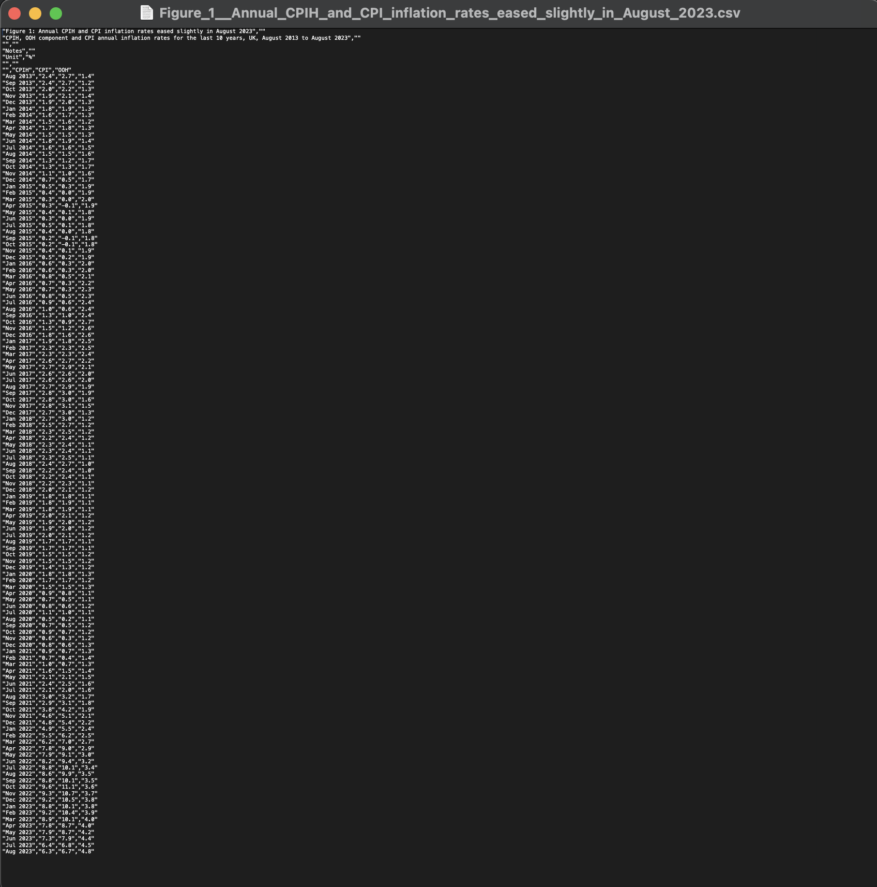
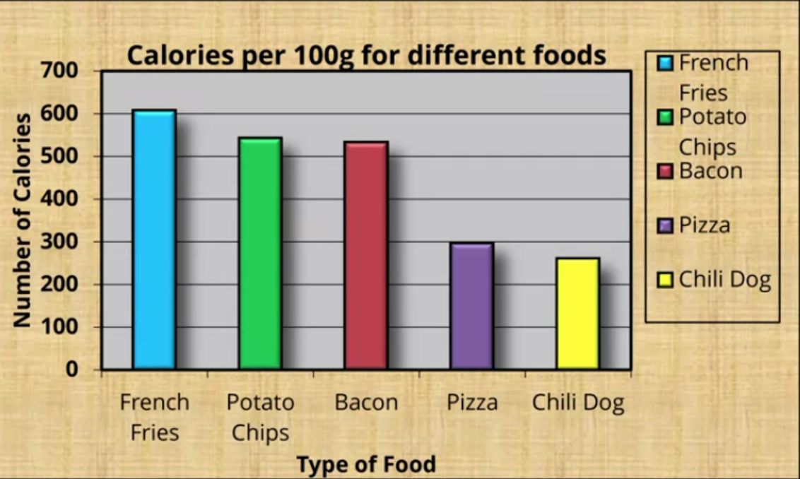
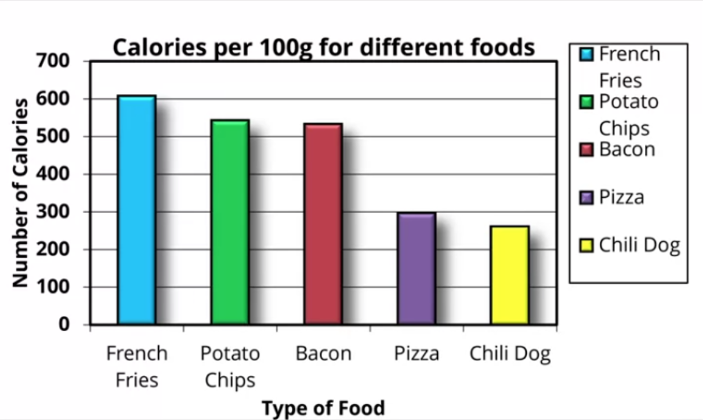
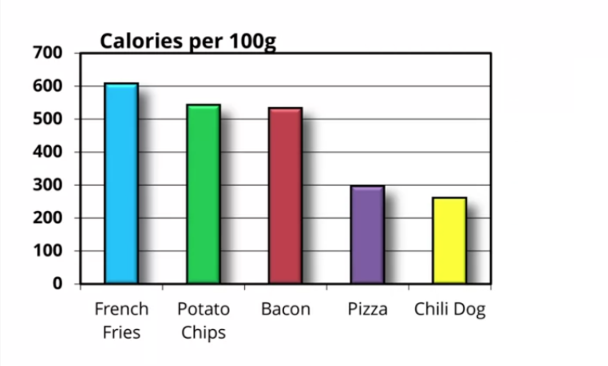
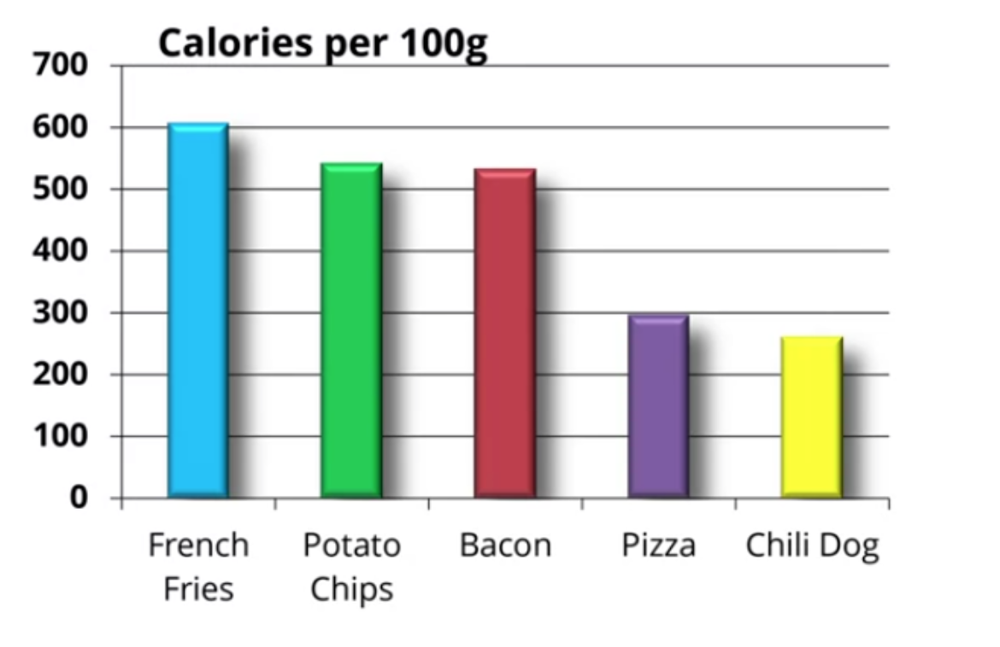
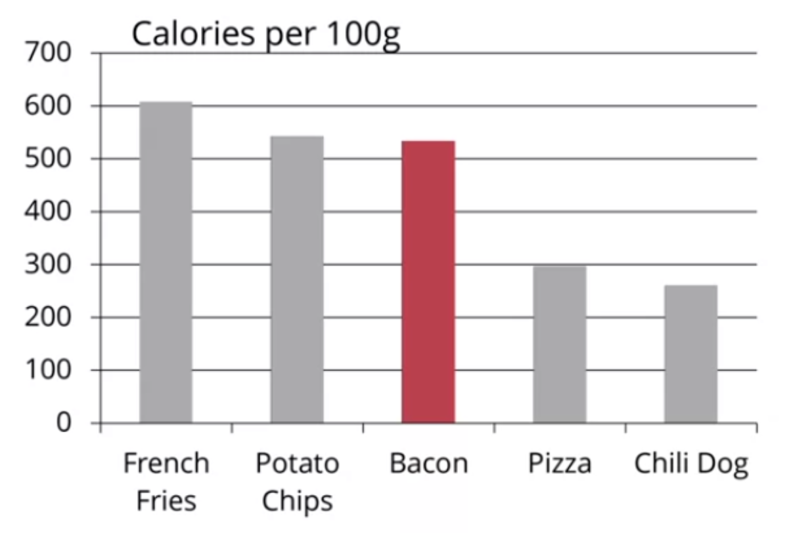
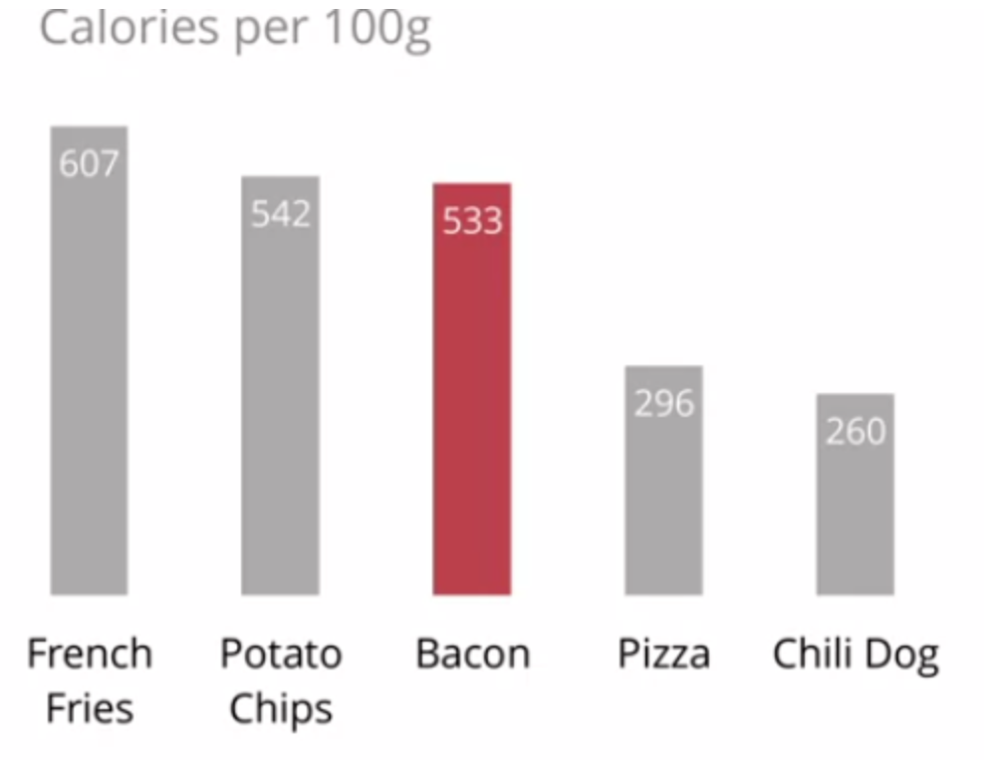
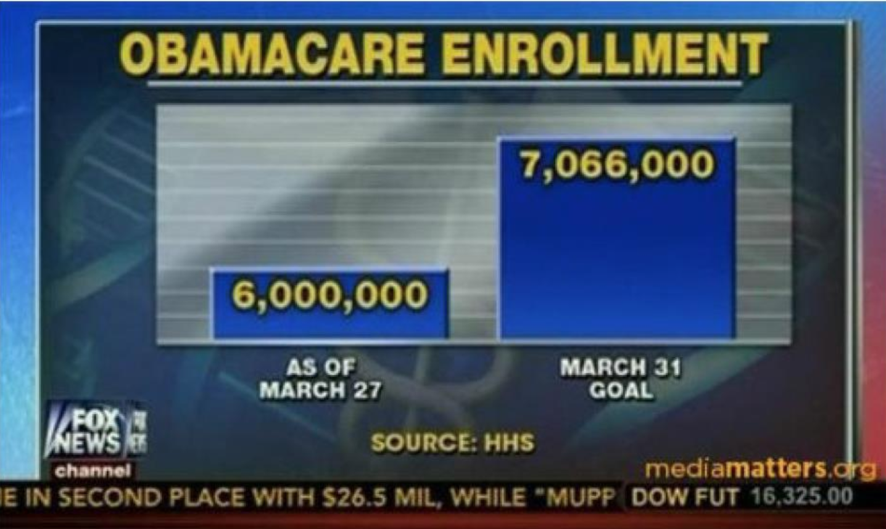
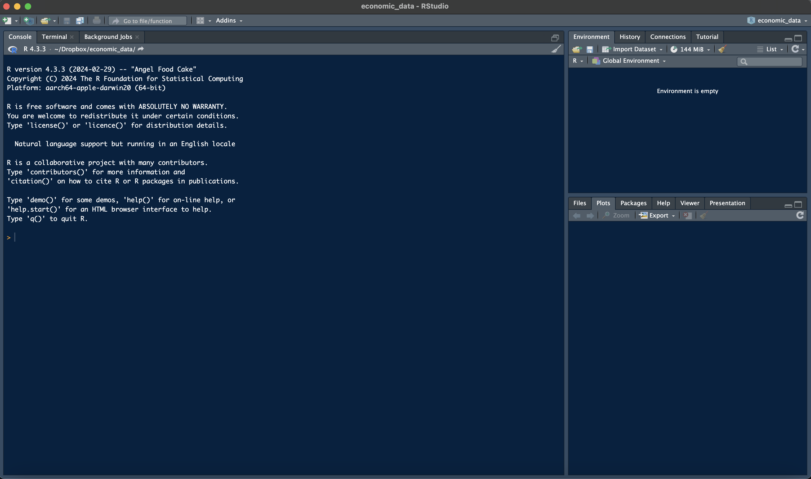

```{r xaringan-themer, include=FALSE, warning=FALSE}
options(htmltools.dir.version = FALSE)

library(xaringanthemer)
style_mono_accent(
  base_color = "#1c5253")

options(htmltools.dir.version = FALSE)

# This is a recommended set up for flipbooks
knitr::opts_chunk$set(fig.width = 6, small.mar=TRUE, fig.retina = 5,message = FALSE, warning = FALSE, comment = "", cache = F)
library(flipbookr)
library(tidyverse)
library(readxl)
library(scales)
library(ggthemes)
```


```{css, eval = TRUE, echo = FALSE}
.remark-code{line-height: 1.5; font-size: 80%}

@media print {
  .has-continuation {
    display: block;
  }
}

code.r.hljs.remark-code{
  position: relative;
  overflow-x: hidden;
}


code.r.hljs.remark-code:hover{
  overflow-x:visible;
  width: 500px;
  border-style: solid;
}

.centered-content {
  display: flex;
  flex-direction: column;
  justify-content: center;
  align-items: center;
  height: 60vh; /* Adjust based on your needs */
  text-align: center;
  margin-top: auto;
  margin-bottom: auto;
}

```


<div class="centered-content">
  <h2> </h2>
  <p>  Why economic data?<p> 

   <p> How this unit works. <p>

  <p> Data visualisation basics. <p>

  <p> What is R? <p>
</div>


---

class: inverse, center, middle

# Why Economic Data?


---

## A Scenario

*You work for the Bank of England and your boss asks you for an update on the latest inflation numbers.*

*"(insert your name here), I need to know:*

- *How much are prices increasing?*

- *How much have prices increased over the last decade?*

- *Why are prices going up?*

- *What can we do to stop prices going up?*

*get back to me in an hour."*


$\Rightarrow$ What do you need to know to approach this question? 

<!-- What do you need to know to approach this task?  -->


---

## What do you need to know? 

- What is inflation?

- How are prices measured? How is the price-level measured? 

- Where can I find reliable data on prices? 

- How is inflation defined? 

- How do I analyse the data? 

- How do I present the data and communicate the insights? 

- How can I make the analysis reproducible? 


---

## Answers

The answers require the skills developed in this course.

- Knowledge of concepts and definitions: How is inflation measured?

- Software skills to work with datasets and organize data.

- Data visualisation and description skills.


---

```{r, fig.align="center", echo=FALSE, message=FALSE, warning=FALSE, fig_caption= FALSE,fig.align="center", include=FALSE}
# Loading and cleaning the main dataset
library(tidyverse)

df <- read_csv("../data/Figure_1__Annual_CPIH_and_CPI_inflation_rates_eased_slightly_in_August_2023.csv", skip =6) %>%
  rename(date    = `...1`) %>%
  mutate(date = paste(date, "01", sep=" "),
         date = as.Date(date, format = "%b %Y %d")) %>% 
  gather(series, p, 2:4, -date)  %>% 
  filter(series == 'CPI')
  
p1 <- ggplot(data = df, aes(x = date, y = p, color = series))+
  geom_line(stat='identity', lwd = 1.2)+
  theme(plot.title = element_text(size=22),
        plot.subtitle = element_text(size=16),
        legend.title = element_blank(),
        legend.text=element_text(size=14),
        legend.position="none",
        plot.caption = element_text(size=12, hjust = 0),
        axis.title = element_text(size = 18),
        strip.background = element_blank(),
        axis.text.x=element_text(angle=45, hjust=1, size = 12),
        axis.text.y=element_text(size = 12),
        strip.placement = "outside",
        panel.grid.minor = element_line('grey', size = 0.1, linetype = 'dashed'),
        panel.grid.major = element_line('grey', size = 0.1, linetype = 'dashed'),
        panel.background = element_rect(fill = "transparent", colour = NA),
        plot.background  = element_rect(fill = "transparent", colour = NA),
        legend.background = element_rect(fill='transparent'),
        legend.key=element_blank())+
  scale_x_date(date_breaks = "6 month", date_labels = "%m-%Y")+
  xlab("") +
  ylab("Inflation rate (%)") +
  labs(title = "Monthly Inflation in UK",
       subtitle = "Measures monthly annual change in prices, Aug. 2013 - Aug. 2023.",
       caption = "Source: ONS.") 

```

```{r dev.args = list(bg = 'transparent'), fig.align="center", echo=FALSE, message=FALSE, warning=FALSE, fig_caption= FALSE, fig.height = 8, fig.width = 11, fig.align="center"}
p1
```


---

##  A Scenario cont.

*Your boss liked your analysis!* 

*In fact, he liked it so much that he wants to construct the same chart but beginning in 2003.*

*No problem!*

*You wrote a computer script that runs the analysis that we can share with him.*

*You give him the script and he can re-run every step of the analysis himself.*


Being able to reproduce the analysis is extremely important:

- Saves a lot of time.

- Makes mistakes less likely.

- Facilitates sharing the analysis.


---

```{r, fig.align="center", echo=T, message=FALSE, warning=FALSE, fig_caption= FALSE,fig.align="center", include=T}
df <- read_csv("../data/Figure_1__Annual_CPIH_and_CPI_inflation_rates_eased_slightly_in_August_2023.csv", 
               skip =6) %>%
  rename(date    = `...1`) %>%
  mutate(date = paste(date, "01", sep=" "),
         date = as.Date(date, format = "%b %Y %d")) %>% 
  gather(series, p, 2:4, -date)  %>% 
  filter(series == 'CPI')
  
p1 <- ggplot(data = df, aes(x = date, y = p, color = series))+
  geom_line(stat='identity', lwd = 1.2)+
  theme(plot.title = element_text(size=22),
        plot.subtitle = element_text(size=16),
        legend.title = element_blank(),
        legend.text=element_text(size=14),
        legend.position="none",
        plot.caption = element_text(size=12, hjust = 0),
        axis.title = element_text(size = 18),
        axis.text.x=element_text(angle=45, hjust=1, size = 12),
        axis.text.y=element_text(size = 12),
        legend.key=element_blank())+
  scale_x_date(date_breaks = "6 month", date_labels = "%m-%Y")+
  xlab("") +
  ylab("Inflation rate (%)") +
  labs(title = "Monthly Inflation in UK",
       subtitle = "Measures monthly annual change in prices, Aug. 2013 - Aug. 2023.",
       caption = "Source: ONS.") 
```


<!-- --- -->

<!-- ## Why Economic Data -->

<!-- Beyond tangible skills needed for professional economists.  -->

<!-- both inductive and deductive elements.  -->

<!-- data plays a crucial part in any economic analysis.  -->


---

class: inverse, center, middle

# How this unit works

---


## Structure of the unit

**Learning method:**

- Lectures & background reading

- Work on projects at home and in labs

- Give & receive feedback

- Test understanding on quiz<br><br>

**Learning objectives:**

- Economic concepts and definitions

- Software: R

- Data visualisation and description 


---

## Lectures and labs

**Lectures:**

- 1 hour

- Recorded

- Provides overview of topic<br><br>

**Lab sessions:**

- 2 hours

- Attendance recorded

- Part 1: We create two visualisations on the topic of the week

- Part 2: We give individual feedback and support

- You should use the labs to work on the mini projects


---

## Formative assessments

**What:**

- Will not affect your mark.

- Four mini projects.

- Weekly quiz questions. <br><br>


**Feedback:**

- Four mini projects: feedback from us in labs and from peers on Eduflow.

- Weekly quiz questions: feedback at the end of the week


---


## Mini projects

**Rules:**

- 400 words and 2 visualisations.

- All visualisations should be made from scratch

- Use Excel for mini projects 1 and 2, R for 3 and 4

- Use data from one of the following sources: Eurostat, OECD, Bank of England, IMF, World Bank Data, The Maddison Project

- Submit projects on Eduflow

- You are assigned to one of four countries


---

## Mini projects

**Marking criteria:**

- Data visualisations: self-explanatory, clear, appropriate type

- Description: concise, non-speculative

- Coherence: close link between text and visualisations, coherent, readability


---


## Summative assessment

**What:**

- Coursework project after teaching finishes!

- Released: December 8, 2023, 11am

- Due: December 15, 2023, 11am on Blackboard


<!-- Tell me more about what -->

<!-- - 4 mini projects -->

<!-- - Mini project 2 -->

<!-- - One of mini project 1, 3, or 4 -->

<!-- - 2 new mini projects -->

<!-- - 20 quiz questions -->

<!-- - The same questions as the formative questions, but different variants -->

<!-- - 1 feedback task -->


---


## Blackboard

- Key unit information

- Announcements

- Contact us

- Learning materials

- Live sessions

- Discussion board

- Reading list

- Assessments


---

class: inverse, center, middle

# Data Visualisation Basics


---

<div style="text-align: center; margin-top: 50px;">
  
</div>


---

```{r, fig.align="center", echo=FALSE, message=FALSE, warning=FALSE, fig_caption= FALSE,fig.align="center", include=FALSE}
# Loading and cleaning the main dataset
library(tidyverse)

df <- read_csv("../data/Figure_1__Annual_CPIH_and_CPI_inflation_rates_eased_slightly_in_August_2023.csv", skip =6) %>%
  rename(date    = `...1`) %>%
  mutate(date = paste(date, "01", sep=" "),
         date = as.Date(date, format = "%b %Y %d")) %>% 
  gather(series, p, 2:4, -date)  %>% 
  filter(series == 'CPI')
  
p1 <- ggplot(data = df, aes(x = date, y = p, color = series))+
  geom_line(stat='identity', lwd = 1.2)+
  theme(plot.title = element_text(size=22),
        plot.subtitle = element_text(size=16),
        legend.title = element_blank(),
        legend.text=element_text(size=14),
        legend.position="none",
        plot.caption = element_text(size=12, hjust = 0),
        axis.title = element_text(size = 18),
        strip.background = element_blank(),
        axis.text.x=element_text(angle=45, hjust=1, size = 12),
        axis.text.y=element_text(size = 12),
        strip.placement = "outside",
        panel.grid.minor = element_line('grey', size = 0.1, linetype = 'dashed'),
        panel.grid.major = element_line('grey', size = 0.1, linetype = 'dashed'),
        panel.background = element_rect(fill = "transparent", colour = NA),
        plot.background  = element_rect(fill = "transparent", colour = NA),
        legend.background = element_rect(fill='transparent'),
        legend.key=element_blank())+
  scale_x_date(date_breaks = "6 month", date_labels = "%m-%Y")+
  xlab("") +
  ylab("Inflation rate (%)") +
  labs(title = "Monthly Inflation in UK",
       subtitle = "Measures monthly annual change in prices, Aug. 2013 - Aug. 2023.",
       caption = "Source: ONS.") 

```

```{r dev.args = list(bg = 'transparent'), fig.align="center", echo=FALSE, message=FALSE, warning=FALSE, fig_caption= FALSE, fig.height = 8, fig.width = 11, fig.align="center"}
p1
```


---

<!-- check principles in the book ...  -->

## Charts and Economic Data 

Plotting economic data is important:

- Highlights patterns and trends. 

- Facilitates comparison across groups or over time. 

- Helps communicate insights from economic analysis. <br><br>

What is a good chart? Unfortunately, no simple rules of thumb exist. 

A good chart requires good judgment and domain knowledge. 

Also a question of who is looking at it, and why.

We will consider two fairly general principles.

<!-- no simple list of crieteria, but a number of issues to consider  -->

<!-- The effectiveness of any particular graph is not just a matter of how it looks in the abstract, but also a question of who is looking at it, and why. -->


<!-- what looks good and more to do with how human visual perception works -->


<!--  practice those compositional principles have amounted to an encouragement to maximize the “data-to-ink” ratio -->


---

class: inverse, center, middle


## Data to ink ratio  = Data / Ink

---


<div style="text-align: center; margin-top: 100px;">
  
</div>


---


<div style="text-align: center; margin-top: 100px;">
  
</div>


---


<div style="text-align: center; margin-top: 100px;">
  
</div>


---


<div style="text-align: center; margin-top: 100px;">
  
</div>


---


<div style="text-align: center; margin-top: 100px;">
  
</div>


---

<div style="text-align: center; margin-top: 100px;">
  
</div>


---

class: inverse, center, middle


## Lie factor  = Visual size of effect / Size of effect in data 


---
<div style="text-align: center; margin-top: 100px;">
  
</div>

---


class: inverse, center, middle

# Introduction to R

---


## Why R?

**Automation**: Scripts automate repetitive tasks like data cleaning, transformation, and analysis.

**Reproducibility**: Scripts offer a clear, documented workflow that's easy to share and reproduce.

**Error Reduction**: Manual data entry and copying formulas can easily introduce errors.<br><br> 

For these reasons we will learn how to write computer scripts to analyse data in this course.

Two useful languages are Python and R. 

We will use R and the RStudio GUI since it's more developed for statistics and econometrics. 


---
<div style="text-align: center; margin-top: 80px;">
  
</div>


<!-- - Highlights patterns and trends.  -->

<!-- - Facilitates comparison across groups or over time.  -->

<!-- - Helps communicate insights from economic analysis. <br><br> -->

<!-- What is a good chart? Unfortunately, no simple rules of thumb exist.  -->

<!-- A good chart requires good judgment and domain knowledge.  -->

<!-- Also a question of who is looking at it, and why. -->

<!-- We will consider two fairly general principles. -->


---
<div style="text-align: center; margin-top: 80px;">
  
</div>


---


class: inverse, center, middle

# Summary


---

## Summary

You should know: 

- How this course is organized. 

- Why we need to learn about economic data. 

- Two principles of data visualization. 

- What R is. <br><br> 


**Next week**: Overview of demographic data. 


---

class: inverse, center, middle

# See you in the labs! 

Questions? $\texttt{sebastian.ellingsen@bristol.ac.uk}$.


