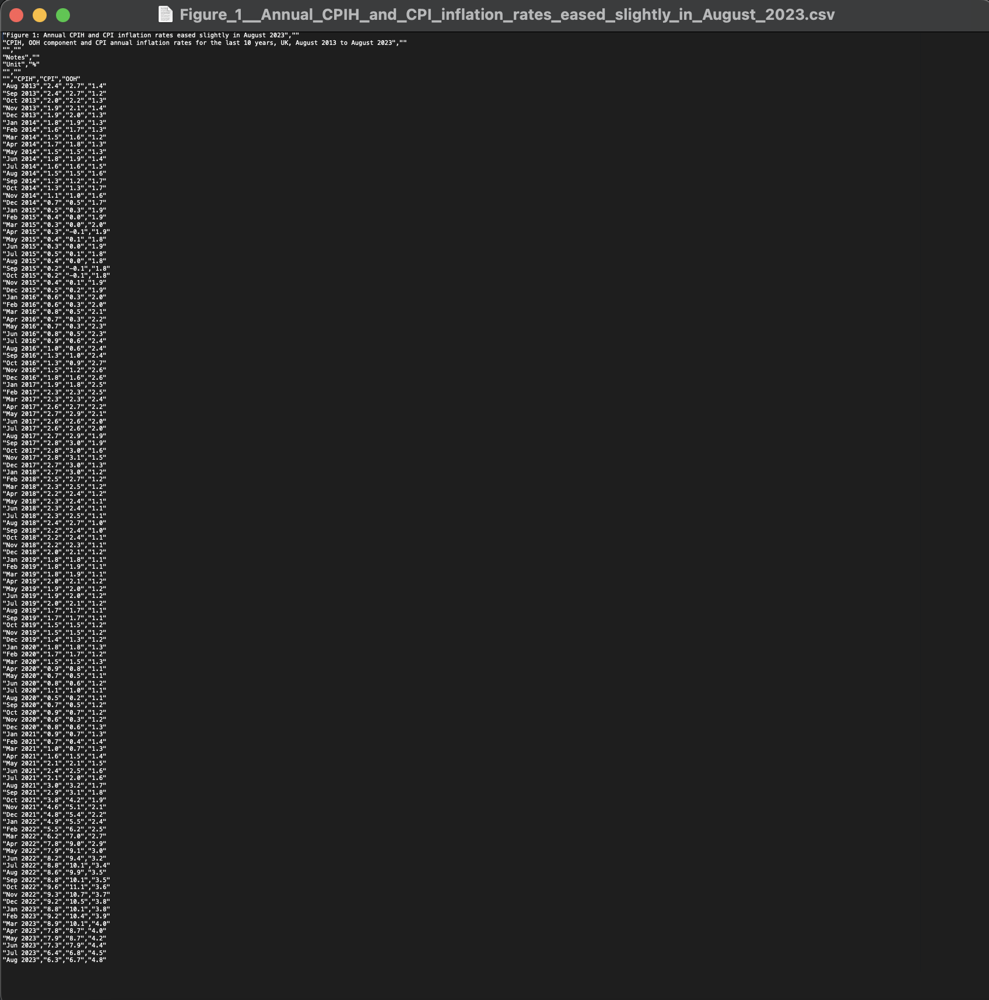
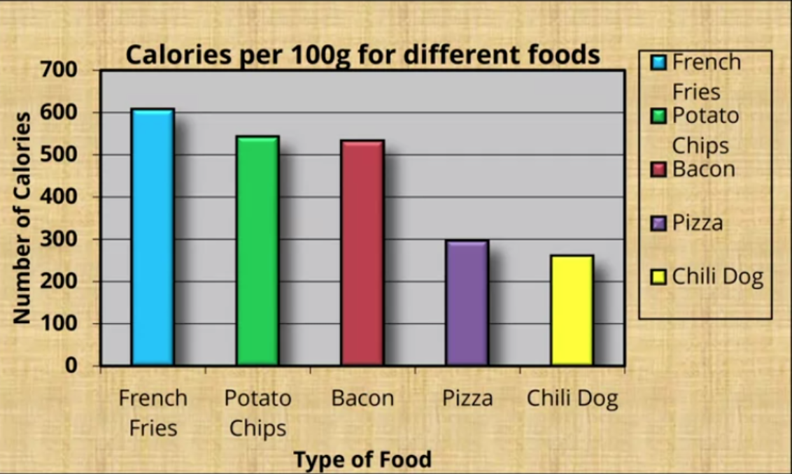
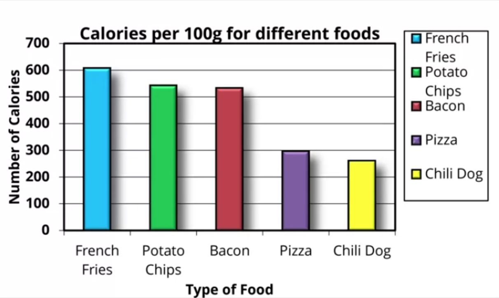
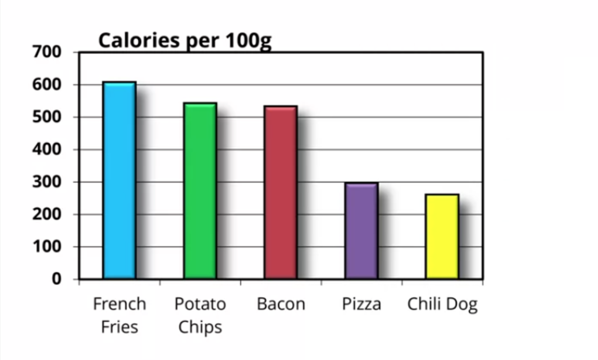
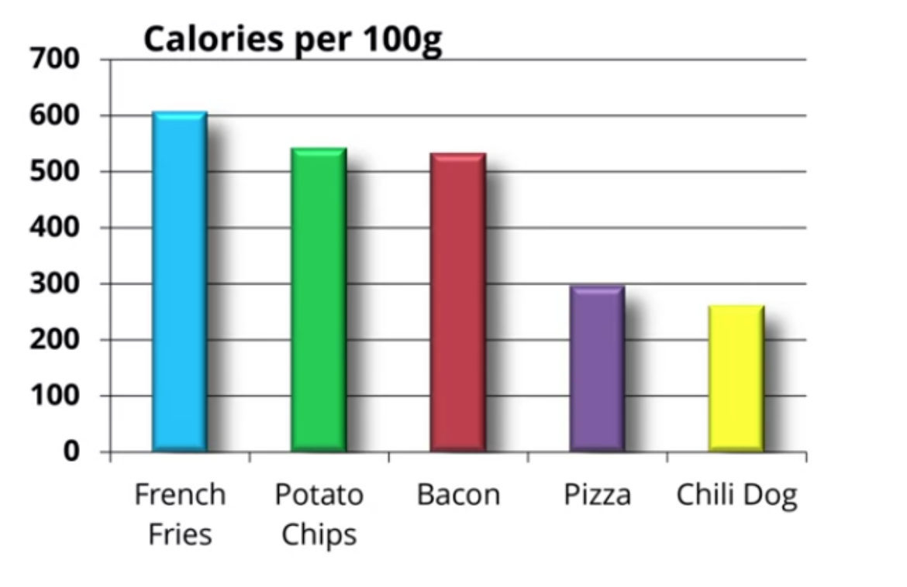
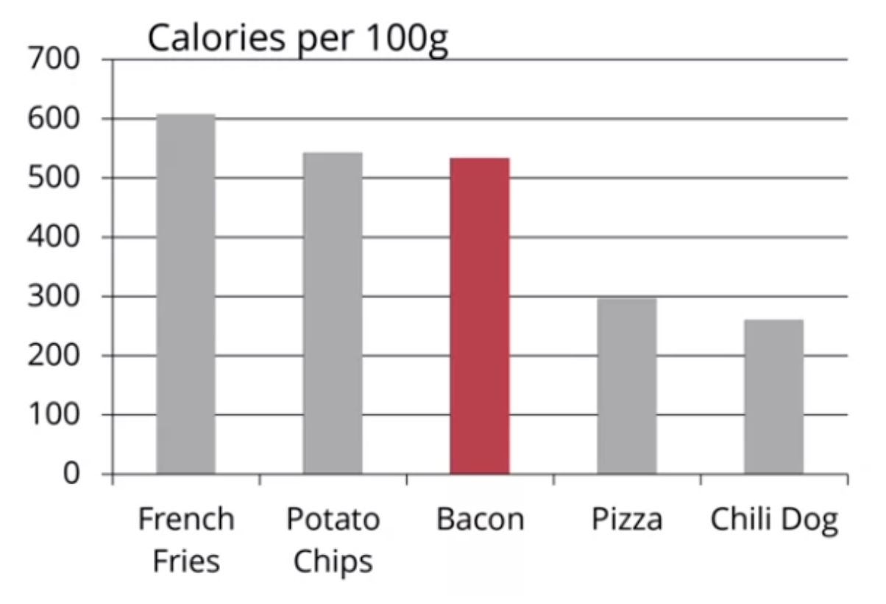
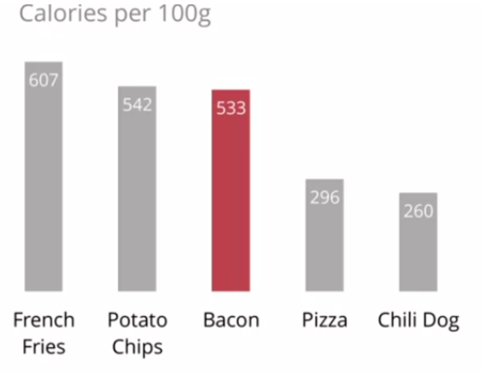
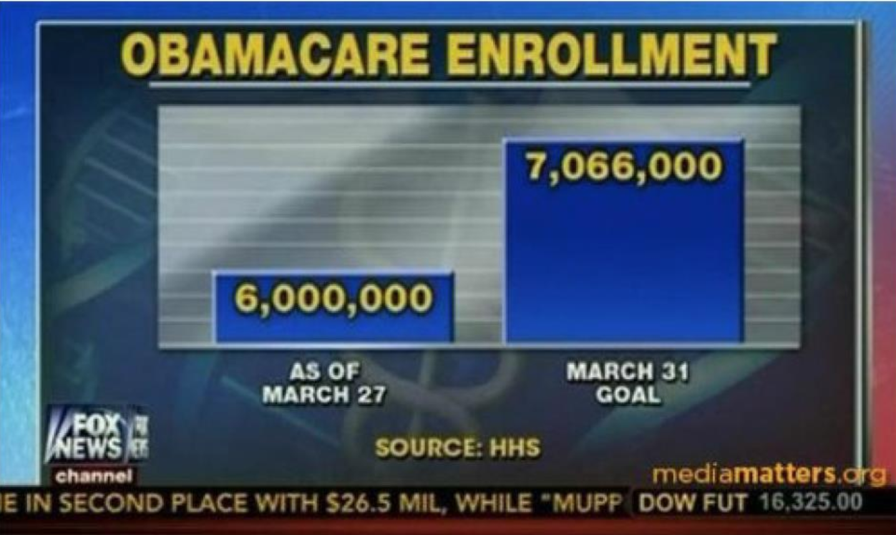
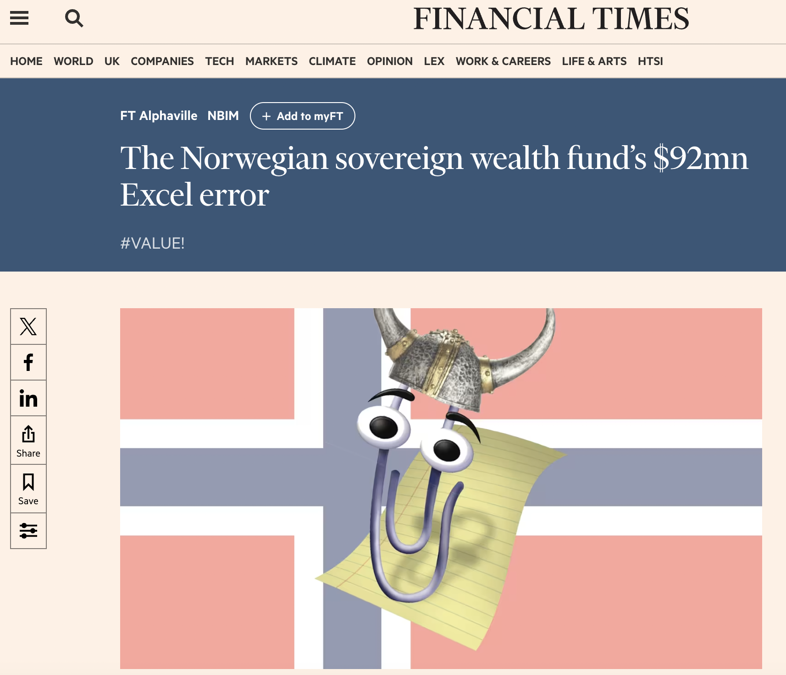
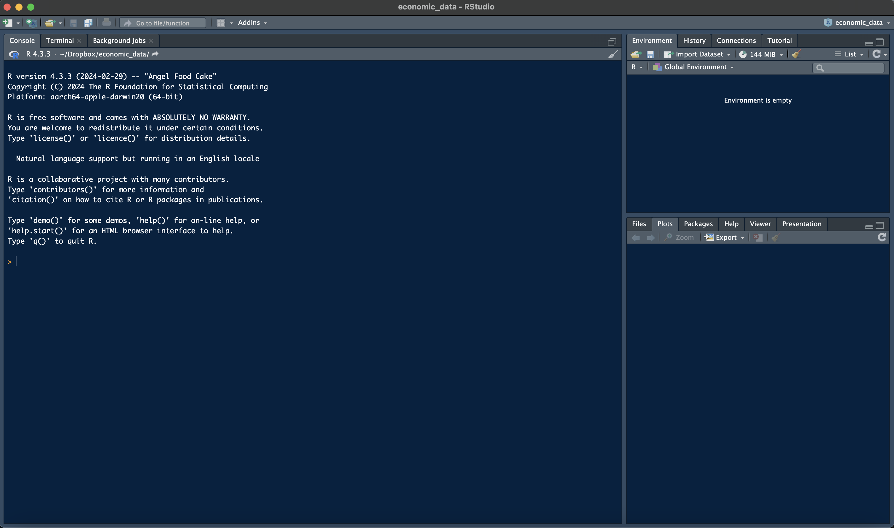

```{r xaringan-themer, include=FALSE, warning=FALSE}
options(htmltools.dir.version = FALSE)

library(xaringanthemer)
style_mono_accent(
  base_color          = "#1D3557",   # deep navy
  header_font_google  = google_font("Lato"),
  text_font_google    = google_font("Lato"),
  code_font_google    = google_font("Fira Mono"),
  text_font_size      = "1.1rem"
)
```


```{r setup, include=FALSE, warning=FALSE, message=FALSE}
knitr::opts_chunk$set(
  fig.width  = 11,
  fig.height = 6,
  fig.retina = 5,
  fig.align  = "center",
  message    = FALSE,
  warning    = FALSE,
  comment    = "",
  cache      = FALSE,
  small.mar  = TRUE
)

library(flipbookr)
library(tidyverse)
library(readxl)
library(scales)
library(ggthemes)
library(xaringanExtra)

xaringanExtra::use_tile_view()
xaringanExtra::use_progress_bar(color = "#E63946", location = "bottom", height = "3px")
xaringanExtra::use_extra_styles(hover_code_line = TRUE, mute_unhighlighted_code = TRUE)

# Reusable lecture theme
theme_lecture <- function() {
  theme_minimal(base_size = 14) +
  theme(
    panel.grid.minor   = element_blank(),
    panel.grid.major.x = element_blank(),
    plot.title         = element_text(face = "bold", size = 20),
    plot.subtitle      = element_text(size = 14, color = "grey40"),
    plot.caption       = element_text(hjust = 0, color = "grey50", size = 10),
    axis.title         = element_text(size = 13),
    axis.text          = element_text(size = 11),
    plot.background    = element_rect(fill = "transparent", colour = NA),
    panel.background   = element_rect(fill = "transparent", colour = NA),
    legend.background  = element_rect(fill = "transparent"),
    legend.key         = element_blank()
  )
}

theme_set(theme_lecture())

# Load and clean inflation data
df <- read_csv("../data/cpi_annual_2013_2026.csv") %>%
  rename(p = CPI) %>%
  mutate(date = as.Date(paste("01", date), format = "%d %b %Y"))

# Find peak for annotation
peak <- df %>% filter(p == max(p, na.rm = TRUE))

# Build plot
p1 <- ggplot(df, aes(x = date, y = p)) +
  geom_hline(yintercept = 2, linetype = "dashed", colour = "grey70", linewidth = 0.5) +
  geom_line(linewidth = 1.2, color = "#1c5253") +
  geom_point(data = peak, aes(x = date, y = p),
             color = "#1c5253", size = 3) +
  annotate("text",
           x     = peak$date + 60,
           y     = peak$p + 0.4,
           label = paste0("Peak: ", round(peak$p, 1), "%\n", format(peak$date, "%b %Y")),
           size  = 3.5, hjust = 0, color = "grey30") +
  annotate("text",
           x     = as.Date("2013-02-01"),
           y     = 2.5,
           label = "BoE target (2%)",
           size  = 3, hjust = 0, color = "grey50") +
  scale_x_date(date_breaks = "1 year", date_labels = "%Y") +
  scale_y_continuous(labels = scales::label_number(suffix = "%")) +
  labs(
    title    = "UK inflation surged to over 11% in late 2022, then fell back",
    subtitle = "Annual CPI inflation rate, Jan. 2013 – Aug. 2026",
    x        = NULL,
    y        = "Annual rate",
    caption  = "Source: ONS."
  )
```


```{css, eval=TRUE, echo=FALSE}
.remark-code { line-height: 1.5; font-size: 80% }

@media print {
  .has-continuation { display: block; }
}

code.r.hljs.remark-code {
  position: relative;
  overflow-x: hidden;
}

code.r.hljs.remark-code:hover {
  overflow-x: visible;
  width: 500px;
  border-style: solid;
}

.slide-caption {
  text-align: center;
  font-size: 0.75em;
  color: #666;
  margin-top: 8px;
}

blockquote {
  border-left: 4px solid #457B9D;
  background-color: #f8f9fa;
  padding: 0.7em 1.2em;
  margin: 0.8em 0;
  border-radius: 0 4px 4px 0;
  color: #333;
}

.callout {
  background-color: #f0f4f8;
  border-left: 4px solid #1D3557;
  padding: 0.8em 1.2em;
  margin: 1em 0;
  border-radius: 0 4px 4px 0;
  font-size: 0.95em;
}

.formula {
  font-size: 1.9em;
  font-weight: bold;
  margin: 0.4em 0;
  line-height: 1.4;
}

.agenda {
  font-size: 1.25em;
  line-height: 2.4;
  margin-top: 0.5em;
}
```


---

class: center, middle

### Today

.agenda[
Why economic data?

How this unit works

Data visualisation basics

What is R?

Use of AI
]


---

class: inverse, center, middle

# Why Economic Data?


---

## A Scenario

You work for the Bank of England and your boss asks you for an update on the latest inflation numbers.

.callout[
*"I need to know:*

- *How much are prices increasing?*
- *How much have prices increased over the last decade?*
- *Why are prices going up?*
- *What can we do to stop prices going up?*

*Get back to me in an hour."*
]

$\Rightarrow$ What do you need to know to approach this question?


---

## What do you need to know?

- What is inflation?

- How are prices measured? 

- How is the price level measured?

- How is inflation defined?

- Where can I find reliable data on prices?

- How can I access these data?

- How do I calculate inflation from data on prices?

- How do I analyse the data?

- How do I present the data and communicate the insights?

- How can I make the analysis reproducible?


---

## Answers

The answers require the skills developed in this course.

- Knowledge of concepts and definitions: How is inflation measured?

- Knowledge of data sources in economics and how economic data is collected.

- Software skills to work with datasets and organise data.

- Data visualisation and description skills.


---

```{r echo=FALSE}
p1
```


---

## Reproducibility

*Your boss liked your analysis!*

*In fact, they liked it so much that they want to construct the same chart but beginning in 2003.*

*No problem!*

*You wrote a computer script that runs the analysis that we can share with them.*

*You give them the script and they can re-run every step of the analysis themselves.*


Being able to reproduce the analysis is extremely important:

- Saves a lot of time.

- Makes mistakes less likely.

- Facilitates sharing the analysis.


---

```{r echo=TRUE, eval=FALSE}
df <- read_csv("../data/cpi_annual_2013_2026.csv") %>%
  rename(p = CPI) %>%
  mutate(date = as.Date(paste("01", date), format = "%d %b %Y"))

ggplot(df, aes(x = date, y = p)) +
  geom_hline(yintercept = 2, linetype = "dashed", colour = "grey70", linewidth = 0.5) +
  geom_line(linewidth = 1.2, color = "#1c5253") +
  scale_x_date(date_breaks = "1 year", date_labels = "%Y") +
  scale_y_continuous(labels = scales::label_number(suffix = "%")) +
  labs(title = "UK inflation surged to over 11% in late 2022, then fell back",
       subtitle = "Annual CPI inflation rate, Jan. 2013 – Aug. 2026",
       x = NULL, y = "Annual rate", caption = "Source: ONS.")
```


---

## Topics

This unit is organized around topics.

- Demographic data

- Economic activity

- Wellbeing

- Prices

- Unemployment

- Inequality

- Money


---

class: inverse, center, middle

# How this unit works

---


## Structure of the unit

.pull-left[
**Learning method:**

- Lectures & background reading.
- Work on projects at home and in labs.
- Give & receive feedback.
- Test understanding with a weekly quiz.
]

.pull-right[
**Learning objectives:**

- Economic concepts and definitions.
- Software: R
- Data visualisation and description.
]


---

## Lectures and labs

.pull-left[
**Lectures:**

- 1 hour.
- Recorded.
- Provides an overview of the topic.
]

.pull-right[
**Lab sessions:**

- 2 hours.
- Attendance recorded.
- Part 1: Two visualisations on the topic of the week.
- Part 2: Individual feedback and support.
- Use the labs to work on the mini projects.
]


---

## Formative assessments

.pull-left[
**What:**

- Will not affect your mark.
- Four mini projects.
- Weekly quiz questions.
]

.pull-right[
**Feedback:**

- Mini projects: from us the teaching team and from peers.
- Quiz questions: solutions at the end of the week.
]


---

## Mini projects

Mini-projects are open-ended exercises in which you investigate a question of your own choosing, applying the skills and methods covered in this course.

.callout[
Your task is to analyse the change in the number of people in your assigned country since the 1980s. Your answer could cover topics such as population stocks and flows, changes in fertility, migration, emigration, mortality or life expectancy. The task description is intentionally vague: you decide on the precise time periods and the exact focus of your assignment. Use around 400 words and 2 visualisations for this exercise. All visualisations should be made from scratch using R. Data can be drawn from sources such as Eurostat, OECD, the World Bank, or national statistical offices.
]

**Rules:**

- 400 words and 2 visualisations.

- All visualisations should be made from scratch.

- Use data from one of the following sources: Eurostat, OECD, Bank of England, IMF, World Bank Data, The Maddison Project.

- You are assigned to one of four countries.


---


## Summative assessment


The summative assessment consists of four “mini-project” exercises, two of which are based on the formative mini-projects.

**What:**

- Coursework project after teaching finishes.

- Released on December 2.

- Deadline December 9.


---

## Marking criteria

Five criteria are assessed for each mini-project:

1. Can locate and analyse relevant data and produce visualizations from scratch using R.

2. Describes the data and sources in sufficient detail for someone to reproduce the analysis. Each variable is defined: (i) how it is defined and (ii) what the underlying data source is.

3. Justifies the choice of data sources and variables. Why was a particular variable chosen? E.g., GDP adjusted for PPP for international comparisons.

4. Description of the main pattern is included but non-speculative — no causal claims. Close link between analysis and discussion. Clearly stated objective or question.

5. Figure follows data visualisation principles: self-contained with a source note and appropriate chart type; descriptive title and labelled axes; no visual clutter, shadows, or superfluous elements.


---


## Blackboard

- Key unit information.

- Announcements.

- Contact us.

- Learning materials.

- Live sessions.

- Discussion board.

- Reading list.

- Assessments.


---

## Use of AI

AI tools can be helpful for coding — but how you use them matters.

.pull-left[
**Early in the unit: avoid AI**

- You need to build understanding from scratch.
- Using AI before you understand the basics means you cannot judge whether the output is correct.
- Struggle is part of learning.
]

.pull-right[
**Later in the unit: coding suggestions only**

- AI can help with syntax, debugging, and efficiency once you have a foundation.
- Never use AI to write your text. All writing should be yours.
- You must understand every line of code you submit.
]

.callout[
**Important**: submitted code may be checked. If you cannot explain what your code does, that is a problem.
]

---

class: inverse, center, middle

# Data Visualisation Basics


---

<div style="text-align: center; margin-top: 50px;">
  
  <p class="slide-caption">Raw data in tabular form — hard to see patterns at a glance.</p>
</div>


---

```{r echo=FALSE}
p1
```

<p class="slide-caption">The same information as a chart — the trend is immediately visible.</p>


---

## Charts and Economic Data

Plotting economic data is important:

- Highlights patterns and trends.

- Facilitates comparison across groups or over time.

- Helps communicate insights from economic analysis. <br><br>

What is a good chart? There are no simple rules of thumb.

A good chart requires judgment and domain knowledge. It also depends on who is looking at it, and why.

Human perception matters: position-based encodings (line and bar charts) are read more accurately than angles or areas (pie charts). This follows from research by Cleveland and McGill on how we decode visual information.

We will consider two widely used principles.


---

class: inverse, center, middle

.formula[
Data-to-ink ratio = Data / Ink
]

---


<div style="text-align: center; margin-top: 100px;">
  
  <p class="slide-caption">Starting point — heavy use of non-data ink.</p>
</div>


---


<div style="text-align: center; margin-top: 100px;">
  
  <p class="slide-caption">Remove the background fill.</p>
</div>


---


<div style="text-align: center; margin-top: 100px;">
  
  <p class="slide-caption">Remove the grid lines.</p>
</div>


---


<div style="text-align: center; margin-top: 100px;">
  
  <p class="slide-caption">Remove the border.</p>
</div>


---


<div style="text-align: center; margin-top: 100px;">
  
  <p class="slide-caption">Remove redundant fill colours.</p>
</div>


---

<div style="text-align: center; margin-top: 100px;">
  
  <p class="slide-caption">Final result — maximum data-to-ink ratio. A useful guide, though some contextual elements (light grid lines) can still aid reading.</p>
</div>


---

class: inverse, center, middle

.formula[
Lie factor = Visual size of effect / Size of effect in data
]


---

<div style="text-align: center; margin-top: 100px;">
  
  <p class="slide-caption">A truncated y-axis makes a small change look dramatic — lie factor well above 1. Note: restricting the axis range is not always deceptive; intent and context matter.</p>
</div>

---


class: inverse, center, middle

# Introduction to R

---


## Why programming?

**Automation**: Scripts automate repetitive tasks like data cleaning, transformation, and analysis.

**Reproducibility**: Scripts offer a clear, documented workflow that's easy to share and reproduce.

**Error Reduction**: Manual data entry and copying formulas can easily introduce errors.<br><br>

For these reasons, we will learn how to write computer scripts to analyse data in this course.

Python and R are the two most widely used languages for data analysis.

We will use R via RStudio, which provides a well-developed environment for statistics and econometrics.


---

<div style="text-align: center; margin-top: 80px;">
  
  <p class="slide-caption"></p>
</div>


---

<div style="text-align: center; margin-top: 80px;">
  
  <p class="slide-caption"></p>
</div>


---


class: inverse, center, middle

# Summary


---

## Summary

You should know:

- How this course is organized.

- Why we need to learn about economic data.

- Two principles of data visualisation.

- What R is.

- How to use AI responsibly in this unit. <br><br>


**Next week**: Overview of demographic data.


---

class: inverse, center, middle

# See you in the labs!

Questions? $\texttt{sebastian.ellingsen@bristol.ac.uk}$
