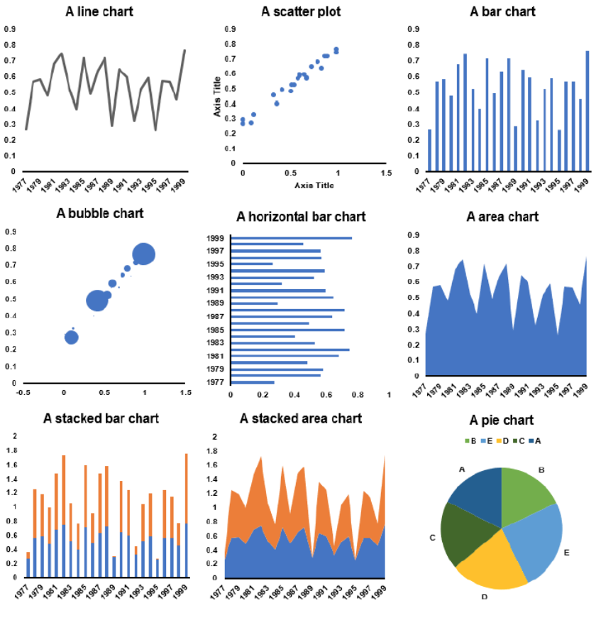

```{r xaringan-themer, include=FALSE, warning=FALSE}
options(htmltools.dir.version = FALSE)

library(xaringanthemer)
style_mono_accent(
  base_color = "#1c5253")

options(htmltools.dir.version = FALSE)

# This is the recommended set up for flipbooks
# you might think about setting cache to TRUE as you gain practice --- building flipbooks from scratch can be time consuming
knitr::opts_chunk$set(fig.width = 6, fig.align="center",small.mar=TRUE, fig.retina = 5,message = FALSE, warning = FALSE, comment = "", cache = F)
library(flipbookr)
library(tidyverse)
library(readxl)
library(scales)
library(ggthemes)
```


```{css, eval = TRUE, echo = FALSE}
.remark-code{line-height: 1.5; font-size: 80%}

@media print {
  .has-continuation {
    display: block;
  }
}

code.r.hljs.remark-code{
  position: relative;
  overflow-x: hidden;
}


code.r.hljs.remark-code:hover{
  overflow-x:visible;
  width: 500px;
  border-style: solid;
}
```

<style>

.center2 {
  margin: 0;
  position: absolute;
  top: 50%;
  left: 50%;
  -ms-transform: translate(-50%, -50%);
  transform: translate(-50%, -50%);
}

</style>


---
class: inverse, center, middle

# Coursework 


---

## Coursework structure

1. The 20 quiz questions (10%)

2. Two of the four mini projects chosen at random (40%) 

3. Two new mini projects (40%) 

4. A feedback exercise (10%) 


---

## Coursework structure

The coursework will be uploaded on **Wednesday November 27**. 

It should be handed in on **Wednesday December 4**. 

All data work should be done from scratch. 

The final project should be handed in as *one pdf document*. 

It must contain your student number. 


---

## Coursework evaluation


For the mini projects the below marking criteria are applied:

Data: informed choice of data/measures. 

Data visualisations: self-explanatory, clear, appropriate type.

Description: concise, non-speculative.

Coherence: close link between text and visualisations, coherent, readability.<br><br>

**Key**: Both choice of visualisation and data/measures should be informed by the question/task.


---
class: inverse, center, middle

# Revision 


---

## Presenting data

**Table**: values represented by text.

- $+$ Precise

- $-$ Cognitively demanding (can only show a limited number of data points)<br><br>

**Chart**: values represented by position, shape, or colour.

- $+$ Less demanding: can show many data points.

- $-$ Imprecise


---


## Data visualization

We have seen some important principles for visualization:

- The *data to ink ratio*.

- The *lie factor*.

- Reproducibility $\Rightarrow$ Programming.


---


## Chart recommendations

Trends over time: line charts.

Correlation between two variables: scatter plot.

Compare values across (categorical groups): bar chart.

Series that constitute a whole: area chart/bars.

Part of a whole: A pie chart.


---


<div style="text-align: center; margin-top: 50px;">
  
</div>


---

## Data sources we have used

Register data (administrative data)

- Part of a register/system.

- Mostly collected for administrative. purposes<br><br>

Sample survey data

- Survey (view/look/investigate) a sample (part/subset) of the population.<br><br>

Census survey data

- Survey the entire population.


---
## Data about people

Population data you have worked with in this course is typically an estimate.

- Net migration and natural population growth.

- Also a statistical discrepancy.<br><br>

We also saw important measures of fertility and life expectancy.


---

## Measuring economic activity

We saw three ways to measure GDP:

- Sum of all *spending flows*: expenditure approach.

- Sum of all *income flows*: income approach.

- Sum of all *production flows*: output approach.<br><br>

This enables us to decompose GDP in different ways. 

GDP is based on the national account and there are international standards for what is included in GDP.

GDP is used for measuring economic growth, defining business cycles, measuring productivity, measuring well-being.


---
## Measuring well-being

Subjective well-being measures:

- ”Overall, how satisfied are you with your life nowadays?” (life satisfaction).

- ”Overall, how happy did you feel yesterday?” (happiness).<br><br>


Objective wellbeing measures:

- Use various proxies.

- Environment: Air and water Pollution

- Crime and safety: Crime rates

- Education: Completed education

- Health: Life expectancy

- Example: Human Development Index (HDI), education, life expectancy.

---


## Prices over time

A price index as a weighted aggregation of many prices.

Two main types: Paasche and Laspeyres price index 

- Considering the price of an initial basket of goods vs. updating the basket.

- Chain linking.<br><br>

We used price indices for two purposes:

- Calculate the rate of inflation.

- Convert nominal values from nominal to real.


---


## Prices across space

Goal: Eliminate price differences across countries.

- Just like we eliminated price differences across time, with the consumer price index.

Solution: Compare the price of representative basket of goods across countries.

Purchasing power: how many baskets of the representative basket of goods can we purchase.


---

## The labour force

**The labour force = Unemployed + Employed**<br><br>

*Unemployed* (ILO definition) 

- Without a job, have been actively seeking work in the past four weeks and are available to start work in the next two weeks.

- Out of work, have found a job and are waiting to start it in the next two weeks.<br><br>

*Employed* (ILO definition)

- Work at least one hour for pay in a week.

- Temporarily away from jobs.

- On Government-supported training/employment programs.

- Unpaid family work.<br><br>

We explored the role of seasonality adjustment in monthly time series data.


---

## Inequality

Most popular quantification:

- Gini coefficient: smaller value $\Rightarrow$ lower inequality.<br><br>

Alternatives:

- Income shares

- 20:20 ratio (top 20 vs bottom 20)

- Wage share (from GDP income approach)<br><br>

We saw how to work on data on inequality and how to calculate the Gini index.

---


## Interest rates 

**Policy Rate**

- Set by the central bank

- Often based on an inflation target<br><br>


**Interbank Interest Rate**

- Banks charge each other

- UK: "Sterling OverNight Indexed Average" or "SONIA"<br><br>


**Commercial lending rate**

- depends on repayment schedule, security/information, flexibility.


---

## Exchange rates

What determines the exchange rate?

- Financial institutions trade currencies on the foreign exchange market (forex).

- ... and then buy and sell them to us (we pay a premium).<br><br>

**Appreciates**: the currency increases in value – ex. 1£ from costing 1.39$ to 1.45$

**Depreciates**: the currency loses in value – ex. 1£ from costing 1.39$ to 1.28$<br><br>

Exchange rates, like many other prices, are determined by supply and demand.


---
class: inverse, center, middle

# What Comes Next 


---
## What comes next

We have barely scraped the surface of the use of economic data in this course.

1. Econometrics. 

2. Programming in other languages.

3. More complex data structures.


---
## Econometrics 

So far we have focused on economic data as an object of analysis. 

Moving forward you the approach will be slightly different. 

We will assume the data are a realization from some probability distribution:

$$F(\mu, \sigma)$$

We are faced with a sample of size $N$ from this distribution denoted $\{x_i\}_{i=1}^N$.

Our task is to learn about the population model $F(\mu, \sigma)$ using the sample. 

To do this precisely, we need to learn more probability theory and statistics.

Econometrics is the study of statistical properties of economic data. 


---

## Programming in other languages

This course has provided an introduction to programming. 

This is widely used in economics, but the languages depend on application: 

- Matlab for computational economics. 

- Stata for applied econometrics. 

- Python/R for everything. <br><br>

In practice the syntax differs but it will be familiar if you know R. 

The workflow is always the same: You write a script, and run it in the console. 


---
## Data structures

So far all the data we have worked with have a very clean structure.

They have been collected by professionals for the purpose of analysis.

The come in familiar formats and are cleaned.

We don't need to put in that much work to get the data tidied.

- Observations as rows and variables as columns.<br><br>

Many useful data sources do not come in that format.


---
## Spatial data

Spatial data provides the information that identifies the location of features on Earth.<br><br>

This has wide applicability in economics. 

- Each entry in your data is indexed by a location.

- Can calculate distances between observations.

- Calculate the intersection between areas

- Match datasets by location etc. <br><br>

Other examples: 

- Monitoring agricultural productivity.

- Measuring consumption through car parking occupancy

- Mobility data from cellphone location.


---

.center2[
```{r echo = FALSE, fig.height = 9, fig.width = 9.3}
knitr::include_graphics("images/nightlights_europe.png")
```
]


---

.center2[
```{r echo = FALSE, fig.height = 9, fig.width = 9.3}
knitr::include_graphics("images/bristol_nightlights.png")
```
]


---
## Text as data

Another widely used unconventional data source used in economics is text. 

- Any information that is stored and written in a text format. 

- It can be anything from emails to blog posts to social media posts, online forum comments, etc.<br><br>

These kinds of data become more and more useful as more of the economy is digital.<br><br>

There are several examples in economics. 

- Measure inflation posted prices on websites. 

- Measuring economic sentiments from social media posts. 

- Measuring media bias/political slant etc. 


---
## Alternative data 

Working on these kinds of data sources requires deeper programming knowledge. 

- The data sources are unstructured, and it takes extensive work to get them into a useful format.

- More computational resources available to work on these data in the last decade. <br><br>

Novel statistical models to understand the properties of these data. 

- Often very high dimensional.

- Need tools to reduce the dimension, e.g. machine learning. <br><br>


$\Rightarrow$ There are plenty of opportunities to dig deeper into all these topics in the economics program.


---

class: inverse, center, middle

# See you in the labs!

Questions? $\texttt{sebastian.ellingsen@bristol.ac.uk}$.


