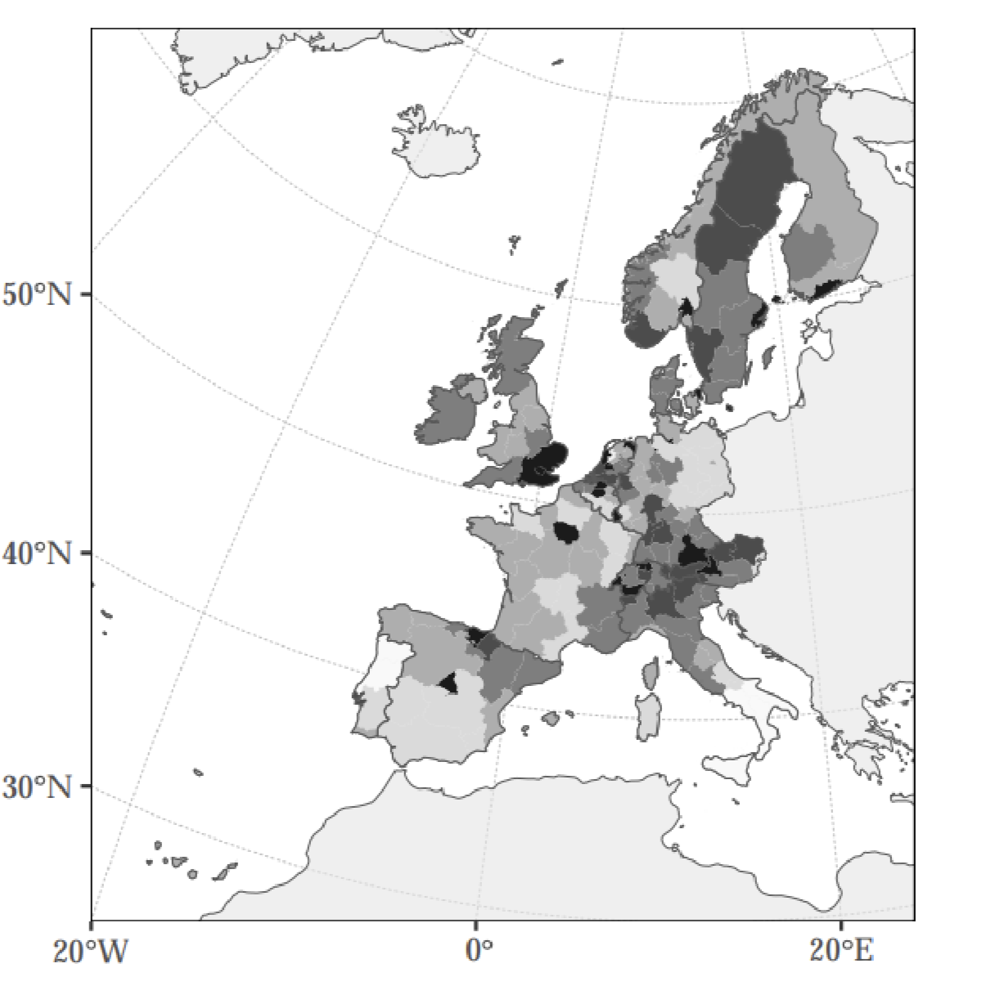

```{r xaringan-themer, include=FALSE, warning=FALSE}
options(htmltools.dir.version = FALSE)

library(xaringanthemer)
style_mono_accent(base_color = "#43418A")

options(htmltools.dir.version = FALSE)

# This is a recommended set up for flipbooks
knitr::opts_chunk$set(fig.width = 6, small.mar=TRUE, fig.retina = 5,message = FALSE, warning = FALSE, comment = "", cache = F)
library(flipbookr)
library(tidyverse)
library(readxl)
library(scales)
library(ggthemes)
```


```{css, eval = TRUE, echo = FALSE}
.remark-code{line-height: 1.5; font-size: 80%}

@media print {
  .has-continuation {
    display: block;
  }
}

code.r.hljs.remark-code{
  position: relative;
  overflow-x: hidden;
}


code.r.hljs.remark-code:hover{
  overflow-x:visible;
  width: 500px;
  border-style: solid;
}

.centered-content {
  display: flex;
  flex-direction: column;
  justify-content: center;
  align-items: center;
  height: 60vh; /* Adjust based on your needs */
  text-align: center;
  margin-top: auto;
  margin-bottom: auto;
}

```


## Outline of the Lecture 


 <br><br>
  <br><br>

What is this unit about?  


<br><br>  


How is the unit organized?  


---

class: inverse, center, middle

# What is This Unit About?


---

## Motivation

 <br><br>
  <br><br>

Production, trade and income are highly unevenly distributed across space.

- Agglomeration in cities (∼50 per cent of the world’s population, expected to sharply increase)
- Geographical sectoral specialization (e.g. soybean production in Brazil, Silicon Valley in the US, manufacturing in China, ...)

Since the mid-1990s, an ever-growing number of studies established the field of spatial economics


---

## 


---

## 


---

## 


---

## 


---

## 




---

## 


---

## 


---

## Why is Economic Activity Unevenly Distributed?


<!-- CRONON higlights two main explanations. -->

**First-nature characteristics**:

- Physical geography (mountains, rivers, coastlines, terrain)
- Climate and natural resources (fertile land, mineral deposits)
- Accessibility to natural harbors or waterways<br><br>

<br>

**Second-nature characteristcs**

- Market access
- Infrastructure (roads, cities, ports)
- Agglomeration effects and social networks<br><br>

<br>
<!-- how do economic interactions between individuals shape the location of economic activity? -->

**Spatial equilibrium**: The spatial distribution of agents is interpreted as the equilibrium of agents optimizing and interacting in this kind of environment. 


---


## Agglomeration and Dispersion Forces


It is useful to think of spatial equilibrium as the balance between agglomeration and dispersion forces. 

**Agglomeration forces**: 

- Create incentives to co-locate economic activity: transportation costs, labor pooling, knowledge spillovers, and dense markets.

**Dispersion forces**: 

- Create incentives to spread out: Rising land rents, congestion, competition for local resources.

<br>


The relative strength of **agglomeration** and **dispersion** forces underlies many key economic outcomes. 

- It determines the impact of place-based policies, infrastructure investment, land-use regulation, investment in local amenities, local taxation, e.g.
- The impacts are mediated by agglomeration and dispersion forces since factors and products are mobile.


---


## Spatial Scale in Economic Geography

Spatial scale matters: from regions or states within countries to neighbourhoods within cities.

**Quantitative Economic Geography**:

- Focus: Regional differences in economic activity  
- Key linkages: Trade and migration

<br>

**Quantitative Urban Economics**:

- Focus: Differences in activity *within* cities  
- Key linkages: Commuting and land use

<br>

Different agglomeration and dispersion forces operate at these scales, yet the models used are conceptually similar.

---


## Models in Quantitative Economic Geography


Why Models?

- Provide predictions we can take to the data  
- Enable quantification and counterfactual analysis
- Help highlight key identification and inference challenges

<br>

Modern spatial economics borrows heavily from international trade, which has long modeled interactions between people and places.  

  - Realistic geographies
  - Rich interactions
  - Analytical tractability


<!-- --- -->

<!-- - Spatial economics has evolved over recent decades to meet these goals.   -->
<!-- - We’ll look at **classic examples** in this unit.   -->
<!-- - You’ll see that most models share a **common framework**,   -->
<!--   making the field **highly accessible** once you master the basics. -->


<!-- why models? predictions to take to the data, qunatification and counterfactuals, highligting identification and inference challenges.  -->

<!-- modern spatial economics borrows a lot from international trade, they have spent decades modelling and studying relevant interactions between people.  -->

<!-- need to have realistic geographies, rich interactions among people, but still tractable, not easy -->

<!-- spatial eocnomics havae been developed over the last decades with this in mind  -->

<!-- we will see some classic examples in this unit  -->

<!-- will try to emphasize that the models are all fairly similar which will make the field fairly accessible to you if you know the basic frameowrk.  -->


---

## What is this Unit About?

<br><br>

We will focus on **three main objectives**:

1. Explain the location of economic activity 
2. Study the effects of shocks and policies in spatial environments  
3. Understand the core models used in this field  

The goal is to provide you with the tools to read, analyze, and eventually contribute to frontier research in economic geography.

---


class: inverse, center, middle

# How is the Unit Organized?


---


## Roadmap

**Regional Economics:**
- Workhorse model: Allen & Arkolakis (2014)
- Applications:
  - Redding & Sturm (2008)
  - Donaldson (2016)
  - Identification: Allen & Arkolakis (2022)

<br>

**Urban Economics:** 
- Workhorse model: Redding & Rossi-Hansberg (2017)
- Applications:
  - Redding, Sturm & Wolf (2016)
  - Redding & Sturm (forthcoming)

<br>

Lectures: 2 hours on Mondays. 
Computer Labs: 1 hour on Fridays.

---


## Assessment

Each student will give a **40-minute presentation** on a topic in *economic geography*.

Option 1: Research Idea

- Present a novel research question  
- Review and position your idea within the existing literature  
- Discuss feasibility and planned research design (theoretical or empirical)  
- Reflect on potential challenges and how to address them  

<br>

Option 2: Referee Report

- Critically review an unpublished paper in the context of the literature  
- Explain the research question, model, and identification strategy  
- Summarize the main findings and assess the paper’s contribution  
- Offer constructive feedback and suggestions for improvement


---


## References

Ahlfeldt, Gabriel M., Stephen J. Redding, Daniel M. Sturm, and Nikolaus Wolf. 2015. “The Economics of Density: Evidence From the Berlin Wall.” *Econometrica* 83 (6): 2127–89. 

Allen, Treb, and Costas Arkolakis. 2014. “Trade and the Topography of the Spatial Economy.” *The Quarterly Journal of Economics* 129 (3): 1085–1140.

Donaldson, Dave. 2018. “Railroads of the Raj: Estimating the Impact of Transportation Infrastructure.” *American Economic Review* 108 (4-5): 899–934.

Redding, Stephen J, and Daniel M Sturm. 2008. “The Costs of Remoteness: Evidence from German Division and Reunification.” *American Economic Review* 98 (5): 1766–97.

Redding, Stephen J, and Esteban Rossi-Hansberg. 2017. “Quantitative Spatial Economics.” *Annual Review of Economics*, no. 9: 21–58.

Redding, Stephen J. 2024. ”Quantitative Urban Economics.” *NBER Working Paper* 33130.

Redding, Stephen J, and Daniel M Sturm. 2024. “Neighborhood Effects: Evidence from Wartime Destruction in London.” *Manuscript*


<!-- - will cover these papers in more depth -->

<!-- second part of the course, more urban economics  -->

<!-- - will cover these papers in more depth -->

<!-- Time matters, many factors that are exogenous in the short run are maleable over the very long-run. -->


<!-- ## Some Questions we will Encounter -->

<!-- why do cities form and how are they sustained? -->

<!-- how do places shape individuals outcomes? -->

<!-- how do improvements in amenities, local productivity, transportation infrastructure shape the spatial distriution of cities? -->

<!-- is the spatial distribution uniquely determined? -->

<!-- how do shocks affect the spatial distribution of economic activity? -->

<!-- all these -->


<!-- --- -->

<!-- ##  -->


<!-- the questions  -->

<!-- some facts  -->

<!-- some explanations -->

<!-- rich models to incorporate these issues  -->

<!-- standard lens through which to understand these questions, even if not explicit reference to the formal model -->

<!-- will cover the basic model, look at some extensions and identify parameters -->

<!-- then identificaton informed by the models -->

<!-- identifying parameters in these models  -->

<!-- reduced form manner to capture exogenous productivity and amenities, and endogneous agglmoeration forces  -->


<!-- emphsasis on tractable models that fit the data and link closely to reduced form approaches  -->

<!-- - some factors are not really realistic -->


<!-- unevenly distributed, within cities and across cities  -->

<!-- - quantitative spatial economics, intro and motivating facts, spatial scale matters, different margins of adjustment matter as a result, rich enough that we can map it to data and evaluate realistic counterfacturals, spatial distribution determine by agglomeration forces, amenities and productivivies, location relative to other places  -->

<!-- - quantitative regional economics, model, applications, allen and arkolakis, redding and sturm,  -->

<!-- - quantitative urban economics, model, empirical applications, ahlfeldt et al, redding and sturm making a metropolis  -->

<!-- - open areas where we should know more,  -->


<!-- Final lecture on data, how to work on it, calculating mobility, aggregation etc.  -->


<!-- CHECK NAGY ON historical quant, why model, relative effects, counterfactuals etc. understanding mechanisms  -->


