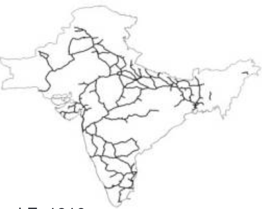

```{r xaringan-themer, include=FALSE, warning=FALSE}
options(htmltools.dir.version = FALSE)

library(xaringanthemer)
style_mono_accent(base_color = "#43418A")

options(htmltools.dir.version = FALSE)

# This is a recommended set up for flipbooks
knitr::opts_chunk$set(fig.width = 6, small.mar=TRUE, fig.retina = 5,message = FALSE, warning = FALSE, comment = "", cache = F)
library(flipbookr)
library(tidyverse)
library(readxl)
library(scales)
library(ggthemes)
library(ggpubr)
```


```{css, eval = TRUE, echo = FALSE}
.remark-code{line-height: 1.5; font-size: 80%}

@media print {
  .has-continuation {
    display: block;
  }
}

code.r.hljs.remark-code{
  position: relative;
  overflow-x: hidden;
}


code.r.hljs.remark-code:hover{
  overflow-x:visible;
  width: 500px;
  border-style: solid;
}

.centered-content {
  display: flex;
  flex-direction: column;
  justify-content: center;
  align-items: center;
  height: 60vh; /* Adjust based on your needs */
  text-align: center;
  margin-top: auto;
  margin-bottom: auto;
}

```

```{css, echo=FALSE}
details {
  background-color: #f9f9f9; /* Light grey background */
  border: 1px solid #ccc; /* Add a border */
  padding: 10px;
  border-radius: 5px;
  margin-bottom: 15px;
}

summary {
  cursor: pointer;
  font-weight: bold;
}
```


## Outline of the Lecture 


 <br><br>
  <br><br>

Quantitative regional economics


<br>

A workhorse model


<br>


Applications and extensions


---

## Quantitative Regional Economics

What governs the *distribution of economic activity* across regions?

First-Nature Geography
- Physical characteristics: forests, coasts, mountains, natural resources  
- Endowments that shape where activity *can* take place  

Second-Nature Geography 
- Agglomeration economies  
- Dispersion forces: fixed non-tradable factors, congestion, local externalities  
- Linkages across locations:  
  - Access to goods, labor, and migration opportunities  
- The equilibrium between *agglomeration* and *dispersion* determines spatial outcomes  


How can we incorporate all these forces into *tractable, quantitative models*?


---

## 


---

class: inverse, center, middle

# A Benchmark Model


---

## Geography

<!-- In what follows, I introduce the basics of the spatial model of Allen and Arkolakis 2014. -->

There are $R$ regions indexed by $i$ or $j$ (e.g. states, municipalities, or counties).<br><br>

Regions differ in their productivity: $\large \mathcal{A}=\{\bar{A}_i\}_{i=1}^R\normalsize$.

- <small> Different inate characteristics that make it more or less suitable for production.</small> <br><br>

And their amenities: $\large \mathcal{u}=\{\bar{u}_i\}_{i=1}^R\normalsize$. 

- <small> Some regions are nicer to live than others (e.g. natural amenities). </small> <br><br>

Trade between regions are subject to iceberg trade costs: $\large \mathcal{T}=\{\tau_{ij}\}_{i,j\in R}\normalsize$ where $\tau_{ij}\geq 1$.

- <small> For one unit to arrive in $j$, $\tau_{ij}$ units must be shipped from $i$. </small> <br><br>


---

## Demand 

Utility is derived from consumption in region $i$ is defined over differentiated varieties and local amenities $u_i$:
\begin{equation}
\large W_{i} =  \left(\sum_{j\in R} c_{ji}^{\frac{\sigma-1}{\sigma}}\right)^{\frac{\sigma}{\sigma-1}}u_i.\normalsize
\end{equation}
where $c_{ji}$ denotes the amount of the $j$ good consumed in $i$ and $u_i$ denote amenities. 

Each location produces a unique good (the Armington assumption).

The demand function for $c_{ji}$ is given by $c_{ji} = p_{ij}^{-\sigma}P_i^{\sigma-1}y_i$

- Note that: $\frac{\partial\ln(c_{ji}\mathbin{/}c_{ki})}{\partial\ln(p_{ji}\mathbin{/}p_{ki})} = \sigma$.

Why CES? Simple and tractable (homothetic), nests other demand systems (such as Cobb-Douglas).


---

## Amenities 

Regions might differ in other ways that matter for utility than real wages 

- Exogenous factors (e.g. natural beauty, temperature).

- Endogenous factors that are a function of population size (e.g. congestion, green space). <br><br>

We will capture both of these factors in a very simple reduced form manner:
\begin{equation}
\large u_i = \bar{u}_iL_i^{\beta},\normalsize
\end{equation}
where $L_i$ denotes the number of people in $i$. 


---


## Labour mobility 

The utility attained by a consumer in location $i$ is given by: 
\begin{equation}
\large V_{i} = \frac{y_i}{P_i} \bar{u}_iL_i^{\beta}.\normalsize
\end{equation}

Migration is frictionless in the basic case and the model is static.

We assume that people move across locations until utility is equalized: 
\begin{equation}
\large \bar{V} = V_{i} \text{ }\forall \text{ } i.\normalsize
\end{equation}
This will be our first notion of *spatial equilibrium* (a non-arbitrage condition across regions).

We assume that we are in this spatial equilibrium and don't model transitional dynamics. 


---

## Supply 

There is a large number of firms producing the location specific good $q_i$ with the following technology
\begin{equation}
\large q_i = A_i L_i.\normalsize
\end{equation}

We assume that there is perfect competition in each location: $p_j = \frac{w_j}{A_j}$.

Since there are iceberg trade costs, for one unit to arrive in location $i$, $\tau_{ji}$ must be shipped.

The price for the $j$ good in location $i$ is therefore
\begin{equation}
\large p_{ji} = \tau_{ji} \frac{w_j}{A_j}.\normalsize
\end{equation}
All people in $i$ supply one unit of labour inelastically.


---

## Productivity 

Just like with amenities, regions can differ in their productivity. 

- Exogenous factors (e.g. location fundamentals, natural resources).

- Endogenous factors that are a function of population size (e.g. agglomeration economies). <br><br>

We assume that the location productivity takes the following form:  
\begin{equation}
\large A_i = \bar{A}_iL_i^{\alpha},\normalsize
\end{equation}
where $\bar{A}_i$ is exogenous. 


---

## Trade 

Consumers maximize utility subject to their income $y_i$: 
\begin{equation}
\pi_{ji} =\left(\frac{p_{ji}}{P_{i}}\right)^{1-\sigma} (\text{exp. share}),
\end{equation}
where $P_{i} = \left(\sum_{j\in R} p_{ji}^{1-\sigma}\right)^{\frac{1}{1-\sigma}}$ (the ideal price index in $i$).

Then the value of goods shipped from $j$ to $i$ is 
\begin{equation}
X_{ji} = \pi_{ji} Y_i = \pi_{ji} L_i y_i = \pi_{ji} L_i w_i,
\end{equation}
where $Y_i$ is the total income in region $i$.

It follows that 
\begin{equation}
X_{ji} = \tau_{ji}^{1-\sigma} \left(\frac{w_j}{A_j}\right)^{1-\sigma} P_i^{\sigma-1} L_i w_i.
\end{equation}
Which is a gravity equation for trade. 


---

## Equilibrium 

The equilibrium is an allocation of populations and wages such that, 

1. Goods market clearing: $w_iL_i = \sum_{j=1}^RX_{ij}$

2. Balanced trade:  $w_iL_i = \sum_{j=1}^RX_{ji}$ 

3. Welfare is equalized across locations: $V_i=\bar{V}$ for all $i$.


---
## Equilibrium 

We can combine the equilibrium conditions into the following two equations.

By combining the goods market clearing, indirect utility and full labour mobility condition: 

\begin{equation}
\large w_i^{\sigma} L_i^{1+(1-\sigma)\alpha} = \bar{V}^{1-\sigma} \sum_{j\in R} \tau_{ij}^{1-\sigma} \bar{A}_i^{\sigma-1}w_j^{\sigma}\bar{u}_j^{\sigma-1}L_j^{1+\beta(\sigma-1)}\normalsize 
\end{equation}
By combining the price index/balanced trade condition and indirect utility: 
\begin{equation}
\large w_i^{1-\sigma} L_i^{(1-\sigma)\beta}=  \bar{V}^{1-\sigma} \sum_{j\in R}\tau_{ji}^{1-\sigma}\bar{u}_i^{\sigma-1} \bar{A}_j^{\sigma-1}L_j^{(\sigma-1)\alpha}w_j^{1-\sigma} \normalsize 
\end{equation}
An equilibrium, $\{L_i, w_i\}_{i=1}^R$ therefore solves the $2\times R$ equations above.

This is very complicated, but assuming that trade costs are symmetric (quasi-symmetric), we can simplify it. 


---
## Equilibrium 

Specifically, Allen and Arkolakis (2014) show that the origin and destination term is equal up to scale when the trade costs are symmetric. 

This means that 
\begin{equation}
\large w_i^{1-\sigma} A_i^{\sigma-1} =\phi P_i^{\sigma-1} L_i w_i\Rightarrow\normalsize 
\end{equation}
\begin{equation}
\large w_i = \phi \bar{V}^{\tilde{\sigma}}\bar{A}_i^{\tilde{\sigma}}L_i^{\tilde{\sigma}(\frac{1}{1-\sigma}+\alpha-\beta)}\bar{u}_i^{-\tilde{\sigma}}\normalsize 
\end{equation}
So $w_i$ is just a function of the geography and the population size. 

We can use this to eliminate $w_i$ in the equilibrium conditions on the previous slide.

This greatly simplifies the solution and characterization of the equilibrium. 


---
## Equilibrium 

The equilibrium can then be reduced to 
\begin{equation}
\large L_i^{\tilde{\sigma}\gamma_1} = \phi^{\prime} \bar{A}_i^{\tilde{\sigma}(\sigma-1)}\bar{u}_i^{\tilde{\sigma}\sigma}  \sum_{j\in R}\tau_{ji}^{1-\sigma} \bar{A}_j^{\tilde{\sigma}\sigma}\bar{u}_j^{\tilde{\sigma}(\sigma-1)} \left(L_j^{\tilde{\sigma}\gamma_1}\right)^{\frac{\gamma_2}{\gamma_1}}, \normalsize 
\end{equation}
\begin{equation}
\large w_i = \phi \bar{V}^{\tilde{\sigma}}\bar{A}_i^{\tilde{\sigma}}L_i^{\tilde{\sigma}(\frac{1}{1-\sigma}+\alpha-\beta)}\bar{u}_i^{-\tilde{\sigma}},\normalsize 
\end{equation}
where $\tilde{\sigma} = \frac{1-\sigma}{1-2\sigma}$, $\gamma_1 = 1-\alpha(\sigma-1)-\beta\sigma$, and $\gamma_2 =  1+ \beta(\sigma-1) +\alpha\sigma$. 

Theorem 2 in Allen and Arkolakis (2014) states that when $\gamma_2/\gamma_1\in[-1,1]$ then an equilibrium exists and is unique.

Therefore, an equilibrium exists and is unique when the dispersion force is large relative to the agglomeration force. 


---

##  


---

## Example: Simple model 

Let's consider 900 places equally spaced on a grid 10km apart.

$u$ is drawn from a distribution.

$A$ forms a "city".

<!-- trade costs are ...  -->

We set $\sigma = 5$, $\alpha=0.5$, $\beta=-0.3$.


---


##  


```{r, fig.align="center", echo=FALSE, message=FALSE, warning=FALSE, fig_caption= FALSE,fig.align="center", include=FALSE}

df_simulation <- read_csv("outputs/raster_df.csv")

p1 <- ggplot(df_simulation, aes(x = x, y = y, fill = u)) +
  geom_tile() +
  scale_fill_viridis_c() +  
  theme_tufte()+
  labs(title = "Amenity (u)",
       x = "", y = "", fill = "")+
  theme(plot.title = element_text(hjust = 0.5, size = 20),
        axis.text.x = element_blank(),  
        axis.text.y = element_blank(),  
        axis.ticks.x = element_blank(), 
        legend.key.width = unit(1.5, "cm"),  
        legend.key.height = unit(1, "cm"),   
        legend.text = element_text(size = 14), 
        legend.title = element_text(size = 16), 
        axis.ticks.y = element_blank())

p2 <- ggplot(df_simulation, aes(x = x, y = y, fill = A)) +
  geom_tile() +
  scale_fill_viridis_c() +  
  theme_tufte()+
  labs(title = "Productivity (A)",
       x = "", y = "", fill = "")+
  theme(plot.title = element_text(hjust = 0.5, size = 20),
        axis.text.x = element_blank(),  
        axis.text.y = element_blank(),  
        axis.ticks.x = element_blank(), 
        legend.key.width = unit(1.5, "cm"),  
        legend.key.height = unit(1, "cm"),   
        legend.text = element_text(size = 14), 
        legend.title = element_text(size = 16), 
        axis.ticks.y = element_blank())

```

```{r dev.args = list(bg = 'transparent'), fig.align="center", echo=FALSE, message=FALSE, warning=FALSE, fig_caption= FALSE, fig.height = 8, fig.width = 14, fig.align="center"}
ggarrange(p1, p2, ncol=2, nrow=1, common.legend = T, legend = 'bottom')
```


---

##  


```{r, fig.align="center", echo=FALSE, message=FALSE, warning=FALSE, fig_caption= FALSE,fig.align="center", include=FALSE}

df_simulation <- read_csv("outputs/raster_df.csv")

p1 <- ggplot(df_simulation, aes(x = x, y = y, fill = L)) +
  geom_tile() +
  scale_fill_viridis_c() +  
  theme_tufte()+
  labs(title = "Population (L)",
       x = "", y = "", fill = "")+
  theme(plot.title = element_text(hjust = 0.5, size = 20),
        axis.text.x = element_blank(),  
        axis.text.y = element_blank(),  
        axis.ticks.x = element_blank(), 
        legend.key.width = unit(1.5, "cm"),  
        legend.key.height = unit(1, "cm"),   
        legend.text = element_text(size = 14), 
        legend.title = element_text(size = 16), 
        axis.ticks.y = element_blank())

p2 <- ggplot(df_simulation, aes(x = x, y = y, fill = P)) +
  geom_tile() +
  scale_fill_viridis_c() +  
  theme_tufte()+
  labs(title = "Price index (P)",
       x = "", y = "", fill = "")+
  theme(plot.title = element_text(hjust = 0.5, size = 20),
        axis.text.x = element_blank(),  
        axis.text.y = element_blank(),  
        axis.ticks.x = element_blank(), 
        legend.key.width = unit(1.5, "cm"),  
        legend.key.height = unit(1, "cm"),   
        legend.text = element_text(size = 14), 
        legend.title = element_text(size = 16), 
        axis.ticks.y = element_blank())

p3 <- ggplot(df_simulation, aes(x = x, y = y, fill = w)) +
  geom_tile() +
  scale_fill_viridis_c() +  
  theme_tufte()+
  labs(title = "Wages (w)",
       x = "", y = "", fill = "")+
  theme(plot.title = element_text(hjust = 0.5, size = 20),
        axis.text.x = element_blank(),  
        axis.text.y = element_blank(),  
        axis.ticks.x = element_blank(), 
        legend.key.width = unit(1.5, "cm"),  
        legend.key.height = unit(1, "cm"),   
        legend.text = element_text(size = 14), 
        legend.title = element_text(size = 16), 
        axis.ticks.y = element_blank())

p4 <- ggplot(df_simulation, aes(x = x, y = y, fill = w/P)) +
  geom_tile() +
  scale_fill_viridis_c() +  
  theme_tufte()+
  labs(title = "Real wages (w/p)",
       x = "", y = "", fill = "")+
  theme(plot.title = element_text(hjust = 0.5, size = 20),
        axis.text.x = element_blank(),  
        axis.text.y = element_blank(),  
        axis.ticks.x = element_blank(), 
        legend.key.width = unit(1.5, "cm"),  
        legend.key.height = unit(1, "cm"),   
        legend.text = element_text(size = 14), 
        legend.title = element_text(size = 16), 
        axis.ticks.y = element_blank())

```

```{r dev.args = list(bg = 'transparent'), fig.align="center", echo=FALSE, message=FALSE, warning=FALSE, fig_caption= FALSE, fig.height = 8.7, fig.width = 12, fig.align="center"}
ggarrange(p1, p2, p3, p4, ncol=2, nrow=2, common.legend = T, legend = 'bottom')
```


---

## Taking the model to the data 

So what do we need to use this model for study counterfactuals in real data. 

We need estimates of the structural parameters. 

How do we recover recovering model fundamentals $\mathcal{u}$ and $\mathcal{A}$?

If we have data on $\{L\}_{i=1}^R$ and $\{w\}_{i=1}^R$ as is often the case, we can *invert* the model.

This means solving for $\mathcal{u}$ and $\mathcal{A}$ that rationalizes $\{L\}_{i=1}^R$ and $\{w\}_{i=1}^R$ as an equilibrium. 

This is a good starting point for a counterfactual exercise. 


---

## Model inversion

How is this done in practice? Remember our equilibrium conditions:

\begin{equation}
\large L_i^{\tilde{\sigma}\gamma_1} = \phi^{\prime} \bar{A}_i^{\tilde{\sigma}(\sigma-1)}\bar{u}_i^{\tilde{\sigma}\sigma}  \sum_{j\in R}\tau_{ji}^{1-\sigma} \bar{A}_j^{\tilde{\sigma}\sigma}\bar{u}_j^{\tilde{\sigma}(\sigma-1)} \left(L_j^{\tilde{\sigma}\gamma_1}\right)^{\frac{\gamma_2}{\gamma_1}}, \normalsize 
\end{equation}
\begin{equation}
\large w_i = \phi \bar{V}^{\tilde{\sigma}}\bar{A}_i^{\tilde{\sigma}}L_i^{\tilde{\sigma}(\frac{1}{1-\sigma}+\alpha-\beta)}\bar{u}_i^{-\tilde{\sigma}},\normalsize 
\end{equation}
where $\tilde{\sigma} = \frac{1-\sigma}{1-2\sigma}$, $\gamma_1 = 1-\alpha(\sigma-1)-\beta\sigma$, and $\gamma_2 =  1+ \beta(\sigma-1) +\alpha\sigma$. 

Notice, by using the wage equation, we can eliminate $\mathcal{u}$ in the first equation. 

This then becomes a function of only $\mathcal{A}$, $\{L\}_{i=1}^R$ and $\{w\}_{i=1}^R$.

We can use this to solve for $\mathcal{A}$ and then the wage equation to solve for $\mathcal{u}$.

<!-- INSERT SOLUTION HERE  -->


---

## Summary

<br><br>Summary, simple model, but tractable and allows a realistic geography, and we can do interesting counterfactuals 

There are several extensions to the framework that are easy to incorporate. 

We will turn to this next. 


---


class: inverse, center, middle

# Application 1


---

## What is the Costs of Remoteness?

What explains the huge variation in economic development across countries and regions?  

Redding and Sturm (2008) study how a location’s remoteness (market access) affects economic development.

The challenge is that market access both influences and is influenced by development:

- Remoteness may correlate with unobserved factors like endowments or institutions.

- Development itself can reduce remoteness via infrastructure investment.

Thus, cross-sectional comparisons are problematic, since cities differ in many confounding ways beyond remoteness.<br><br>

$\Rightarrow$ Use Germany’s division and 1990 reunification as exogenous shocks to identify the causal impact of market access on economic development.


---


## 


---

## A "Natural Experiment" 

Main idea: West German cities close to the new border experienced a disproportionate loss of market access relative to other West German cities.

There are several compelling features: 

- No institutional variation: Treatment and control cities share the same country and institutions.

- Stable endowments: Natural endowments are constant over time.

- Large shock: German division caused an unusually large change in market access, observed over decades.

- Exogenous border: The East–West border was drawn for military reasons, unrelated to prewar city traits.<br><br>

$\Rightarrow$ These features allow us to isolate the causal effect of market access on economic development.


---


## The Model  

**Geography:**  

- Fixed number $c\in\{1, \dots, C\}$, each with an exogenous stock of a non-tradeable amenity $H_c$.  

- Mass $L$, mobile workers across cities, each endowed with $1$ unit of labor.

- To deliver **1 unit** from city $i$ to city $c$, $T_{ic} > 1$ units must be shipped. 

**Consumers:**  

- Share $\mu$ of expenditure on differentiated tradeable varieties with elasticity of substitution $\sigma$.
  
**Production Technology:**

  - Each tradeable variety requires a fixed cost and a constant marginal cost of labor.
  
  - Labor is the only factor of production.

**Market Structure:**  

  - Tradeable varieties are produced under monopolistic competition.


---

### City Size in Equilibrium 

Workers move until real wages are equalized across all populated cities.  

The equilibrium condition is therefore given by 

\begin{equation}
\large \omega_c = \frac{w_c}{P_{Mc}^{\mu}P_{Hc}^{1-\mu}} = \omega \text{ }\forall \text{ }c\in C. \normalsize
\end{equation}

- $w_c$: nominal wage in city $c$. 

- $P_c$: price index for tradeable varieties.  

- $H_c$: price of the nontradeable amenity. <br><br>


Assume $\omega_i > \omega_j$. What what are the underlying economic forces leading to adjustment? 


---

### Market Access and City Size

Redding and Sturm rewerite the equilibrium population size in terms of firm and consumer market access: 
\begin{equation}
\large L_c = \xi \left(FMA_c\right)^{\frac{\mu}{\sigma(1-\mu)}} \left(CMA_c\right)^{\frac{\mu}{\sigma(1-\mu)(\sigma-1)}} H_c\normalsize
\end{equation}
where $\xi$ is a function of parameters and the common real wage $\omega$ and parameters. <br><br>

$FMA_c = \sum_{i\in C} (w_i L_i)^{1-\mu} \left(P_{iM}\right)^{\sigma-1} T_{ci}^{1-\sigma}$.

- Captures the proximity of firms to demand in all cities (home market effect + transport costs).<br>

$CMA_c = \sum_{i\in C} n_ip_i T_{ic}^{1-\sigma}$.

- Represents the “cost of living effect” — cities with high $CMA_c$ face lower tradeable prices.<br>

Congestion Effect: 

  - Driven by the limited stock of the non-tradeable amenity $H_c$.


---

## Model Predictions

<br><br>Parameters are chosen based on values from the literature.

$H$ is calibrated so that the model exactly matches the observed population distribution in 1930.

The model is then simulated under a scenario with very high trade costs to capture the impact of the East–West border.

Main Results:

- The imposition of the East–West border leads to a relocation of population from West German cities near the new border toward other cities farther west.

- Smaller cities experience larger relative effects, consistent with stronger local economic shocks.


---

## 


---

## 


---

## Empirical Specification

Their baseline specification is the following regression 

\begin{equation}
\large \text{Popgrowth}_{ct} = \beta \text{Border}_c + \gamma (\text{Border}_c \times \text{Division}_t) + \delta_t + \varepsilon_{ct}.\normalsize
\end{equation}

- $\text{Popgrowth}_{ct}$: Annualized population growth in city $c$ at time $t$ (1919–1988).  

- $\text{Border}_c$: Indicator for cities $\leq75$ km from the East–West border. 

- $\text{Division}_t$: Equals $1$ during periods of German division.  

- $\delta_t$: Full set of time fixed effects.  

- Standard errors clustered at the city level. <br><br>

The parameter of interest is $\gamma$ which captures the differential impact of division on close and far away cities. 

- Model prediction is $\gamma>0$ and larger for the subsample of small cities. 

<!-- - $\gamma<0$, smaller for larger cities than for smaller cities, esitmate seprately for the two samples  -->

<!-- fix the specification  -->


<!-- can these forces account for the reduced form effect -->

<!-- what are the likely drivers here?  -->

<!-- what trade costs and agglomeration forces is it that matters here? add the expressions.  -->


---

## 


---

## 


---

## 


<!--  -->


---


## Mechanisms

Several potential mechanisms that could explain the findings: 

- War time related destruction. 

- Refugees from eastern Europe and Eastern Germany. 

- Improved integration of Western Germany. 

- Fear of further armed conflict. <br><br>

What remains plausible channels are changes in consumer and firm market access? 

- Are the reduced form magnitudes potentially explained by these channels? 

- Which mechanisms in the model are important? 


---


## 


<!--  -->


---


## 


<!--  -->


---


## Conclusions


<br><br>Exploits German division and reunification as a *natural experiment* to identify the causal effect of market access.

West German cities near the East-West border became economically peripheral after 1949.

These cities experienced a less population growth, especially smaller ones.

Effects match predictions from a quantitative spatial model.

<!-- Various checks rule out alternative explanations. -->

Supports a *causal relationship* between market access and the spatial distribution of economic activity.


                  
                  
---

class: inverse, center, middle

# Models with Comparative Advantage


---


## Models with Comparative Advantage

<br><br>So far, trade between regions has been driven by preferences (love for variety).

Many applications in spatial economics consider the role of *comparative advantage* in driving patterns of trade.

In short, incorporating differences in technologies across locations in driving trade can be important.

- This is often used in papers in development/agricultural economics.

The standard approach is to follow Eaton and Kortum (2002).

We will see how to incorporate this in a spatial model next.


---


## Geography

The model is defined on a "reduced form" but flexible geography.

There are $R$ locations indexed by $i$ or $j$. 

There are $L_i$ workers in each location (full labor mobility).

Locations differ in their exogenous productivity $\{T_i\}_{i=1}^R$.

There are different varieties produced in each location $\omega$.

Amenities differ by locations: $u_i = \bar{u}_iL^{\beta}$.

Locations can trade subject to iceberg trade costs $\tau_{ij}\geq 1$.

- $\tau_{ij} = 1$ if $i=j$.

- Trade costs are quasi-symmetric.


---

## Production

There is a continuum of goods $\omega\in [0,1]$ in each of the $R$ regions.

- Each good can be produced in any location.

There are $L_i$ workers supplied inelastically, which is the only factor of production.

Let $z_{i}(\omega)$ denote the unit labor cost of $\omega$ in location $i$ (amount of labor for one unit).

The price of $\omega$ produced in location $i$ in location $j$ is then
\begin{equation}
\large p_{ij}(\omega) = \tau_{ij}\frac{w_i}{z_{i}(\omega)},\normalsize
\end{equation}
where $\tau_{ij}$ is the iceberg trade cost and $w_i$ the nominal wage.

- However, region $j$ may not choose to buy $\omega$ from $i$.


---


## Production

One approach is to specify the productivity for each good $\omega\in [0,1]$ given by  $z_{i}(\omega)$.<br><br>

The common approach is to assume that technology is such that $z_{i}(\omega)$ is the realization of a *i.i.d.* random variable.

- Intuitively, we only specify the productivity distribution, not the productivity of each good.

- Due to the law of large numbers, many important moments will be non-stochastic. <br><br>

We will specify the CDF of $z_{i}(\omega)$ given by
\begin{equation}
\large F\left(z\right) = \mathbb{P}\left(z_{i}(\omega) \leq z\right)\normalsize
\end{equation}

In this way, we can have productivity differences, many goods and trade between many locations.

- This is the basics of the contribution of Eaton and Kortum (2002).


---


## Production

Eaton and Kortum (2002) assume that $z_{i}(\omega)$ follows a Fréchet distribution.

$F\left(z\right)$ is the given by
\begin{equation}
\large F\left(z\right) = e^{-T_i z^{-\theta}},\normalsize
\end{equation}
where $\theta$ is called the shape parameter and $T_i$ the scale parameter.

$T_i$ determines the average productivity in the region.

$\theta$ determines the dispersion of productivity across goods.

- In the context of trade, $T_i$ denotes *absolute advantage* and $\theta$ *comparative advantage*.

- The productivity dispersion is crucial; the smaller $\theta$, the more productivity dispersion and the more productivity differences across locations.

- $T_i$ captures differences across locations captured by $\bar{A}_i$ in the basic model.


---


```{r, fig.align="center", echo=FALSE, message=FALSE, warning=FALSE, fig_caption= FALSE,fig.align="center", include=FALSE}

library(ggplot2)
library(dplyr)

# Frechet density with T = 1
dfrechet <- function(z, theta, T = 1) {
    ifelse(
        z > 0,
        T * theta * z^(-(theta + 1)) * exp(-T * z^(-theta)),
        0
    )
}

# Parameters
theta_vals <- c(1, 2, 3)                  # chosen θ values
z_vals <- seq(0.01, 5, length.out = 500)  # avoid z=0 to prevent Inf

# Data frame
df <- expand.grid(z = z_vals, theta = theta_vals) %>%
    mutate(density = mapply(dfrechet, z, theta))

# Plot
p1 <- ggplot(df, aes(x = z, y = density, color = factor(theta))) +
    geom_line(size = 1) +
    labs(title = "Fréchet Distribution (T = 1) for Different θ",
         x = "z",
         y = "Density",
         color = expression(theta)) +
    theme_minimal(base_size = 14)

# Frechet density with T = 1
dfrechet <- function(z, theta, T = 3) {
    ifelse(
        z > 0,
        T * theta * z^(-(theta + 1)) * exp(-T * z^(-theta)),
        0
    )
}

# Parameters
theta_vals <- c(1, 2, 3)                  # chosen θ values
z_vals <- seq(0.01, 5, length.out = 500)  # avoid z=0 to prevent Inf

# Data frame
df <- expand.grid(z = z_vals, theta = theta_vals) %>%
  mutate(density = mapply(dfrechet, z, theta))

# Plot
p2 <- ggplot(df, aes(x = z, y = density, color = factor(theta))) +
    geom_line(size = 1) +
    labs(title = "Fréchet Distribution (T = 3) for Different θ",
          x = "z",
          y = "Density",
          color = expression(theta) ) +
    theme_minimal(base_size = 14)

```

```{r dev.args = list(bg = 'transparent'), fig.align="center", echo=FALSE, message=FALSE, warning=FALSE, fig_caption= FALSE, fig.height = 8.7, fig.width = 12, fig.align="center"}
ggarrange(p1, p2, ncol=2, nrow=1, common.legend = T, legend = 'bottom')
```

---


## Demand

Consumers have CES preferences defined over the all the goods
\begin{equation}
u_i = \left(\int_0^1 q_j(\omega)^{\frac{\sigma-1}{\sigma}}d\omega\right)^{\frac{\sigma}{\sigma-1}},
\end{equation}
where $\sigma$ is again the elasticity of substitution. 

Following the usual steps, the price index is given by
\begin{equation}
P_i = \left(\int_0^1 p_j(\omega)^{1-\sigma}d\omega\right)^{\frac{1}{1-\sigma}}.
\end{equation}
For a given set of prices for $\omega$, $P_i$ gives the price index.

We will next think about how prices are determined in this economy. 


---

## Equilibrium in the Region 


Consumers buy each good $\omega$ from the location with lowest price
\begin{equation}
p_j(\omega) = \text{min}\{p_{1j}(\omega), ..., p_{Rj}(\omega)\}.
\end{equation}
This is true for all the goods (so we sometimes omit $\omega$, also all draws are i.i.d.).

The price of a variety that can be bought in $j$ is the realization of a random variable with CDF
\begin{equation}
G_{ij}(p) = \mathbb{P}\left(p_{ij}(\omega)<p\right) = 1 - \text{exp}\left(-T_i \left(\frac{c_i}{p}\tau_{ij}\right)^{-\theta}\right)
\end{equation}
This is not however, the price faced by country $j$ (they might not source $\omega$ from there in practice).

- This would be the price if region $j$ could not source from other locations than $i$. 


<!-- It turns out, using the fact that $z_{i}$ follows a Fréchet distribution and is *i.i.d.* that: -->


---

## Equilibrium in the Region

The price actually faced in country $j$ for a given variety is given by 
\begin{equation}
G_{j}(p) = \mathbb{P}\left(p_{j}(\omega)<p\right) = 1 - \text{exp}\left(-p^{\theta} \Phi_j \right),
\end{equation}
where $\Phi_j = \sum_{i=1}^R T_i(c_i\tau_{ij})^{-\theta}$.

This follows from properties of the Frechet distribution and that shocks are i.d.d. across locations. 

From this, we can show that the price index in location $j$ is given by
\begin{equation}
P_j = C \left(\sum_{i=1}^R T_i (c_i\tau_{ij})^{-\theta}\right)^{-\frac{1}{\theta}}
\end{equation}
where $C$ is a constant 

The elasticity of substitution $\sigma$ enters $C$.


---

## Equilibrium in the Region

Eaton and Kortum (2002) show that expenditure shares equal the share of goods imported. 

The fraction of goods imported from region $i$ is
\begin{equation}
\pi_{ij} = \frac{T_i (c_i\tau_{ij})^{-\theta}}{\Phi_j}
\end{equation}
We therefore have the gravity equation given by 
\begin{equation}
X_{ij} = \frac{T_i (c_i\tau_{ij})^{-\theta}}{\Phi_j} Y_j
\end{equation}
where $Y_j$ is the aggregate income of region $j$. 

This is similar to the basic model but with trade elasticity $\theta$ instead of $1-\sigma$.

- As $\tau_{ij}$ rises, the number of goods sourced from $j$ changes; how quickly this happens depends on the dispersion parameter. 


<!-- The share of goods from ... is given by ... -->

<!-- Turns out that in this special case, thats the share of expenditure as well. -->

<!-- PRODUCTIVITY TERM, CHECK NAGY, NOT T SHOULD BE A -->

<!-- <!-- There is perfect competition $\Rightarrow$ $p(\omega) = A$ --> 

<!-- <!-- then chooses min out of all the possible, from this the price index is ...  --> 

<!-- <!-- then the share of goods supplied by a country, this equals the share of expenditure ...  --> 

<!-- <!-- from this we have a gravity equation, that is very similar  --> 

<!-- <!-- so we are basically back to the standard case  --> 


---

## General Equilibrium

<br><br>At this stage, we can again close the model like we did with the basic model. 

- We add labor mobility, agglomeration/dispersion economies.

The origin/destination terms are proportional if trade costs are quasi-symmetric.

We then have $R\times2$ equations to solve for $R\times 2$ endogenous variables $\{w_i, L_i\}_{i=1}^R$.

The difference is that we have incorporated differences in technology between places. 

- We have also incorporated many firms with heterogeneous productivity. 


---


class: inverse, center, middle

# Application 2


---

## Railroads of the Raj - Donaldson (2018)

Does infrastructure promote economic development through economic specialization? 
- Examines the impact of railroads in colonial India  
- Combines a reduced-form and structural approach
- Applies the Eaton–Kortum model of trade to a regional setting 


Railroads had a range of effects
  - Migration  
  - Disease  
  - Diffusion of ideas and technology  
  
  
Donaldson (2018) explores whether **specialization** is a key driver of gains of railroads  


<!-- papers studies one particular channel: railroads reduced trade costs and thereby allowed regions to gain from trade, is this what matters for the impact of transportion impreovements? -->


---

## Railroads 1860-1930

<div style="display: flex; justify-content: center; align-items: center;">
  
    
  
</div>


---

## Model Environment 

**Endowments**: $D$ regions differ in their availability of arable land $L_o$, which is the only factor of production.
- There is a continuum of varieties in each location of $K$ goods.<br><br>


**Demand**: $U_o = \sum_{k=1}^K \left(\frac{\mu_k}{\varepsilon_k}\right)\ln \int_{0}^1\left(C_o^k(j))^{\varepsilon_k}\right)$
- $K$ different commodities (Cobb-Douglas), that come in different varieties $j$ (CES). <br><br>


**Technology**: $z_o^k(j)$ denotes the amount of variety $j$ of commodity $k$ that can be produced with one unit of $L_o$.
- Assume that $z_o^k \sim F_o^k(z) = e^{-A_{o}^kz^{-\theta_k}}$ where $A_{o}>0$ and $\theta_k>0$. 
- There is perfect among many small firms: $p_{oo}^k(j) = \frac{r_o}{z_o^k(j)}$.<br><br>


**Trade**: All goods can be transported subject to iceberg trade costs $T_{od}^k$. 
- $p_{od}^k(j) = \frac{T_{od}^k r_o}{z_{o}^k(j)}$


---

## Characterizing Prices in Region $o$  

Consumers value all varieties of each good, but they don’t care where a variety is produced. 

They buy from the region that can deliver it at the lowest cost.

$p_{od}^k(j)$ is therefore a realization of $P_{od}^k$ with CDF 
\begin{equation}
G_{od}^k(p) = 1- \text{exp}\left(-A_o^k   \left(r_o^k T_{od}^k\right)^{-\theta_k}   p^{\theta_k})\right)
\end{equation}
The price distribution actually faced by region $o$ is the distribution of the minimum price of each variety 
\begin{equation}
G_d^k(p) = 1 - \Pi_o^D\left(G_{od}^k(p)\right).
\end{equation}
Each variety in $d$ will be a realization of a random variable with CDF given by $G_d^k(p)$.

The expected price for each commodity in location $o$ is then 
\begin{equation}
\mathbb{E}\left[p_{d}^k(j)\right] = p_{d}^k = \lambda_1^k \left[\sum_{o=1}^D A_o^k\left(r_oT_{od}^k\right)^{-\theta_k}\right]^{\frac{-1}{\theta_k}}
\end{equation}


---

## Equilibrium

The expenditure shares of expenditure that consumers in $d$ allocate to varieties from region $o$ are equal to the probability that region $o$ supplies a variety to region $d$ (Eaton and Kortum, 2002).

\begin{equation}
\frac{X_{od}^k}{X_{d}^k} = \pi_{od}^k = \lambda_3^k A_o^k (r_o T_{od}^k)^{-\theta_k} (p_d^k)^{\theta_k}
\end{equation}
This gives us bilateral trade between all locations conditional on $r_o$ (the land price).

We can close the model by assuming that trade needs to be balanced (*D* equations to pin down $\{r_i\}_{i=1}^D$).
\begin{equation}
r_o L_o = \sum_{d}^D\sum_{k}^K X_{od}^k = \sum_{d}^D\sum_{k}^K \pi_{od}^k \mu_k r_d L_d
\end{equation}
Notice that $\pi_{od}^k$ is only a function of fundamentals and $r_o$.


---

## Four Results

1. Price differences measure trade costs: $\ln p_{d}^k - \ln p_{o}^k = \ln T_{od}^k$

2. Gravity equation: $\ln X_{od}^k = \ln \lambda_k + \ln A_o^k - \theta_k\ln r_o -\theta_k T_{od}^k + \theta_k p_d^k + \ln X_d^k$

3. Welfare equal to real income: $W_o = \frac{r_o}{\Pi_{k=1}^K\left(\tilde{p}_o^k\right)^{\mu_k}}$.

4. Sufficient statistic for welfare gains: $\ln W_o = \Omega + \sum_{k=1}^K\frac{\mu_k}{\theta_k}\ln A_o^k - \sum_{k=1}^K\frac{\mu_k}{\theta_k}\ln \pi_{oo}^k$.

<br><br> General idea: 

- In autarky $\pi_{oo}^k$ would be one for all locations, the degree of openness therefore summarizes how much they specialize in comparative advantage. 

- Once controlled for, any other effect of railroads go through other channels than specialization. 

<!-- one should see no additional effects of railroads on welfare once the trade share (πoo k ) is controlled for. -->


<!-- The actual price for a particular varity is random and the expected price in region $o$ is -->


---

## Railroads and Trade Costs

The first step is to estimate the impact of railroads on trade costs. 

Combining 1. in the previous slide and a parameterization of trade costs gives
\begin{equation}
\ln p_{dt}^o = \ln p_{ot}^o + \underbrace{\beta_{od}^o + \delta \text{LCRED}\left(\mathbf{R}_t, \mathbf{a}\right)_{odt}+\varepsilon_{odt}^o}_{\ln T_{odt}^o}
\end{equation}

- $p_{dt}^o$ is the price of salt type $o$ from region $o$ at time $t$

- $p_{ot}^o$ is captured as an origin fixed effect.  

- $\text{LCRED}\left(\mathbf{R}_t, \mathbf{a}\right)_{odt}$ is the *least cost route effective distance*. 

- The parameters of interest are $\delta$ and $\mathbf{a}$.

- He estimates the model using a NLS approach. 


---

## 


---

## Estimating the Trade Elasticities $\theta^k$ and $A_o^k$

The gravity equation is given by the following equation
\begin{equation}
\ln X_{od}^k =\beta_{od}^k + \ln \lambda_k + \ln A_o^k - \theta_k\ln r_o -\theta_k \hat{\delta} \text{LCRED}\left(\mathbf{R}_t, \mathbf{\hat{a}}\right)_{odt} + \theta_k p_d^k + \ln X_d^k
\end{equation}
<br><br> He estimates the following regression to estimate the trade elasticities $\theta^k$
\begin{equation}
\ln X_{od}^k =  \beta_{ot}^k + \beta_{dt}^k + \beta_{od}^k  -\theta_k \hat{\delta} \text{LCRED}\left(\mathbf{R}_t, \mathbf{\hat{a}}\right)_{odt} + \varepsilon_{odt}^k
\end{equation}
where $\beta_{ot}^k = \ln A_{ot}^k - \theta_k\ln r_{ot}$.

From data on bilateral trade for different commodities he obtain estimates $\hat{\theta}_k$ 

---

## 


---


## Estimating the Trade Elasticities $\theta^k$ and $A_o^k$

The following approach is taken to estimate $A_o^k$ for all locations and commodities. 

Assume that $\ln A_{ot}^k = \kappa \text{RAIN}_{ot}^k$. 

- $\text{RAIN}_{ot}^k$ is the rainfall in location $o$ at time $t$ in growing season for crop $k$

- Rainfall during growing season the main determinant for agricultural productivity. <br><br>

Define the variable $\ln \tilde{X}_{odt}^k = \ln X_{odt}^k  + \hat{\theta}^k \ln r_ot +\theta_k \hat{\delta} \text{LCRED}\left(\mathbf{R}_t, \mathbf{\hat{a}}\right)_{odt}$.

Then we get that 
\begin{equation}
\ln \tilde{X}_{odt}^k =  \beta_{ot}^k + \beta_{dt}^k + \beta_{od}^k +\kappa \text{RAIN}_{ot}^k  + \varepsilon_{odt}^k
\end{equation}
So we can now identify $\kappa$ (the elasticity of productivity wrt. rain during growing season). 


---


## The Effect of Railroads on Real Income

Motivated by the comparative statics, he estimates the following reduced form regression 
\begin{equation}
\ln\left(\frac{r_{ot}}{\tilde{P}_{ot}}\right) = \beta_o + \beta_t + \gamma \text{RAIL}_{ot}+\varepsilon_{ot}
\end{equation}
where $\frac{r_{ot}}{\tilde{P}_{ot}}$ measures real income.

- $\text{RAIL}_{ot}$ is an indicator taking the value one when district $o$ gets connected to the network.<br><br>

**Assumption**: Districts where not built in anticipation of real income growth. 

He argues that the timing is primarliy driven by military considerations. 


---

## 


---


## Did Gains from Trade drive the Effect on Real Income?

Remember the sufficient statistic
\begin{equation}
\ln\left(\frac{r_{ot}}{\tilde{P}_{ot}}\right)= \Omega + \sum_{k=1}^K\frac{\mu_k}{\theta_k}\ln A_o^k - \sum_{k=1}^K\frac{\mu_k}{\theta_k}\ln \pi_{oo}^k
\end{equation}
Uses all the estimated parameters to see if there is an effect of railroads once the gains from specialization are controlled for 
\begin{equation}
\ln\left(\frac{r_{ot}}{\tilde{P}_{ot}}\right) - \sum_{k=1}^K\frac{\mu_k}{\theta_k}\ln \hat{A}_o^k= \beta_o + \beta_t + \gamma \text{RAIL}_{ot}   + \phi \sum_{k=1}^K\frac{\mu_k}{\theta_k}\ln \hat{\pi}_{oo}^k + \varepsilon_{ot}
\end{equation}
$\hat{\pi}_{oo}^k$ are found by solving the model for the given set of estimated parameters. 

The suffciient statistic approach says that after controlling for productivity differences, the only way through which transportation costs matter are through the trade share. 

If this is true, then $\gamma$ should be zero. 


---

## 


---

## Summary

<br><br> Gains from specialization appear to account for **around half** of the impact of railroads on real income.  

- Other factors also play an important role.  

- There is a large literature examining the impact of railroads on a wide range of economic, demographic, and social outcomes.  

This provides a good example of how to combine quantitative spatial models with reduced-form empirical evidence to understand the mechanisms behind economic development.


---

## Class of Spatial Models Used applied to Regions

<br><br>The main interactions between regions are trade and migration.  

Different underlying drivers of trade can help rationalize the observed spatial distribution of economic activity.  

Many different micro-foundations give the same equilibrium system, so we can use the same tools to characterize it. 

These models are well-suited for counterfactual analysis, allowing us to simulate the effects of policy or shocks.  

They also map closely to reduced-form parameters, bridging theory and empirics.  

<br>

 **Next week:** Urban Economics


---


## References

Allen, Treb, and Costas Arkolakis. 2014. “Trade and the Topography of the Spatial Economy.” *The Quarterly Journal of Economics* 129 (3): 1085–1140.

Donaldson, Dave. 2018. “Railroads of the Raj: Estimating the Impact of Transportation Infrastructure.” *American Economic Review* 108 (4-5): 899–934.

Eaton, Jonathan, and Samuel Kortum. 2002. “Technology, Geography, and Trade.” *Econometrica* 70 (5): 1741–79.

Redding, Stephen J, and Daniel M Sturm. 2008. “The Costs of Remoteness: Evidence from German Division and Reunification.” *American Economic Review* 98 (5): 1766–97.

Nagy, David. 2022. “Quantitative Economic Geography Meets History: Questions, Answers and Challenges.” *Regional Science and Urban Economics* 94 (103675):1-14.

Head, Keith, and Thierry Mayer. 2014. “Gravity Equations: Workhorse, Toolkit, and Cookbook.” *Handbook of International Economics* Vol 4: 131-195


