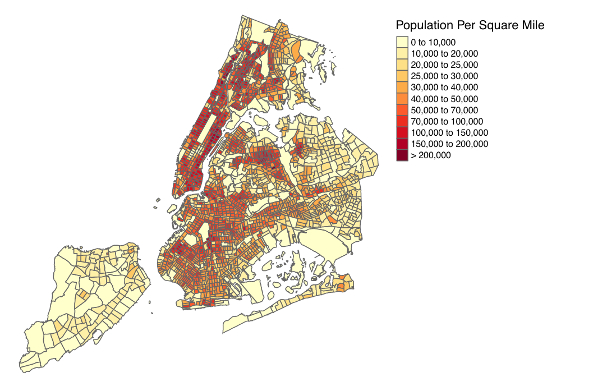
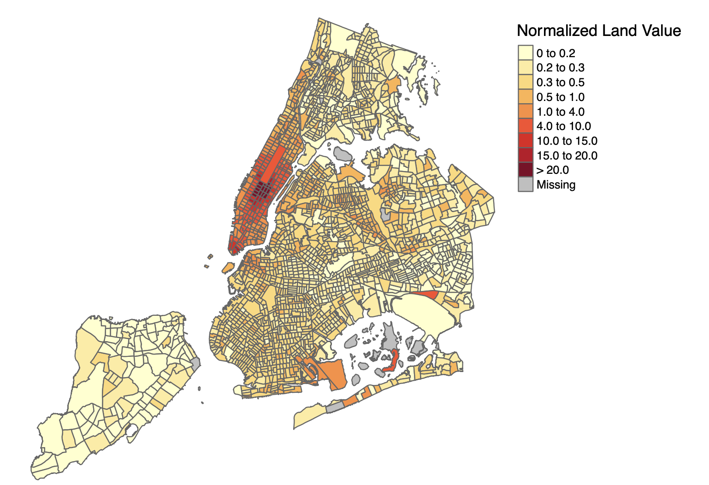
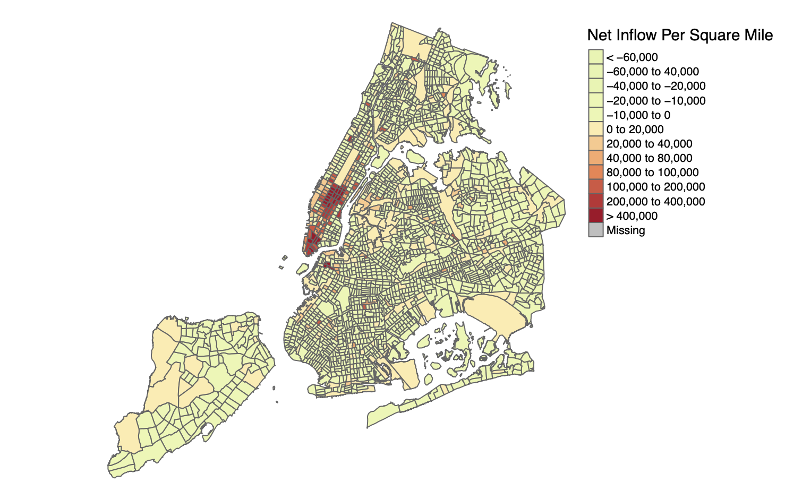
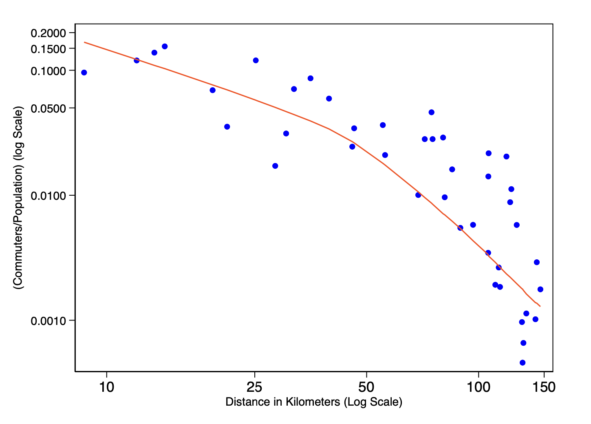
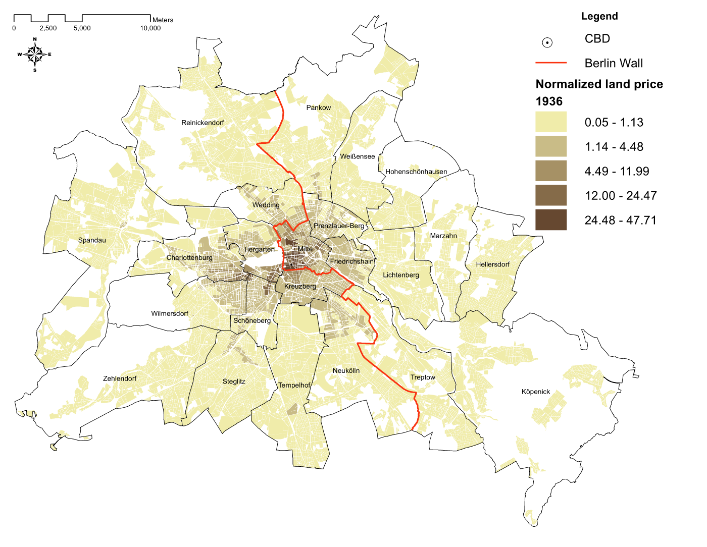
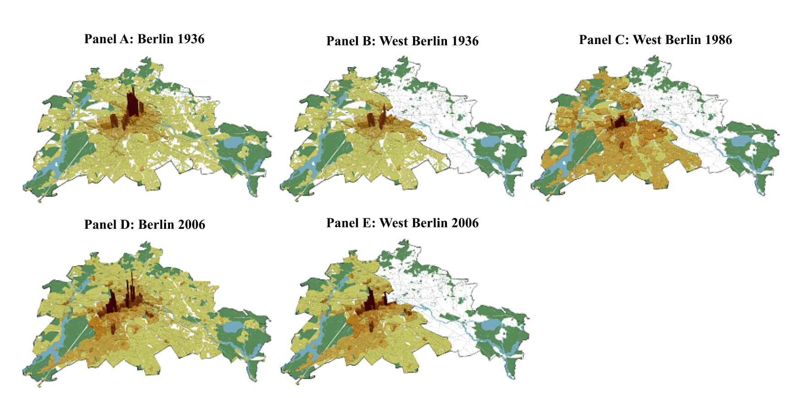
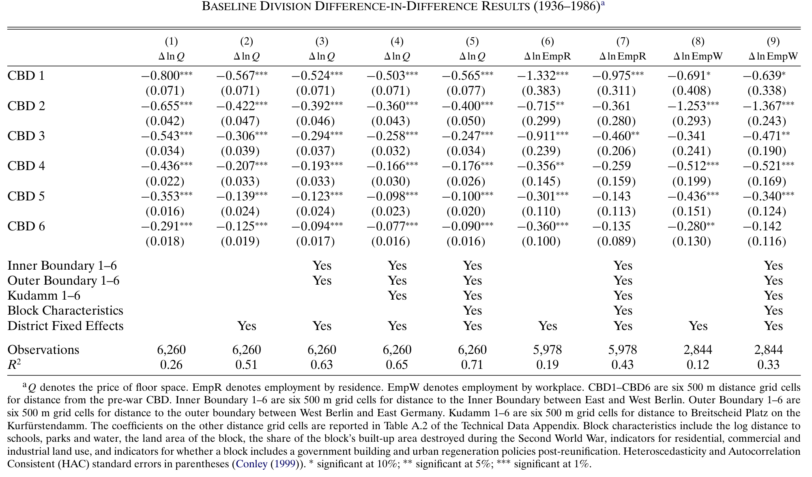
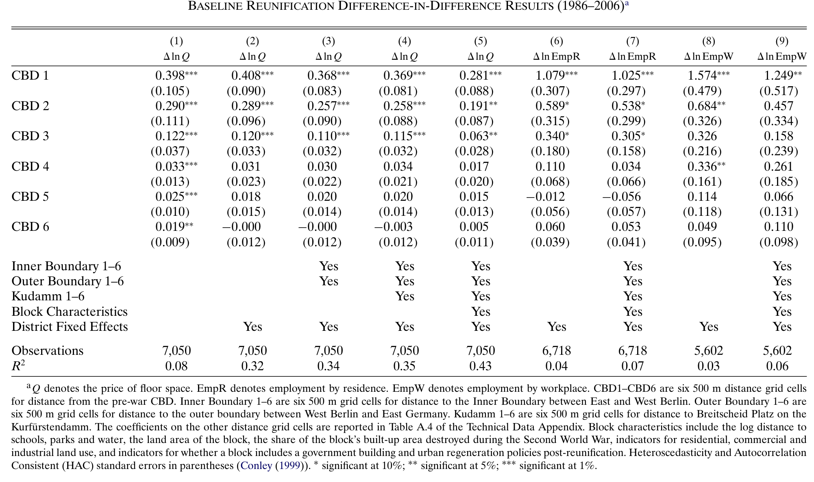

```{r xaringan-themer, include=FALSE, warning=FALSE}
options(htmltools.dir.version = FALSE)

library(xaringanthemer)
style_mono_accent(base_color = "#43418A")

options(htmltools.dir.version = FALSE)

# This is a recommended set up for flipbooks
knitr::opts_chunk$set(fig.width = 6, small.mar=TRUE, fig.retina = 5,message = FALSE, warning = FALSE, comment = "", cache = F)
library(flipbookr)
library(tidyverse)
library(readxl)
library(scales)
library(ggthemes)
library(ggpubr)
```


```{css, eval = TRUE, echo = FALSE}
.remark-code{line-height: 1.5; font-size: 80%}

@media print {
  .has-continuation {
    display: block;
  }
}

code.r.hljs.remark-code{
  position: relative;
  overflow-x: hidden;
}


code.r.hljs.remark-code:hover{
  overflow-x:visible;
  width: 500px;
  border-style: solid;
}

.centered-content {
  display: flex;
  flex-direction: column;
  justify-content: center;
  align-items: center;
  height: 60vh; /* Adjust based on your needs */
  text-align: center;
  margin-top: auto;
  margin-bottom: auto;
}

```

```{css, echo=FALSE}
details {
  background-color: #f9f9f9; /* Light grey background */
  border: 1px solid #ccc; /* Add a border */
  padding: 10px;
  border-radius: 5px;
  margin-bottom: 15px;
}

summary {
  cursor: pointer;
  font-weight: bold;
}
```


## Outline of the Lecture 


 <br><br>
  <br><br>

- Quantitative urban economics


<br>

- A workhorse model


<br>


- Applications and extensions


---

## 




---

## 




---

## 




---

## 




---

## Quantitative Regional Economics

What governs the *distribution of economic activity* within cities?

First-Nature Geography
- Natural amenities
- Physical geography and endowments

Second-Nature Geography 
- Agglomeration economies 
- Dispersion forces 
- Linkages across locations: Commuting
- The equilibrium between *agglomeration* and *dispersion* determines spatial outcomes  


Understanding these is important in and of themselves, but also important as they mediate the impact of place-based interventions and shocks.

How can we incorporate all these forces into *tractable, quantitative models*?


---

class: inverse, center, middle

# A Benchmark Model


---

## Geography

<br><br>

The model has rich heterogeneity across $\mathbb{N}$ neighborhoods (indexed by $i$ or $n$).

Amenities: Quality-of-life factors (climate, culture, safety) that influence wages and housing prices.  

Productivities: Agglomeration, knowledge spillovers, and scale effects raise urban productivity and wages.  

Commuting costs: Neighborhoods are connected through coommuting.

Trade is costless within the city (typically the numeraire $P_c=1$).

Locations differ in their suitability for production and living. 

Agents choose a place to live and a place to work. 


<!-- - pen vs. Closed City: -->
<!--   - *Open City*: Mobile population, utility equalized, wages & rents adjust.   -->
<!--   - *Closed City*: Fixed population, utility varies, shocks absorbed by wages or housing prices. -->


---

## Preferences

There are two goods: a costlessly traded consumption good with price $P_n$ and residential floorspace with price $Q_n$.

Workers have Cobb-Douglas preferences defined over the two goods 
- Expenditure share on goods given by $\alpha\in(0,1)$). 

The utility of a worker residing in neighborhood $n$ and working in neighborhood $i$ is
\begin{equation}
u_{ni}(\omega) = \frac{B_n b_{ni}(\omega)w_i}{\kappa_{ni}P_n^{\alpha}Q_n^{1-\alpha}}
\end{equation}
- $B_n$ represents residential amenities

- $w_i$ are nominal wages

- $b_{ni}(\omega)$ are idiosyncratic preferences for residence/work neighbrhood pair $ni$

- $\kappa_{ni} = e^{\kappa\tau_{ni}}$ are iceberg commuter costs where $\tau_{ni}$ is travel time

---


## Neighborhood Residential Amenities

Residential amenities in $n$ depend on location fundamentals $(\bar{B}_n)$ and externalities $(\mathbb{B}_n^{\eta^B})$
\begin{equation}
B_n = \bar{B}_n\mathbb{B}_n^{\eta^B}
\end{equation}
The externalities take the following form
\begin{equation}
\mathbb{B}_n = \sum_{i\in \mathbb{N}} e^{-\delta^B\tau_{ni} R_i}
\end{equation}
- $\tau_{ni}$ again denotes travel time from $n$ to $i$
- $\eta^B$ denotes the strength of externalities
- $\delta^B$ denotes the rate of decay

This is different than the regional model, but appropriate since the neighborhoods are often very small. 

---


## Idiosyncratic Preferences

 <br><br>

$b_{ni}(\omega)$ is drawn from a Fréchet distribution with shape parameter $\epsilon$
\begin{equation}
\mathbb{P}\left(b_{ni}(\omega)\leq b\right) = e^{-b^{-\epsilon}}
\end{equation}
$\epsilon$ governs the variance of the preference distribution and therefore the degree of heterogeneity. 

Larger $\epsilon$ makes the variance lower, making people more sensitive to $economic$ differences across locations. 

Smaller $\epsilon$ increases the spread, making economic differences less important. 

Scale parameter is set to $1$

We assume that the shock is i.i.d. 


---


```{r, fig.align="center", echo=FALSE, message=FALSE, warning=FALSE, fig_caption= FALSE,fig.align="center", include=FALSE}

library(ggplot2)
library(dplyr)

# Frechet density with T = 1
dfrechet <- function(z, theta, T = 1) {
    ifelse(
        z > 0,
        T * theta * z^(-(theta + 1)) * exp(-T * z^(-theta)),
        0
    )
}

# Parameters
theta_vals <- c(1, 2, 3)                  # chosen θ values
z_vals <- seq(0.01, 5, length.out = 500)  # avoid z=0 to prevent Inf

# Data frame
df <- expand.grid(z = z_vals, theta = theta_vals) %>%
    mutate(density = mapply(dfrechet, z, theta))

# Plot
p1 <- ggplot(df, aes(x = z, y = density, color = factor(theta))) +
    geom_line(size = 1) +
    labs(title = "Fréchet Distribution (T = 1) for Different θ",
         x = "z",
         y = "Density",
         color = expression(theta)) +
    theme_minimal(base_size = 14)

# Frechet density with T = 1
dfrechet <- function(z, theta, T = 3) {
    ifelse(
        z > 0,
        T * theta * z^(-(theta + 1)) * exp(-T * z^(-theta)),
        0
    )
}

# Parameters
theta_vals <- c(1, 2, 3)                  # chosen θ values
z_vals <- seq(0.01, 5, length.out = 500)  # avoid z=0 to prevent Inf

# Data frame
df <- expand.grid(z = z_vals, theta = theta_vals) %>%
  mutate(density = mapply(dfrechet, z, theta))

# Plot
p2 <- ggplot(df, aes(x = z, y = density, color = factor(theta))) +
    geom_line(size = 1) +
    labs(title = "Fréchet Distribution (T = 3) for Different θ",
          x = "z",
          y = "Density",
          color = expression(theta) ) +
    theme_minimal(base_size = 14)

```

```{r dev.args = list(bg = 'transparent'), fig.align="center", echo=FALSE, message=FALSE, warning=FALSE, fig_caption= FALSE, fig.height = 8.7, fig.width = 12, fig.align="center"}
ggarrange(p1, p2, ncol=2, nrow=1, common.legend = T, legend = 'bottom')
```


---

## Commuting Flows

The share of workers living in $n$ and working in $i$ is given by 
\begin{equation}
\mathbb{P}\left(u_{ni} \geq u_{jk} \forall jk\in \mathbb{N}\times\mathbb{N}\right)
\end{equation}
This probability will equal the share since we have a continuum of agents in each location. 

Using the properties of the Fréchet distribution and that the shocks are i.i.d., it follows that 
\begin{equation}
\lambda_{ni} = \frac{L_{ni}}{L_{\mathbb{N}}} = \frac{\left(B_n w_i\right)^{\epsilon} \left(\kappa_{ni}P_n^{\alpha}Q_n^{1-\alpha}\right)^{-\epsilon}}{\sum_{k\in\mathbb{N}}\sum_{\ell\in\mathbb{N}} \left(B_k w_{\ell}\right)^{\epsilon}\left(\kappa_{k\ell}P_k^{\alpha} Q_k^{1-\alpha}\right)^{-\epsilon}}
\end{equation}
The number of people residing in $n$ and working in $i$ depends on the relative attractiveness of the $ni$ pair. 

The sensitivity again depends on $\epsilon$. 

It follows from this that commuting flows satisfy a gravity equation. 


---

## Residents in Each Location

The fraction of workers who choose to live in a location can be found from $\lambda_{ni}$:
\begin{equation}
\lambda_n^R = \frac{R_n}{L_{\mathbb{N}}} = \sum_{i\in\mathbb{N}}\lambda_{ni} = \frac{B_n^{\epsilon}\Phi_n^R \left(P_n^{\alpha} Q_n^{1-\alpha}\right)^{-\epsilon}}{\sum_{k\in \mathbb{N}} \left(B_k\right)^{\epsilon} \Phi_k^R \left(P_k^{\alpha}Q_k^{1-\alpha}\right)^{-\epsilon}},
\end{equation}
where $\Phi_n^R = \sum_{\ell\in \mathbb{N}}\left(\frac{w_{\ell}}{{\kappa_{n\ell}}}\right)^{\epsilon}$.

$\Phi_k^R$ denotes the *residence commuter market access*. 

- Summarizes the access to earnings opportunities for a location. 

Cheaper places with better amenities are more attractive to live in.

The higher $\Phi_k^R$, the more attractive a location becomes because it potentially provides easier access to well-paying jobs. 


---

## Workers in Each Location

The fraction of people who choose to work in a location can also be found from $\lambda_{ni}$:
\begin{equation}
\lambda_i^L = \frac{L_i}{L_{\mathbb{N}}} = \sum_{k\in\mathbb{N}}\lambda_{ki} = \frac{ w_i^{\epsilon}  \Phi_i^L  }{\sum_{\ell \in \mathbb{N}} w_{\ell}^{\epsilon}\Phi_{\ell}^L},
\end{equation}
where $\Phi_{i}^L = \sum_{k\in \mathbb{N}} B_k^{\epsilon}\left(\kappa_{ki} P_{k}^{\alpha}Q_{k}^{1-\alpha}\right)^{-\epsilon}$

$\Phi_k^L$ denotes the *workplace commuter market access*. 

- Summarizes the access to residential areas in a neighborhood. 

Neighborhoods with higher nominal wages $w_i$ are more attractive to work in.

The higher $\Phi_k^L$, the more attractive a location becomes for working because you have access to nice places to live. 


---

## Production

 <br><br>

Production of the final good is done with a Cobb-Douglas technology using labour and floorspace.
- $\beta$ is the labour share.

Perfect competition implies that the unit cost equals the price
\begin{equation}
1 = \frac{1}{A_n}w_n^{\beta}q_{n}^{1-\beta}
\end{equation}
where we have imposed $P_n = 1$ for all $n$ (no trade costs, consumption good is the numeraire).

$q_{n}$ is the price of commercial floor space and $w_n$ nominal wages. 


---

## Production Externalities

<br><br>

The productivity $A_n$ depends on location fundamentals $(\bar{A}_n)$ and production externalities $(\mathbb{A}_n)$.
\begin{equation}
A_n = \bar{A}_n\mathbb{A}_n^{\eta^A}
\end{equation}
The externalities take the following form
\begin{equation}
\mathbb{A}_n = \sum_{i\in \mathbb{N}} e^{-\delta^A\tau_{ni}L_i}
\end{equation}
where $\delta^A$ governs the spatial decay of externalities and $\eta^A$ the overall strength.

Locations closer to many workers have higher productivity. 


---

## Land Market Clearing

<br><br>

Let $v_n$ denote the per capita income, so $v_nR_n$ is aggregate income in location $n$. 

Market-clearing for residential requires that the total expenditure on residential floor space equals the payment for its use: 
\begin{equation}
(1-\alpha) v_nR_n = H_n^R Q_n
\end{equation}
Assume an absentee landlord, so we can ignore how income is distributed in the baseline model. 

With Cobb-Douglas technology, we also have that 
\begin{equation}
(1-\beta)w_n L_n = \beta H_n^L q_n
\end{equation}


---

## General Equilibrium 

<br><br>

Let's think about the equilibrium distribution of economic activity. 

Endogenous variables: $\{w_n, L_n, R_n, v_n, Q_n, q_n, \Phi_n^L, \Phi_n^R, A_n, B_n\}_{i=1}^{\mathbb{N}}$. 

Parameters: $\{\alpha, \beta, \kappa, \epsilon, \eta^A, \eta^B, \delta^A, \delta^B\}$.

Geography: $\{\tau_{ij}, \bar{A}_n, \bar{B}, H_n^R, H_n^L\}$

To pin down the equilibrium we need ten equations. 

Let's assume that all the parameters and the geography are known. 


---

## General Equilibrium 

For each location $n$, we have that 

(1) Residents: $R_n = \xi \left( B_n \left( \Phi^R_n \right)^{\frac{1}{\epsilon}} Q_n^{\alpha - 1} \right)^{\epsilon}$

(2) Residence commuter MA: $\Phi^R_n = \frac{1}{\xi} \sum_{i \in \mathbb{N}} e^{-\kappa \epsilon \tau_{ni}} L_i \left( \Phi^L_i \right)^{-1}$

(3) Workers: $L_n = \xi \left( w_n \left( \Phi^L_n \right)^{\frac{1}{\epsilon}} \right)^{\epsilon}$

(4) Worker commuter MA: $\Phi^L_n = \frac{1}{\xi} \sum_{i \in \mathcal{N}} e^{-\kappa \epsilon \tau_{ni}} R_i \left( \Phi^R_i \right)^{-1}$

(5) Nominal wages: $w_n = A_n^{\frac{1}{\beta}} q_n^{-\left(\frac{1 - \beta}{\beta}\right)}$

(6) Per capita earnings: $\Phi^R_n v_n = \sum_{i \in \mathcal{N}} e^{-\kappa \epsilon \tau_{ni}} (w_i)^{\epsilon + 1}$

(7) Residential floor space: $Q_n = (1 - \alpha) v_n R_n (H^R_n)^{-1}$


---

## General Equilibrium 


(8) Commercial floor space: $q_n = A_n \left( \frac{L_n}{\beta} \right)^{\beta} \left( \frac{H^L_n}{1 - \beta} \right)^{-\beta}$

(9) Amenities: $B_n = \bar{B}_n \left( \sum_{i \in \mathcal{N}} e^{-\delta^B \tau_{ni}} R_i \right)^{\eta^B}$

(10) Productivities: $A_n = \bar{A}_n \left( \sum_{i \in \mathcal{N}} e^{-\delta^A \tau_{ni}} L_i \right)^{\eta^A}$

This gives us $10 \times \mathbb{N}$ equations to pin down $10 \times \mathbb{N}$ equations. 


---

## General Equilibrium 

The equilibrium can be written as a system of equations as follows 
\begin{equation}
x_{nh} = \sum_{i \in \mathcal{N}} \kappa_{nih} \prod_{h' \in \mathcal{H}} x_{ih'}^{\gamma_{nhh'}},
\end{equation}
where $h\in\mathbb{H}$ denotes economic interactions and $n\in \mathbb{N}$ locations.

$\kappa_{nih}$ is a "kernel" that incorporates bilateral frictions.

In our example, $\mathbb{H} = 1, ..., 10$ and $\mathbb{N}$ is the number of blocks.

This is very convenient because we can characterize the equilibrium (existence, uniqueness) using results in Allen, Arkolakis, and Li (2024).

The properties of the equilibrium is governed by the coefficient matrix $\gamma_{nhh'}$.
- Spectral radius of the coefficient matrix is less than one.
- Then there exists a simple interative aglorithm that can be used to solve the system.

<!-- We can also characterize when we can solve the model using a simple iterative procedure.  -->

<!-- intutiively it again boils down to a version of weak aglomeration forces relative to dispersion.  -->

---


## Applications and Extensions

There are several applications of the model in the literature:
- Quantifying agglomeration spillovers
- Counterfactual exercises
- Decomposing variation in the spatial distribution of economic activity into various components.

<br>

Several potential extensions (see syllabus)
- Floor space supply elasticities
- Goods trade assumptions
- Worker heterogeneity and sorting
- Dynamics
- Normative questions
- Consumption market access


---

class: inverse, center, middle

## Application 1


---

## The Economics of Density - Ahlfeldt et al. (2016) 

**Key challenge**: distinguishing agglomeration and dispersion forces from variation in locational fundamentals.

The main contribution of the paper is to estimate agglomeration economies flexibly.  

It does this in three steps:

- The paper develops a quantitative model of internal city structure with agglomeration and dispersion forces and an arbitrary number of heterogeneous city blocks.  

- Estimates the reduced form impact of the division of Berlin on the location of economic activity.

- Estimation uses data on thousands of Berlin city blocks (1936, 1986, 2006) together with exogenous variation from the city's division and reunification.  

Results reveal substantial, highly localised production and residential externalities.  

The model, with estimated agglomeration parameters, reproduces observed changes in city structure both qualitatively and quantitatively.  


---

## 




---

## Model setup

The model consists of a set of discrete blocks indexed by $i = 1, ..., S$. 

**Workers**: The utility is given by $u_{ijo} = \frac{z_{ijo}B_iw_jQ_i^{\beta-1}}{d_{ij}}$

**Production**: Production in block $j$ is given by $y_j = A_jH_{Mj}^{\alpha}L_{Mj}^{1-\alpha}$

**Floor space**: Floor space is produced using capital and land $L_i = \xi_iQ_i$

**Floor prices**: Equal subject friction $q_i = \xi_iQ_i$

**Agglomeration economies**: $A_j = a_j \mathcal{Y}_j$ where $\mathcal{Y}_j = \sum_{s\in S}e^{-\delta \tau_{ij}}\frac{H_{Ms}}{K_s}$

**Amenities**: $B_i = b_i \Omega_j$ where $\Omega_i = \sum_{s\in S}e^{-\rho \tau_{ij}}\frac{H_{Rs}}{K_s}$

The spatial equilibrium is a trade-off between agglomeration economies (productivity + amenities) and demand for land.


---

## Reduced form analysis 

They begin the analysis by estimating the impact of being close to the division line on subsequent urban development. 

They estimate a version of the following equation
\begin{equation}
\Delta \ln O_i = \alpha + \sum_{k\in K} \mathbb{I}_{ik} + \ln M_i\gamma + u_i
\end{equation}
where $O_i$ denotes an economic outcome (employment, land price, residents, etc.)

$\mathbb{I}_{ik}$ is an indicator variable for whether block $i$ lies within a distance grid cell $k$ from the pre-war CBD.

$M_i$ denotes time-invariant block-level controls.


---

## 




---

## 




---

## 




---

## Next steps

Can the model reproduce these reduced form findings?


---

## References

Allen, Treb, Costas Arkolakis, and Xiangliang Li. 2024. “On the Equilibrium Properties of Spatial Models.” *American Economic Review: Insights*, forthcoming.

Ahlfeldt, Gabriel M., Stephen J. Redding, Daniel M. Sturm, and Nikolaus Wolf. 2015. “The Economics of Density: Evidence From the Berlin Wall.” *Econometrica* 83 (6): 2127–89. 

Redding, Stephen J, and Daniel M Sturm. 2024. “Neighborhood Effects: Evidence from Wartime Destruction in London.” *Manuscript*.

Redding, Stephen J. 2024. ”Quantitative Urban Economics.” *NBER Working Paper* 33130.<br>


<!-- <!-- In what follows, I introduce the basics of the spatial model of Allen and Arkolakis 2014. -->

<!-- There are $R$ regions indexed by $i$ or $j$ (e.g. states, municipalities, or counties).<br><br> -->

<!-- Regions differ in their productivity: $\large \mathcal{A}=\{\bar{A}_i\}_{i=1}^R\normalsize$. -->

<!-- - <small> Different inate characteristics that make it more or less suitable for production.</small> <br><br> -->

<!-- And their amenities: $\large \mathcal{u}=\{\bar{u}_i\}_{i=1}^R\normalsize$.  -->

<!-- - <small> Some regions are nicer to live than others (e.g. natural amenities). </small> <br><br> -->

<!-- Trade between regions are subject to iceberg trade costs: $\large \mathcal{T}=\{\tau_{ij}\}_{i,j\in R}\normalsize$ where $\tau_{ij}\geq 1$. -->

<!-- - <small> For one unit to arrive in $j$, $\tau_{ij}$ units must be shipped from $i$. </small> <br><br> -->
