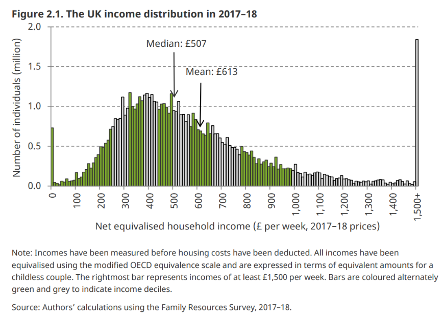

```{r xaringan-themer, include=FALSE, warning=FALSE}
options(htmltools.dir.version = FALSE)

library(xaringanthemer)
style_mono_accent(
  base_color = "#1c5253")

options(htmltools.dir.version = FALSE)

# This is a recommended set up for flipbooks
knitr::opts_chunk$set(fig.width = 6, small.mar=TRUE, fig.retina = 5,message = FALSE, warning = FALSE, comment = "", cache = F)
library(flipbookr)
library(tidyverse)
library(readxl)
library(scales)
library(ggthemes)
```


```{css, eval = TRUE, echo = FALSE}
.remark-code{line-height: 1.5; font-size: 80%}

@media print {
  .has-continuation {
    display: block;
  }
}

code.r.hljs.remark-code{
  position: relative;
  overflow-x: hidden;
}


code.r.hljs.remark-code:hover{
  overflow-x:visible;
  width: 500px;
  border-style: solid;
}

.centered-content {
  display: flex;
  flex-direction: column;
  justify-content: center;
  align-items: center;
  height: 60vh; /* Adjust based on your needs */
  text-align: center;
  margin-top: auto;
  margin-bottom: auto;
}

```


<div class="centered-content">
  <h2> </h2>
   <p>  Measuring well-being <p> 

  <p>  Measuring economic actvity<p> 

   <p> Approaches to measuring GDP <p>

  <p> Applications of GDP <p>

</div>


---

class: inverse, center, middle

# Measuring Well-being


---

## What is wellbeing?

The utility of an individual can be thought of as the indirect utility function:
\begin{equation}
u_i\left(p, w \right),
\end{equation}
where $p$ denotes market prices and $w$ endowments.<br><br>

For a society of $n$ individuals, aggregate well-being can be formulated as
\begin{equation}
W = F(u_1, ..., u_n).
\end{equation}

- No agreement on appropriate term of $u_i$.

- No agreement on the measurement of these concepts.

- No agreement on how to aggregate utility function $F(\cdot)$.


---

## What is wellbeing?

Even if we agree on an appropriate term of $u_i$, how do we aggregate them?

- Utilitarian: $W = \sum_{i=1}^n u_i$.

- Rawls: utility of the worst off $W = \text{min}\{ u_1, ..., u_n\}$.

- Average utility: $W = \sum_{i=1}^n \frac{1}{n}u_i$.<br><br>

Well-being linked to availability of resources in numerous ways (GDP as welfare measure often motivated in this way). 


---


## GDP per capita is not a measure of well-being

It is a measure of certain types of economic activity. 

Ignores non-market activity that could be important. 

- Natural amenities, education, health, crime, cultural activities, safety.

GDP is correlated with a lot of *good stuff*.

- E.g. higher GDP associated with lower infant mortality rates


---


## chart here

It is a measure of certain types of economic activity. 


---

## GDP does not measure income distribution

Who gets the growth?

- Uneven benefits of growth.

- Skill-biased technological change.

- What is our welfare function?

- Utilitarian: $W = \sum_{i=1}^n u_i$.

- Rawls: utility of the worst off $W = \text{min}\{ u_1, ..., u_n\}$.

- Average utility: $W = \sum_{i=1}^n \frac{1}{n}u_i$.


---

## 

<div style="text-align: center; margin-top: 50px;">
  
</div>


---

## Summary

GDP is the most publicized economic data. 

- GDP measures economic activity in terms of expenditures, production or income.

- GDP is based on the national accounts.

- There are international standards for what is included in GDP.

- GDP is used for measuring economic growth, defining business cycles, measuring productivity, measuring wellbeing.<br><br> 

**Coming weeks**: How to measure welfare? Adjusting for prices (spatially and temporally): Real or nominal GDP?


---

class: inverse, center, middle

# See you in the labs! 

Questions? $\texttt{sebastian.ellingsen@bristol.ac.uk}$.


