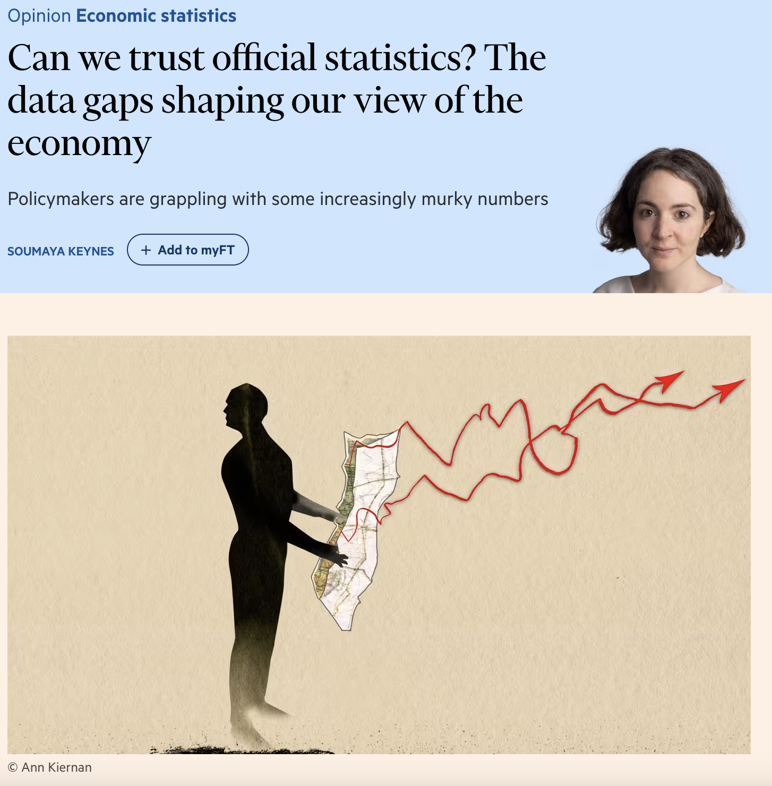

```{r xaringan-themer, include=FALSE, warning=FALSE}
options(htmltools.dir.version = FALSE)

library(xaringanthemer)
style_mono_accent(
  base_color = "#1c5253")

options(htmltools.dir.version = FALSE)

# This is the recommended set up for flipbooks
# you might think about setting cache to TRUE as you gain practice --- building flipbooks from scratch can be time consuming
knitr::opts_chunk$set(fig.width = 6, small.mar=TRUE, fig.retina = 5,message = FALSE, warning = FALSE, comment = "", cache = F)
library(flipbookr)
library(tidyverse)
library(readxl)
library(scales)
library(zoo)
library(ggthemes)
```


```{css, eval = TRUE, echo = FALSE}
.remark-code{line-height: 1.5; font-size: 80%}

@media print {
  .has-continuation {
    display: block;
  }
}

code.r.hljs.remark-code{
  position: relative;
  overflow-x: hidden;
}


code.r.hljs.remark-code:hover{
  overflow-x:visible;
  width: 500px;
  border-style: solid;
}
```


## After this lecture you should be able to

<br><br>

1. Explain how labour market statistics are calculated.

2. Explain the difference between register and survey data.

3. Explain the intuition behind seasonal adjustment. 


<!-- froim pop to labor market, some def of labor market, then the data sources, then seasnoall adjustment  -->


---
class: inverse, center, middle

# Data About the Labor Market


---

```{r, fig.align="center", echo=FALSE, message=FALSE, warning=FALSE, fig_caption= FALSE,fig.align="center", include=FALSE}
# Loading and cleaning data 
pop <- read_csv('../data/HISTPOP_27102023144550354.csv') %>% 
  rename(year = Time, pop = Value) %>% 
  dplyr::select(year, pop) %>% 
  mutate(pop = pop/1000000)


# Constructing plots 
p1 <- ggplot(data=pop, aes(x = year, y = pop))+
  geom_line(size = 1.2, alpha = 0.7)+
  theme(plot.title = element_text(size=22),
        plot.subtitle = element_text(size=16),
        legend.title = element_blank(),
        legend.text=element_text(size=14),
        legend.position="none",
        plot.caption = element_text(size=12, hjust = 0),
        axis.title = element_text(size = 18),
        strip.background = element_blank(),
        axis.text.x=element_text(angle=45, hjust=1, size = 12),
        axis.text.y=element_text(size = 12),
        strip.placement = "outside",
        panel.grid.minor = element_line('grey', size = 0.1, linetype = 'dashed'),
        panel.grid.major = element_line('grey', size = 0.1, linetype = 'dashed'),
        panel.background = element_rect(fill = "transparent", colour = NA),
        plot.background  = element_rect(fill = "transparent", colour = NA),
        legend.background = element_rect(fill='transparent'),
        legend.key=element_blank())+
  xlab("Year") +
  ylab("Population (millions)") +
  labs(title = "Total population of the UK, 1980-2021",
       subtitle = "Population is measured in millions",
       caption = "Source: OECD.")
  
```

```{r dev.args = list(bg = 'transparent'), fig.align="center", echo=FALSE, message=FALSE, warning=FALSE, fig_caption= FALSE, fig.height = 8, fig.width = 11, fig.align="center"}
p1
```

Data available <a href="https://github.com/sebastianellingsen/economic_data_course/blob/648d134ccdd3c867b21dc2d60d56eeda0bc416fb/data/HISTPOP_27102023144550354.csv" target="_blank">here</a>.


---

## From population data to the labour market

<br><br>

We can divide the total population into groups according to their economic activity. 

For economic analyses, it is often useful to split the population into three groups by their age.

- Children (UK definition: Aged below 16).

- Elderly (UK definition: Aged above 64).

- Working age population (UK definition: everyone else).


---


```{r, fig.align="center", echo=FALSE, message=FALSE, warning=FALSE, fig_caption= FALSE,fig.align="center", include=FALSE}


# Working age pop 
df <- read_csv("../data/demo_pjan__custom_13578827_linear.csv")

children <- df %>% 
  slice(1:336) %>% 
  group_by(TIME_PERIOD) %>% 
  summarise(pop = sum(OBS_VALUE, na.rm = T)) %>% 
  mutate(group = 'Children')

working <- df %>% 
  slice(337:2928) %>% 
  group_by(TIME_PERIOD) %>% 
  summarise(pop = sum(OBS_VALUE, na.rm = T)) %>% 
  mutate(group = 'Working age')

elderly <- df %>% 
  slice(2929:4250) %>% 
  group_by(TIME_PERIOD) %>% 
  summarise(pop = sum(OBS_VALUE, na.rm = T)) %>% 
  mutate(group = 'Elderly')

total <- rbind(children, working, elderly)


p1 <- ggplot(data = total, aes(x = TIME_PERIOD, y = pop/1e6, fill = as.factor(group))) +
  geom_area(alpha = 0.9) +
  theme_tufte() +
  theme(plot.title = element_text(size=22),
        plot.subtitle = element_text(size=16),
        legend.title = element_blank(),
        legend.text=element_text(size=14),
        legend.position="bottom",
        plot.caption = element_text(size=12, hjust = 0),
        axis.title = element_text(size = 18),
        strip.background = element_blank(),
        axis.text.x=element_text(angle=45, hjust=1, size = 14),
        axis.text.y=element_text(size = 14),
        strip.placement = "outside",
        panel.grid.minor = element_line('grey', size = 0.1, linetype = 'dashed'),
        panel.grid.major = element_line('grey', size = 0.1, linetype = 'dashed'),
        panel.background = element_rect(fill = "transparent", colour = NA),
        plot.background  = element_rect(fill = "transparent", colour = NA),
        legend.key=element_blank())+
  xlab("") +
  ylab("Population (millions)") +
  labs(title = "Population in the UK by age group, 1972 - 2019",
       caption = "Source: Eurostat (demo_pjan).")

```


```{r dev.args = list(bg = 'transparent'), fig.align="center", echo=FALSE, message=FALSE, warning=FALSE, fig_caption= FALSE, fig.height = 8, fig.width = 11, fig.align="center"}
p1
```

Data available <a href="https://github.com/sebastianellingsen/economic_data_course/blob/648d134ccdd3c867b21dc2d60d56eeda0bc416fb/data/demo_pjan__custom_13578827_linear.csv" target="_blank">here</a>.


---

## The labour force

<br><br>

Within the working-age population, we can further split the population into two groups.

Out of the labour force:

- Students, long-term sick, looking after family/staying home, retired, other.

In the labour force:

- People who are unemployed, people who are employed (including self-employed). <br><br>


We will now take a closer look at the labour force by defining the categories within the labour force.


<!-- from pop to labor market, some measures to summarise the labor market, seasonal adjustment  -->


<!-- --- -->
<!-- ## Out of the labour force -->

<!-- Also known as: The economic inactive -->

<!-- - Studying (≈ 27% in the UK) -->

<!-- - Looking after the family/staying home (≈ 24% in the UK)  -->

<!-- - Long-term sick (≈ 23% in the UK) -->

<!-- - Retired (≈ 13% in the UK) -->


---

## Definitions of the labour force

*Unemployed* (ILO definition):

- Without a job, have been actively seeking work in the past four weeks and are available to start work in the next two weeks.

- Out of work, have found a job and are waiting to start it in the next two weeks.<br><br>

*Employed* (ILO definition):

- Work at least one hour for pay in a week.

- Temporarily away from jobs.

- On Government-supported training/employment programs.

- Unpaid family work.


---
class: inverse, center, middle

$$\Large \text{Labour force} = \text{Unemployed} + \text{Employed}$$


---
class: inverse, center, middle

$$\Large \text{Employment rate} =  \frac{\text{Employed}}{\text{Unemployed} + \text{Employed}}$$


---


```{r, fig.align="center", echo=FALSE, message=FALSE, warning=FALSE, fig_caption= FALSE,fig.align="center", include=FALSE}


df <- read_csv("../data/lfsq_ergan__custom_13595067_linear.csv") %>% 
  mutate(date = as.Date(as.yearqtr(TIME_PERIOD, format = "%Y-Q%q"))) 

p1 <- ggplot(data = df, aes(x = date, y = OBS_VALUE, color = as.factor(geo))) +
  geom_line(size = 1, alpha = 0.7) +
  theme_tufte() +
  theme(plot.title = element_text(size=22),
        plot.subtitle = element_text(size=16),
        legend.title = element_blank(),
        legend.text=element_text(size=14),
        legend.position="none",
        plot.caption = element_text(size=12, hjust = 0),
        axis.title = element_text(size = 18),
        strip.background = element_blank(),
        axis.text.x=element_text(angle=45, hjust=1, size = 12),
        axis.text.y=element_text(size = 12),
        strip.placement = "outside",
        panel.grid.minor = element_line('grey', size = 0.1, linetype = 'dashed'),
        panel.grid.major = element_line('grey', size = 0.1, linetype = 'dashed'),
        panel.background = element_rect(fill = "transparent", colour = NA),
        plot.background  = element_rect(fill = "transparent", colour = NA),
        legend.key=element_blank())+
  xlab("") +
  ylab("Emplyment rate (%)") +
  labs(title = "The Employment Rate in Europe, 2008 - 2023",
       caption = "Source: Eurostat (lfsq_ergan).")+
  ylim(0, 100)


```

```{r dev.args = list(bg = 'transparent'), fig.align="center", echo=FALSE, message=FALSE, warning=FALSE, fig_caption= FALSE, fig.height = 8, fig.width = 14, fig.align="center"}
p1
```

Data available <a href="https://github.com/sebastianellingsen/economic_data_course/blob/648d134ccdd3c867b21dc2d60d56eeda0bc416fb/data/lfsq_ergan__custom_13595067_linear.csv" target="_blank">here</a>.


---
class: inverse, center, middle

$$\Large \text{Unemployment rate} = \frac{\text{Unemployed}}{\text{Unemployed} + \text{Employed}}$$


---


```{r, fig.align="center", echo=FALSE, message=FALSE, warning=FALSE, fig_caption= FALSE,fig.align="center", include=FALSE}


df <- read_csv('../data/AURUKM.csv') 

p1 <- ggplot(data = df, aes(x = DATE, y = AURUKM))+
  geom_line(lwd = 1)+
  theme(plot.title = element_text(size=22),
        plot.subtitle = element_text(size=16),
        legend.title = element_blank(),
        legend.text=element_text(size=14),
        legend.position="bottom",
        plot.caption = element_text(size=12, hjust = 0),
        axis.title = element_text(size = 18),
        strip.background = element_blank(),
        axis.text.x=element_text(angle=45, hjust=1, size = 12),
        axis.text.y=element_text(size = 12),
        strip.placement = "outside",
        panel.grid.minor = element_line('grey', size = 0.1, linetype = 'dashed'),
        panel.grid.major = element_line('grey', size = 0.1, linetype = 'dashed'),
        # text=element_text(family="Palatino"),
        panel.background = element_rect(fill = "transparent", colour = NA),
        plot.background  = element_rect(fill = "transparent", colour = NA),
        legend.background = element_rect(fill='transparent'),
        legend.key=element_blank())+
  scale_x_date(date_breaks = "120 month", date_labels = "%m-%Y")+
  xlab("") +
  ylab("Unemployment rate (%)") +
  labs(title = "Monthly unemployment rate for the UK, 1855-2016",
       caption = "Source: Bank of England, Unemployment Rate in the United Kingdom [AURUKM], retrieved from FRED, Federal Reserve Bank of St. Louis;\nhttps://fred.stlouisfed.org/series/AURUKM,November 10, 2023.")


```

```{r dev.args = list(bg = 'transparent'), fig.align="center", echo=FALSE, message=FALSE, warning=FALSE, fig_caption= FALSE, fig.height = 8, fig.width = 14, fig.align="center"}
p1
```

Data available <a href="https://github.com/sebastianellingsen/economic_data_course/blob/648d134ccdd3c867b21dc2d60d56eeda0bc416fb/data/AURUKM.csv" target="_blank">here</a>.


---


```{r, fig.align="center", echo=FALSE, message=FALSE, warning=FALSE, fig_caption= FALSE,fig.align="center", include=FALSE}

df <- read_csv('../data/STLABOUR_10112023115611842.csv') %>% 
  select(TIME, Measure, Value) %>% 
  rename(date = TIME, 
         adj = Measure,
         unemp = Value) %>% 
  mutate(adj = ifelse(adj == 'Level, rate or quantity series', 'No seasonal adjustment', 'Seasonal adjustment'),
         date = paste(date, "01", sep="-"),
         date = as.Date(date, format = "%Y-%m-%d")) 

p1 <- ggplot(data = df %>% filter(adj == 'No seasonal adjustment'), aes(x = date, y = unemp))+
  geom_line(stat='identity',lwd = 1)+
  theme(plot.title = element_text(size=22),
        plot.subtitle = element_text(size=16),
        legend.title = element_blank(),
        legend.text=element_text(size=14),
        legend.position="bottom",
        plot.caption = element_text(size=12, hjust = 0),
        axis.title = element_text(size = 18),
        strip.background = element_blank(),
        axis.text.x=element_text(angle=45, hjust=1, size = 12),
        axis.text.y=element_text(size = 12),
        strip.placement = "outside",
        panel.grid.minor = element_line('grey', size = 0.1, linetype = 'dashed'),
        panel.grid.major = element_line('grey', size = 0.1, linetype = 'dashed'),
        # text=element_text(family="Palatino"),
        panel.background = element_rect(fill = "transparent", colour = NA),
        plot.background  = element_rect(fill = "transparent", colour = NA),
        legend.background = element_rect(fill='transparent'),
        legend.key=element_blank())+
  xlab("") +
  ylab("Unemployment rate (%)") +
  labs(title = "Monthly unemployment rate, Jan. 2000 - Jun. 2023",
       caption = "Source: OECD, Short-term Unemployment Statistics")
```

```{r dev.args = list(bg = 'transparent'), fig.align="center", echo=FALSE, message=FALSE, warning=FALSE, fig_caption= FALSE, fig.height = 8, fig.width = 14, fig.align="center"}
p1
```

Data available <a href="https://github.com/sebastianellingsen/economic_data_course/blob/648d134ccdd3c867b21dc2d60d56eeda0bc416fb/data/STLABOUR_10112023115611842.csv" target="_blank">here</a>.


---
class: inverse, center, middle

$$\Large \text{Inactivity rate} =  \frac{\text{Economically inactive persons}}{\text{Total population of the same age group}}$$


---

## Labour demand

The measures described above capture both labour supply and demand. 

As for employment, we have survey and register-based measures. 

- Register: Data from public employment services we can use the number of announced job vacancies.

- Survey: Ask firms about their labour demand needs. 

Register-based measures are cheaper, but not all firms post their vacancies in the public employment service.

For surveys, not every firm responds and maybe the firms that respond are not representative.

As a result, these can differ substantially. 


<!-- survey based, less standardized -->

<!-- eurostat defintion -->


---
class: inverse, center, middle

$$\Large \text{JVR} =  \frac{\text{Number of vacancies}}{\text{Number of vacancies + Number of occupied posts}}$$


---


```{r, fig.align="center", echo=FALSE, message=FALSE, warning=FALSE, fig_caption= FALSE,fig.align="center", include=FALSE}

df <- read_csv("../data/jvs_a_rate_r2__custom_13589779_linear.csv")

p1 <- ggplot(data = df, aes(x = TIME_PERIOD, y = OBS_VALUE, color = as.factor(geo))) +
  geom_line(size = 1, alpha = 0.8) +
  theme_tufte() +
  theme(plot.title = element_text(size=22),
        plot.subtitle = element_text(size=16),
        legend.title = element_blank(),
        legend.text=element_text(size=14),
        legend.position="none",
        plot.caption = element_text(size=12, hjust = 0),
        axis.title = element_text(size = 18),
        strip.background = element_blank(),
        axis.text.x=element_text(angle=45, hjust=1, size = 12),
        axis.text.y=element_text(size = 12),
        strip.placement = "outside",
        panel.grid.minor = element_line('grey', size = 0.1, linetype = 'dashed'),
        panel.grid.major = element_line('grey', size = 0.1, linetype = 'dashed'),
        panel.background = element_rect(fill = "transparent", colour = NA),
        plot.background  = element_rect(fill = "transparent", colour = NA),
        legend.key=element_blank())+
  xlab("") +
  ylab("Vacancy rate (%)") +
  labs(title = "The Vacancy Rate in Europe, 2008 - 2023",
       caption = "Source: Eurostat (jvs_a_rate_r2).")

```

```{r dev.args = list(bg = 'transparent'), fig.align="center", echo=FALSE, message=FALSE, warning=FALSE, fig_caption= FALSE, fig.height = 8, fig.width = 11, fig.align="center"}
p1
```

Data available <a href="https://github.com/sebastianellingsen/economic_data_course/blob/648d134ccdd3c867b21dc2d60d56eeda0bc416fb/data/jvs_a_rate_r2__custom_13589779_linear.csv" target="_blank">here</a>.


---
## Where the data comes from

Labour Force Surveys (standardised surveys across the world)

- Ask a random subset of the population about their labour market status

- Often done monthly – but reported quarterly

- Advantage: complies with ILO definition: comparable across time and countries.<br><br>

Administrative data

- Unemployed $\approx$ number of unemployment benefit claimants.

- Advantage: cheap and precise.

**Note**: Age definition for the working age population can vary! ONS (UK): 16-64y, Eurostat: 15-74y, US: Age 15y and over


---


```{r, fig.align="center", echo=FALSE, message=FALSE, warning=FALSE, fig_caption= FALSE,fig.align="center", include=FALSE}

register <- read_csv("../data/Figure_6__Claimant_Count_has_increased_since_March_2020.csv", skip = 6) %>% 
  rename(date = '...1',
         register = 'Unemployment (18-64)',
         survey = 'Claimant Count (18+)') %>% 
  select(date, register) %>% 
  rename(emp = register) %>% 
  mutate(Measure = 'Register') %>% 
  mutate(date = seq(1, 340))


survey <- read_csv("../data/Figure_6__Claimant_Count_has_increased_since_March_2020.csv", skip = 6) %>% 
  rename(date = '...1',
         register = 'Unemployment (18-64)',
         survey = 'Claimant Count (18+)') %>% 
  select(date, survey)%>% 
  rename(emp = survey) %>% 
  mutate(Measure = 'Survey') %>% 
  mutate(date = seq(1, 340))

df <- rbind(register, survey)

p1 <- ggplot(data = df, aes(x = date, y = emp, linetype = as.factor(Measure))) +
  geom_line(size = 1) +
  theme_tufte() +
  theme(plot.title = element_text(size=22),
        plot.subtitle = element_text(size=16),
        legend.title = element_blank(),
        legend.text=element_text(size=14),
        legend.position="bottom",
        plot.caption = element_text(size=12, hjust = 0),
        axis.title = element_text(size = 18),
        strip.background = element_blank(),
        axis.text.x=element_text(angle=45, hjust=1, size = 12),
        axis.text.y=element_text(size = 12),
        strip.placement = "outside",
        panel.grid.minor = element_line('grey', size = 0.1, linetype = 'dashed'),
        panel.grid.major = element_line('grey', size = 0.1, linetype = 'dashed'),
        panel.background = element_rect(fill = "transparent", colour = NA),
        plot.background  = element_rect(fill = "transparent", colour = NA),
        legend.key=element_blank())+
  xlab("") +
  ylab("Population (thousands)") +
  labs(title = "Unemployed in the UK, 1992 - 2019",
       caption = "Source: ONS Labour market statistics time series (LMS).")

```

```{r dev.args = list(bg = 'transparent'), fig.align="center", echo=FALSE, message=FALSE, warning=FALSE, fig_caption= FALSE, fig.height = 8, fig.width = 11, fig.align="center"}
p1
```

Data available <a href="https://github.com/sebastianellingsen/economic_data_course/blob/648d134ccdd3c867b21dc2d60d56eeda0bc416fb/data/Figure_6__Claimant_Count_has_increased_since_March_2020.csv" target="_blank">here</a>.

---


<div style="text-align: center; margin-top: 50px;">
  
</div>

From *The Financial Times*, Nov. 1. You can find the article <a href="https://www.ft.com/content/4978a9f8-e2d5-4a9d-80e7-02b0ba2bd56c" target="_blank">here</a>


---
class: inverse, center, middle

# Seasonal Adjustment


---


## Seasonal variation 

Labor market data has a substantial seasonal component.

- Night: fewer people work, travel etc.

- Weekends: fewer people work, and commute, more people in museums and at the beach.

- August: fewer people work, more travel.

- December: private consumption is higher in UK.<br><br>

This is an issue if we want to compare changes between periods. 

- Unemployment is always lower in December, does that mean "the economy" is doing better?

- We might want to understand if unemployment is lower *over and beyond* what we can expect from seasonal variation or the trend. 


---


```{r, fig.align="center", echo=FALSE, message=FALSE, warning=FALSE, fig_caption= FALSE,fig.align="center", include=FALSE}

df <- read_csv('../data/STLABOUR_10112023115611842.csv') %>% 
  select(TIME, Measure, Value) %>% 
  rename(date = TIME, 
         adj = Measure,
         unemp = Value) %>% 
  mutate(adj = ifelse(adj == 'Level, rate or quantity series', 'No seasonal adjustment', 'Seasonal adjustment'),
         date = paste(date, "01", sep="-"),
         date = as.Date(date, format = "%Y-%m-%d")) 

p1 <- ggplot(data = df %>% filter(adj == 'No seasonal adjustment'), aes(x = date, y = unemp))+
  geom_line(stat='identity',lwd = 1)+
  theme(plot.title = element_text(size=22),
        plot.subtitle = element_text(size=16),
        legend.title = element_blank(),
        legend.text=element_text(size=14),
        legend.position="bottom",
        plot.caption = element_text(size=12, hjust = 0),
        axis.title = element_text(size = 18),
        strip.background = element_blank(),
        axis.text.x=element_text(angle=45, hjust=1, size = 12),
        axis.text.y=element_text(size = 12),
        strip.placement = "outside",
        panel.grid.minor = element_line('grey', size = 0.1, linetype = 'dashed'),
        panel.grid.major = element_line('grey', size = 0.1, linetype = 'dashed'),
        # text=element_text(family="Palatino"),
        panel.background = element_rect(fill = "transparent", colour = NA),
        plot.background  = element_rect(fill = "transparent", colour = NA),
        legend.background = element_rect(fill='transparent'),
        legend.key=element_blank())+
  xlab("") +
  ylab("Unemployment rate (%)") +
  labs(title = "Monthly unemployment rate, Jan. 2000 - Jun. 2023",
       subtitle = "No seasonal adjustment",
       caption = "Source: OECD, Short-term Unemployment Statistics")
```

```{r dev.args = list(bg = 'transparent'), fig.align="center", echo=FALSE, message=FALSE, warning=FALSE, fig_caption= FALSE, fig.height = 8, fig.width = 14, fig.align="center"}
p1
```

Data available <a href="https://github.com/sebastianellingsen/economic_data_course/blob/648d134ccdd3c867b21dc2d60d56eeda0bc416fb/data/STLABOUR_10112023115611842.csv" target="_blank">here</a>.


---


```{r, fig.align="center", echo=FALSE, message=FALSE, warning=FALSE, fig_caption= FALSE,fig.align="center", include=FALSE}

p1 <- ggplot(data = df %>% filter(adj == 'Seasonal adjustment'), aes(x = date, y = unemp))+
  geom_line(stat='identity',lwd = 1)+
  theme(plot.title = element_text(size=22),
        plot.subtitle = element_text(size=16),
        legend.title = element_blank(),
        legend.text=element_text(size=14),
        legend.position="bottom",
        plot.caption = element_text(size=12, hjust = 0),
        axis.title = element_text(size = 18),
        strip.background = element_blank(),
        axis.text.x=element_text(angle=45, hjust=1, size = 12),
        axis.text.y=element_text(size = 12),
        strip.placement = "outside",
        panel.grid.minor = element_line('grey', size = 0.1, linetype = 'dashed'),
        panel.grid.major = element_line('grey', size = 0.1, linetype = 'dashed'),
        # text=element_text(family="Palatino"),
        panel.background = element_rect(fill = "transparent", colour = NA),
        plot.background  = element_rect(fill = "transparent", colour = NA),
        legend.background = element_rect(fill='transparent'),
        legend.key=element_blank())+
  xlab("") +
  ylab("Unemployment rate (%)") +
  labs(title = "Monthly unemployment rate, Jan. 2000 - Jun. 2023",
       subtitle = "Seasonal adjustment",
       caption = "Source: OECD, Short-term Unemployment Statistics")
```

```{r dev.args = list(bg = 'transparent'), fig.align="center", echo=FALSE, message=FALSE, warning=FALSE, fig_caption= FALSE, fig.height = 8, fig.width = 14, fig.align="center"}
p1
```

Data available <a href="https://github.com/sebastianellingsen/economic_data_course/blob/648d134ccdd3c867b21dc2d60d56eeda0bc416fb/data/STLABOUR_10112023115611842.csv" target="_blank">here</a>.


---

```{r, fig.align="center", echo=FALSE, message=FALSE, warning=FALSE, fig_caption= FALSE,fig.align="center", include=FALSE}

p1 <- ggplot(data = df, aes(x = date, y = unemp, color = adj))+
  geom_line(stat='identity',lwd = 1)+
  theme(plot.title = element_text(size=22),
        plot.subtitle = element_text(size=16),
        legend.title = element_blank(),
        legend.text=element_text(size=14),
        legend.position="bottom",
        plot.caption = element_text(size=12, hjust = 0),
        axis.title = element_text(size = 18),
        strip.background = element_blank(),
        axis.text.x=element_text(angle=45, hjust=1, size = 12),
        axis.text.y=element_text(size = 12),
        strip.placement = "outside",
        panel.grid.minor = element_line('grey', size = 0.1, linetype = 'dashed'),
        panel.grid.major = element_line('grey', size = 0.1, linetype = 'dashed'),
        # text=element_text(family="Palatino"),
        panel.background = element_rect(fill = "transparent", colour = NA),
        plot.background  = element_rect(fill = "transparent", colour = NA),
        legend.background = element_rect(fill='transparent'),
        legend.key=element_blank())+
  xlab("") +
  ylab("Unemployment rate (%)") +
  labs(title = "Monthly unemployment rate, Jan. 2000 - Jun. 2023",
       caption = "Source: OECD, Short-term Unemployment Statistics")
```

```{r dev.args = list(bg = 'transparent'), fig.align="center", echo=FALSE, message=FALSE, warning=FALSE, fig_caption= FALSE, fig.height = 8, fig.width = 14, fig.align="center"}
p1
```

Data available <a href="https://github.com/sebastianellingsen/economic_data_course/blob/648d134ccdd3c867b21dc2d60d56eeda0bc416fb/data/STLABOUR_10112023115611842.csv" target="_blank">here</a>.


---

```{r, fig.align="center", echo=FALSE, message=FALSE, warning=FALSE, fig_caption= FALSE,fig.align="center", include=FALSE}

df1 <- df %>% 
  filter(adj == 'Seasonal adjustment') %>%
  select(unemp, date) %>% 
  rename(unemp_s = unemp) %>% 
  full_join(df %>% filter(adj != 'Seasonal adjustment'), by = 'date') %>% 
  mutate(diff = unemp - unemp_s) %>% 
  filter(date > '2016-01-01')

p1 <- ggplot(data = df1, aes(x = date, y = diff))+
  geom_line(stat='identity', lwd = 1)+
  theme(plot.title = element_text(size=22),
        plot.subtitle = element_text(size=16),
        legend.title = element_blank(),
        legend.text=element_text(size=14),
        legend.position="bottom",
        plot.caption = element_text(size=12, hjust = 0),
        axis.title = element_text(size = 18),
        strip.background = element_blank(),
        axis.text.x=element_text(angle=45, hjust=1, size = 12),
        axis.text.y=element_text(size = 12),
        strip.placement = "outside",
        panel.grid.minor = element_line('grey', size = 0.1, linetype = 'dashed'),
        panel.grid.major = element_line('grey', size = 0.1, linetype = 'dashed'),
        # text=element_text(family="Palatino"),
        panel.background = element_rect(fill = "transparent", colour = NA),
        plot.background  = element_rect(fill = "transparent", colour = NA),
        legend.background = element_rect(fill='transparent'),
        legend.key=element_blank())+
  scale_x_date(date_breaks = "4 month", date_labels = "%m-%Y")+
  xlab("") +
  ylab("Unemployment rate (%)") +
  labs(title = "Monthly unemployment rate, Jan. 2016 - Jun. 2023",
       caption = "Source: OECD, Short-term Unemployment Statistics")


```

```{r dev.args = list(bg = 'transparent'), fig.align="center", echo=FALSE, message=FALSE, warning=FALSE, fig_caption= FALSE, fig.height = 8, fig.width = 14, fig.align="center"}
p1
```

Data available <a href="https://github.com/sebastianellingsen/economic_data_course/blob/648d134ccdd3c867b21dc2d60d56eeda0bc416fb/data/STLABOUR_10112023115611842.csv" target="_blank">here</a>.


---
## Decomposing a time series


We can decompose the variation in the unemployment rate $u_t$ as follows.

$$u_t = s_t+\lambda_t +\varepsilon_t$$
- $\lambda_t$ is a trend component.

- $s_t$ is a seasonal compononent. 

- $\varepsilon_t$ are random shocks.<br><br>

Some statistical agencies provide data where the different components have been isolated.

There is a wide variety of ways to decompose a time series and the correct method depends on the series and application.

Let's create our own decomposition to get a sense of how it works. 


---

## Finding the trend component

One way to remove seasonality and other shocks is through the use of a linear filter. 

One such filter is the moving average or MA filter.

The MA filter of order k or $MA(k)$ is given by

$$\lambda_t = \frac{1}{2k + 1}\sum_{t-k}^{t+k}y_t$$

A moving average is commonly used with time series data to smooth out short-term fluctuations and highlight longer-term trends.

Let's try this with our unemployment data.


---

```{r, include = F}
# This is the recommended set up for flipbooks
# you might think about setting cache to TRUE as you gain practice --- building flipbooks from scratch can be time consuming
knitr::opts_chunk$set(fig.width = 6, message = FALSE, warning = FALSE, comment = "", cache = F)
library(flipbookr)
library(tidyverse)
library(readxl)
library(scales)
library(lubridate)
library(ggpubr)


# Loading and cleaning the data 
df <- read_csv('../data/STLABOUR_10112023115611842.csv') %>% 
  select(TIME, Measure, Value) %>% 
  rename(date  = TIME, 
         adj   = Measure,
         unemp = Value) %>% 
  mutate(adj  = ifelse(adj == 'Level, rate or quantity series', 'No seasonal adjustment', 'Seasonal adjustment'),
         date = paste(date, "01", sep="-"),
         date = as.Date(date, format = "%Y-%m-%d")) %>% 
  mutate(month = month(date), year = year(date)) %>% 
  filter(adj == 'No seasonal adjustment') 


# Calcualting the trend 
df <- df %>% 
  mutate(trend = (lag(unemp, n=4)   + lag(unemp, n=3)   + lag(unemp, n=2)  + lag(unemp, n=1)  + 
                  lead(unemp, n=4)  + lead(unemp, n=3)  + lead(unemp, n=2) + lead(unemp, n=1) + 
                  unemp)/9) 

df <- df %>% 
  mutate(month = month(date), year = year(date)) %>% 
  group_by(month) %>% 
  summarise(unemp_month = mean(unemp - trend, na.rm = T)) %>% 
  full_join(df, by = 'month') %>% 
  mutate(unemp_shock = unemp - (trend + unemp_month)) %>% 
  filter(date >= '2014-01-01', date< '2020-03-01') 

```


`r chunk_reveal("chunk_1")`

```{r chunk_1, include = FALSE}
# Loading packages
library(tidyverse)
library(lubridate)

# Loading and cleaning the data
read_csv('../data/STLABOUR_10112023115611842.csv') %>% 
  select(TIME, Measure, Value) %>% 
  rename(date  = TIME) %>%  
  rename(adj   = Measure) %>% 
  rename(unemp = Value) %>% 
  mutate(adj  = ifelse(adj == 'Level, rate or quantity series', 'No seasonal adjustment', 'Seasonal adjustment')) %>% 
  mutate(date = paste(date, "01", sep="-")) %>% 
  mutate(date = as.Date(date, format = "%Y-%m-%d")) %>% 
  mutate(month = month(date), year = year(date)) %>% 
  filter(adj == 'No seasonal adjustment') %>% 
  mutate(trend = (lag(unemp, n=4)   + lag(unemp, n=3)   + lag(unemp, n=2)  + lag(unemp, n=1)  + 
                  lead(unemp, n=4)  + lead(unemp, n=3)  + lead(unemp, n=2) + lead(unemp, n=1) + 
                  unemp)/9) 

```

---


`r chunk_reveal("chunk_2")`

```{r chunk_2, include = FALSE}
# Plotting the data
ggplot(data = df, aes(x = date, y = trend))+
  geom_line(stat='identity', lwd = 1)+
    scale_x_date(date_breaks = "4 month", date_labels = "%m-%Y")+
  xlab("") +
  ylab("Unemp. rate (%)") +
  labs(title = "Trend component",
       caption = "")+
  theme(plot.title = element_text(size=22),
        plot.subtitle = element_text(size=16),
        legend.title = element_blank(),
        legend.text=element_text(size=14),
        legend.position="bottom",
        plot.caption = element_text(size=12, hjust = 0),
        axis.title = element_text(size = 18),
        strip.background = element_blank(),
        axis.text.x=element_text(angle=45, hjust=1, size = 12),
        axis.text.y=element_text(size = 12),
        strip.placement = "outside",
        panel.grid.minor = element_line('grey', size = 0.1, linetype = 'dashed'),
        panel.grid.major = element_line('grey', size = 0.1, linetype = 'dashed'),
        panel.background = element_rect(fill = "transparent", colour = NA),
        plot.background  = element_rect(fill = "transparent", colour = NA),
        legend.background = element_rect(fill='transparent'),
        legend.key=element_blank())
```


---

```{r, fig.align="center", echo=FALSE, message=FALSE, warning=FALSE, fig_caption= FALSE,fig.align="center", include=FALSE}

trend_plot <- ggplot(data = df, aes(x = date, y = trend))+
  geom_line(stat='identity', lwd = 1)+
  theme(plot.title = element_text(size=22),
        plot.subtitle = element_text(size=16),
        legend.title = element_blank(),
        legend.text=element_text(size=14),
        legend.position="bottom",
        plot.caption = element_text(size=12, hjust = 0),
        axis.title = element_text(size = 18),
        strip.background = element_blank(),
        axis.text.x=element_text(angle=45, hjust=1, size = 12),
        axis.text.y=element_text(size = 12),
        strip.placement = "outside",
        panel.grid.minor = element_line('grey', size = 0.1, linetype = 'dashed'),
        panel.grid.major = element_line('grey', size = 0.1, linetype = 'dashed'),
        panel.background = element_rect(fill = "transparent", colour = NA),
        plot.background  = element_rect(fill = "transparent", colour = NA),
        legend.background = element_rect(fill='transparent'),
        legend.key=element_blank())+
  scale_x_date(date_breaks = "4 month", date_labels = "%m-%Y")+
  xlab("") +
  ylab("Unemp. rate (%)") +
  labs(title = "Trend component for the UK",
       caption = "")

```

```{r dev.args = list(bg = 'transparent'), fig.align="center", echo=FALSE, message=FALSE, warning=FALSE, fig_caption= FALSE, fig.height = 8, fig.width = 14, fig.align="center"}
trend_plot
```


---

## Finding the seasonal component

To extract the seasonal component, we can average over each month. 

The part of the unemployment not explained by the trend is given by

$$u_t - \lambda_t$$

Let's calculate the average of this value for each month of the year. 

This will be our seasonal (monthly) component.


---


`r chunk_reveal("chunk_3")`

```{r chunk_3, include = FALSE}
df %>% 
  mutate(month = month(date), year = year(date)) %>% 
  group_by(month) %>% 
  summarise(unemp_month = mean(unemp - trend, na.rm = T)) %>% 
  full_join(df, by = 'month') 

```


---


`r chunk_reveal("chunk_4")`

```{r chunk_4, include = FALSE}
ggplot(data = df, aes(x = date, y = unemp_month))+
  geom_line(stat='identity')+
  theme(plot.title = element_text(size=12),
        plot.subtitle = element_text(size=9),
        legend.title = element_blank(),
        legend.position="bottom",
        plot.caption = element_text(size=6, hjust = 0),
        axis.title = element_text(size = 11),
        strip.background = element_blank(),
        strip.placement = "outside",
        panel.grid.minor = element_line('grey', size = 0.1, linetype = 'dashed'),
        panel.grid.major = element_line('grey', size = 0.1, linetype = 'dashed'),
        legend.key = element_rect(fill = NA),
        axis.text.x=element_text(angle=45, hjust=1),
        panel.background = element_rect(fill = "transparent", colour = NA),
        plot.background = element_rect(fill = "transparent", colour = NA))+
  scale_x_date(date_breaks = "12 month", date_labels = "%m-%Y")+
  xlab("") +
  ylab("Unemployment rate (%)") +
  labs(title = "Seasonal component",
       caption = "")

```


---


```{r, fig.align="center", echo=FALSE, message=FALSE, warning=FALSE, fig_caption= FALSE,fig.align="center", include=FALSE}
season_plot <- ggplot(data = df, aes(x = date, y = unemp_month))+
  geom_line(stat='identity', lwd = 1)+
  theme(plot.title = element_text(size=22),
        plot.subtitle = element_text(size=16),
        legend.title = element_blank(),
        legend.text=element_text(size=14),
        legend.position="bottom",
        plot.caption = element_text(size=12, hjust = 0),
        axis.title = element_text(size = 18),
        strip.background = element_blank(),
        axis.text.x=element_text(angle=45, hjust=1, size = 12),
        axis.text.y=element_text(size = 12),
        strip.placement = "outside",
        panel.grid.minor = element_line('grey', size = 0.1, linetype = 'dashed'),
        panel.grid.major = element_line('grey', size = 0.1, linetype = 'dashed'),
        panel.background = element_rect(fill = "transparent", colour = NA),
        plot.background  = element_rect(fill = "transparent", colour = NA),
        legend.background = element_rect(fill='transparent'),
        legend.key=element_blank())+
  scale_x_date(date_breaks = "4 month", date_labels = "%m-%Y")+
  xlab("") +
  ylab("Unemp. rate (%)") +
  labs(title = "Seasonal component for the UK",
       caption = "")

```

```{r dev.args = list(bg = 'transparent'), fig.align="center", echo=FALSE, message=FALSE, warning=FALSE, fig_caption= FALSE, fig.height = 8, fig.width = 14, fig.align="center"}
season_plot
```


---


## Finding the shock component

Finally, the shock is just what is not explained by the seasonal variation or the trend, 

$$\varepsilon_t = u_t - \lambda_t - s_t$$

This can be thought of as "surprises", something we did not expect by looking at the trend or the month of the year.

- E.g. some positive or negative event (covid, terms of trade shock, etc.)<br><br>

This component can tell us if the labor market is doing better than what is explained by seasonal variation or just a trend.


---


`r chunk_reveal("chunk_5")`

```{r chunk_5, include = FALSE}
df %>% 
  mutate(unemp_shock = unemp - (trend + unemp_month)) 
```


---
`r chunk_reveal("chunk_6")`

```{r chunk_6, include = FALSE}
ggplot(data = df, aes(x = date, y = unemp_shock))+
  geom_line(stat='identity')+
  theme(plot.title = element_text(size=12),
        plot.subtitle = element_text(size=9),
        legend.title = element_blank(),
        legend.position="bottom",
        plot.caption = element_text(size=6, hjust = 0),
        axis.title = element_text(size = 11),
        strip.background = element_blank(),
        strip.placement = "outside",
        panel.grid.minor = element_line('grey', size = 0.1, linetype = 'dashed'),
        panel.grid.major = element_line('grey', size = 0.1, linetype = 'dashed'),
        legend.key = element_rect(fill = NA),
        axis.text.x=element_text(angle=45, hjust=1),
        panel.background = element_rect(fill = "transparent", colour = NA),
        plot.background = element_rect(fill = "transparent", colour = NA))+
  scale_x_date(date_breaks = "12 month", date_labels = "%m-%Y")+
  xlab("") +
  ylab("Unemployment rate (%)") +
  labs(title = "Shock component",
       caption = "Source: OECD, Short-term Unemployment Statistics")
```


---

```{r, fig.align="center", echo=FALSE, message=FALSE, warning=FALSE, fig_caption= FALSE,fig.align="center", include=FALSE}

shock_plot <- ggplot(data = df, aes(x = date, y = unemp_shock))+
  geom_line(stat='identity', lwd = 1)+
  theme(plot.title = element_text(size=22),
        plot.subtitle = element_text(size=16),
        legend.title = element_blank(),
        legend.text=element_text(size=14),
        legend.position="bottom",
        plot.caption = element_text(size=12, hjust = 0),
        axis.title = element_text(size = 18),
        strip.background = element_blank(),
        axis.text.x=element_text(angle=45, hjust=1, size = 12),
        axis.text.y=element_text(size = 12),
        strip.placement = "outside",
        panel.grid.minor = element_line('grey', size = 0.1, linetype = 'dashed'),
        panel.grid.major = element_line('grey', size = 0.1, linetype = 'dashed'),
        panel.background = element_rect(fill = "transparent", colour = NA),
        plot.background  = element_rect(fill = "transparent", colour = NA),
        legend.background = element_rect(fill='transparent'),
        legend.key=element_blank())+
  scale_x_date(date_breaks = "4 month", date_labels = "%m-%Y")+
  xlab("") +
  ylab("Unemp. rate (%)") +
  labs(title = "Shock component for the UK",
       caption = "Source: OECD, Short-term Unemployment Statistics.")


```

```{r dev.args = list(bg = 'transparent'), fig.align="center", echo=FALSE, message=FALSE, warning=FALSE, fig_caption= FALSE, fig.height = 8, fig.width = 14, fig.align="center"}
shock_plot
```


---

```{r dev.args = list(bg = 'transparent'), fig.align="center", echo=FALSE, message=FALSE, warning=FALSE, fig_caption= FALSE, fig.height = 8, fig.width = 14, fig.align="center"}
ggarrange(trend_plot, season_plot, shock_plot, ncol = 1, nrow = 3)
```

Data available <a href="https://github.com/sebastianellingsen/economic_data_course/blob/648d134ccdd3c867b21dc2d60d56eeda0bc416fb/data/STLABOUR_10112023115611842.csv" target="_blank">here</a>.


<!-- then show how to do that with the series for the uk, that way we get the trend  -->

<!-- then we remove the seasonality, just average by quarter and remove it  -->


---


## Seasonal adjustments: summary

**Goal**: To remove seasonal component.

**Approach**:

- Estimate trend level.

- Remove trend from raw series.

- What is left is a seasonal component + error.

- Use that to identify the seasonal component.

- Subtract the seasonal component from the raw series.<br><br>

There is a large literature in econometrics and statistics on filtering time series!

- A lot of it is a version of what you have seen here. 


<!-- --- -->

<!-- ## The labour market: other topics -->

<!-- Labour supply -->

<!-- - Extensive margin vs intensive margin -->

<!-- - Hours worked -->

<!-- Earnings -->

<!-- - Wages, Salary, survey based, register based -->

<!-- Gender disparities -->

<!-- - Earnings & promotions -->


---

## Summary

<br><br>

1. Explain how labour market statistics are calculated.

2. Explain the difference between register and survey data.

3. Explain the intuition behind seasonal adjustment. 

<br><br>

Data for all charts available <a href="https://github.com/sebastianellingsen/economic_data_course/tree/main/data" target="_blank">here</a>.


<!-- LINKS TO DATA HERE (TO GO WITH THE SCRIPTS) -->


---

class: inverse, center, middle

# See you in the labs! 

Questions? $\texttt{sebastian.ellingsen@bristol.ac.uk}$.


