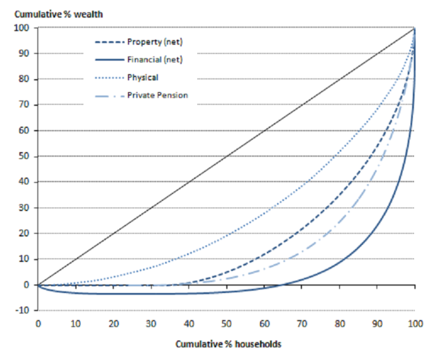

```{r xaringan-themer, include=FALSE, warning=FALSE}
options(htmltools.dir.version = FALSE)

library(xaringanthemer)
style_mono_accent(
  base_color = "#1c5253")

options(htmltools.dir.version = FALSE)

# This is the recommended set up for flipbooks
# you might think about setting cache to TRUE as you gain practice --- building flipbooks from scratch can be time consuming
knitr::opts_chunk$set(fig.width = 6, fig.align="center",small.mar=TRUE, fig.retina = 5,message = FALSE, warning = FALSE, comment = "", cache = F)
library(flipbookr)
library(tidyverse)
library(readxl)
library(scales)
library(ggthemes)
```


```{css, eval = TRUE, echo = FALSE}
.remark-code{line-height: 1.5; font-size: 80%}

@media print {
  .has-continuation {
    display: block;
  }
}

code.r.hljs.remark-code{
  position: relative;
  overflow-x: hidden;
}


code.r.hljs.remark-code:hover{
  overflow-x:visible;
  width: 500px;
  border-style: solid;
}
```

<style>

.center2 {
  margin: 0;
  position: absolute;
  top: 50%;
  left: 50%;
  -ms-transform: translate(-50%, -50%);
  transform: translate(-50%, -50%);
}

</style>


## After this lecture you should be able to

<br><br>

How to measure poverty.

Explain basic inequality measures. 

- Lorenz curves.

- Gini index.

Explain how to calculate these.


---
class: inverse, center, middle

# Data on Inequality and Poverty


---

## Measuring Poverty 

<br><br>
 
Poverty thresholds: income below a defined minimum.


Absolute poverty: fixed standard (e.g., minimum calories needed to survive).
Relative poverty: defined relative to society (e.g., share of median income).

Income vs. consumption: consumption is ideal but hard to measure; income is typically used.

Common measures:
- OECD: < 50% of median income
- EU: < 60% of median income
- UK: < 60% of median income
- Multidimensional poverty indices also widely used.


---


## 


---

## Why measure inequality?

GDP is largely silent on the distribution of income across individuals.  <br><br>

Why would we want to measure the distribution of income across individuals?

- Many economic policy areas have distributive impacts (e.g. tax policy, fiscal policy). 

- Lower inequality is seen as an end in and of itself. 

- Promotes social cohesion and reduces political polarization (see e.g. Rodrik, 1999). <br><br>

$\Rightarrow$ We need to go beyond data on GDP to explore these issues. 


---


## Quantifying inequality

What type of inequality?

- Income or wealth.

- Health, education, etc.

- Gender.<br><br>

Net or gross income?

- Income before (gross) or after taxes and transfers (net).<br><br>

What is our unit of analysis?

- Individuals or households?

- How to compare across households?


---

## Quantifying inequality

Requires access to micro-level data – that is data on the *individual level*.

- So far we have worked on macro data - aggregated over units.<br><br>

Where does data on income come from? 

- From sample surveys or tax records (record flow)<br><br>

Where does data on wealth come from?

- Stock - difficult to measure: bank accounts, house value, etc.


---

## Comparing households

We use weights to adjust for the household size.

**OECD equivalence scale**: 

- 1st person >=14y: weight of 1

- All other >=14y: weight of 0.7

- <14y: weight of 0.5<br><br>


**OECD modified scale**: 

- 1st person >=14y: weight of 1

- All other >=14y: weight of 0.5

- <14y: weight of 0.3


<!-- **Square root scale** -->

<!-- - Household weight: square root of number of household members -->


---


## Income inequality in the UK

.pull-left[
**Domain**:

- Income

**Net and gross**:

- Net (before housing costs)

**Unit**:

- Households

- OECD equivalence scale
]

.pull-right[

```{r echo = FALSE, fig.height = 8, fig.width = 8.3}
knitr::include_graphics("images/inequality.png")
```
]


---


# How to quantify inequality? Percentiles

What are Percentiles?

- Percentiles are a statistical measure that divides a dataset into 100 equal parts.

- Each percentile represents a value below which a certain percentage of the data falls.

    - For example, the 20th percentile is the income level below which 20% of the population’s income falls. <br><br>

Using Percentiles in Income Inequality:

- Low percentiles (e.g., 10th percentile) represent lower-income earners.

- High percentiles (e.g., 90th percentile) represent higher-income earners.

- By comparing incomes at different percentiles, we can measure the *income share* and assess inequality.


---


## How to quantify inequality?

It is useful to have a number to summarize the income distribution. <br><br>

Point of departure: Income shares

- Sort households by income (low to high).

- Assign rank.

- Calculate the total income.

- Calculate the income share for each rank.


---

.center2[
```{r echo = FALSE, fig.height = 9, fig.width = 9.3}

```
]


---

## The Lorenz Curve

.pull-left[
The Lorenz curve

- Calculate cumulative shares of income for each income rank.

- Plot cumulative share against income rank.<br><br>

This gives the Lorenz curve.

It will have a different shape for different domains of inequality.

The Lorenz curve forms the basis of the *Gini index*.
]

.pull-right[

```{r echo = FALSE, fig.height = 6, fig.width = 6.3}

```
]

---


## The Gini Index

.pull-left[
The Gini coefficient is defined as

$$G = \frac{A}{A+B}$$

Gini coefficient close to 0: 

- A is very small $\Rightarrow$ distribution close to perfect equality.

Gini coefficient close to 1: 

- A is large $\Rightarrow$ far from perfect equality.
]

.pull-right[

```{r echo = FALSE, fig.height = 6, fig.width = 6.3}

```
]


---


```{r, fig.align="center", echo=FALSE, message=FALSE, warning=FALSE, fig_caption= FALSE,fig.align="center", include=FALSE}
library(lubridate)
library(tidyverse)
library(ggpubr)
library(ggthemes)

df <- read_csv("../data/API_SI.POV.GINI_DS2_en_csv_v2_5994673.csv", skip = 4) %>% 
  select(-"Country Code", -"Indicator Name", -"Indicator Code", -"...68") %>% 
  gather(year, gini, 2:64) %>% 
  rename(country = 'Country Name') %>% 
  filter(country == 'United Kingdom',
         !is.na(gini)) %>% 
  mutate(gini = as.numeric(gini),
         year = as.numeric(year))

p1 <- ggplot(data = df, aes(x = year, y = gini))+
  geom_line(lwd = 1)+
  geom_point(size = 3)+
  theme(plot.title = element_text(size=22),
        plot.subtitle = element_text(size=16),
        legend.title = element_blank(),
        legend.text=element_text(size=14),
        legend.position="bottom",
        plot.caption = element_text(size=12, hjust = 0),
        axis.title = element_text(size = 18),
        strip.background = element_blank(),
        axis.text.x=element_text(angle=45, hjust=1, size = 12),
        axis.text.y=element_text(size = 12),
        strip.placement = "outside",
        panel.grid.minor = element_line('grey', size = 0.1, linetype = 'dashed'),
        panel.grid.major = element_line('grey', size = 0.1, linetype = 'dashed'),
        panel.background = element_rect(fill = "transparent", colour = NA),
        plot.background  = element_rect(fill = "transparent", colour = NA),
        legend.key=element_blank())+
  xlab("") +
  ylab("Gini Index") +
  labs(title = "The Gini Index for the United Kingdom",
       caption = "Source: World Bank, World Development Indicators.")+
  scale_x_continuous(n.breaks = 6)+
ylim(5,50)

```

```{r dev.args = list(bg = 'transparent'), fig.align="center", echo=FALSE, message=FALSE, warning=FALSE, fig_caption= FALSE, fig.height = 9, fig.width = 14, fig.align="center"}
p1
```


---

```{r, fig.align="center", echo=FALSE, message=FALSE, warning=FALSE, fig_caption= FALSE,fig.align="center", include=FALSE}
df <- read_csv("../data/API_SI.POV.GINI_DS2_en_csv_v2_5994673.csv", skip = 4) %>% 
  select("Country Name", "2019") %>% 
  rename(country = "Country Name", 
         gini = "2019") %>% 
  filter(!is.na(gini), 
         gini>0) %>% 
  mutate(country = fct_reorder(country, gini)) 

gini_plot <- ggplot(df, aes(x=country, y=gini)) +
  geom_linerange(aes(ymin=0, ymax=gini, alpha = 0.8)) +
  geom_hline(yintercept = 0)+
  geom_point()+
  coord_flip() +
  theme_tufte() +
  theme(plot.title = element_text(size=22),
        plot.subtitle = element_text(size=16),
        legend.title = element_blank(),
        legend.text=element_text(size=14),
        legend.position="none",
        plot.caption = element_text(size=12, hjust = 0),
        axis.title = element_text(size = 18),
        strip.background = element_blank(),
        axis.text.x=element_text(size = 14),
        axis.text.y=element_text(size = 8.75),
        strip.placement = "outside",
        panel.grid.minor = element_line('grey', size = 0.1, linetype = 'dashed'),
        panel.grid.major = element_line('grey', size = 0.1, linetype = 'dashed'),
        panel.background = element_rect(fill = "transparent", colour = NA),
        plot.background  = element_rect(fill = "transparent", colour = NA),
        legend.background = element_rect(fill='transparent'),
        legend.key=element_blank())+
  xlab("") +
  ylab("") +
  labs(title = "The Gini Index",
       subtitle = "Selected countries, 2019",
       caption = "Source: World Bank, World Development Indicators.")

```

```{r dev.args = list(bg = 'transparent'), fig.align="center", echo=FALSE, message=FALSE, warning=FALSE, fig_caption= FALSE, fig.height = 9, fig.width = 14, fig.align="center"}
gini_plot
```


---


```{r, fig.align="center", echo=FALSE, message=FALSE, warning=FALSE, fig_caption= FALSE,fig.align="center", include=FALSE}
# Loading packages
library(readxl) 

decile_data <- read_excel("../data/GCIPrawdata.xlsx", skip = 2)  

# Calcualting the lorenz curves in R for China 
decile_data_china <- decile_data %>% 
  filter(Country == 'China', Year %in% c(1980, 2014))

decs_c80          <- unlist(decile_data_china[1, 3:12])
total_inc_80      <- decile_data_china$`Mean Income`[1] * 10
cum_inc_share_c80 <-  cumsum(decs_c80) / total_inc_80

decs_c14          <- unlist(decile_data_china[2, 3:12])
total_inc_14      <- decile_data_china$`Mean Income`[2] * 10
cum_inc_share_c14 <-  cumsum(decs_c14) / total_inc_14
```


`r chunk_reveal("chunk_11")`

```{r chunk_11, include = FALSE}
# Loading data for China 1980 and 2014 
read_excel("../data/GCIPrawdata.xlsx", skip = 2) %>% 
  filter(Country == 'China', Year %in% c(1980, 2014))

# Income deciles for China 1980
decs_c80          <- unlist(decile_data_china[1, 3:12])
decs_c80

# Total income for China 1980
total_inc_80      <- decile_data_china$`Mean Income`[1] * 10
total_inc_80

# Cumulative income shares in 1980
cum_inc_share_c80 <-  cumsum(decs_c80) / total_inc_80
cum_inc_share_c80

# Calculations for 2014
decs_c14          <- unlist(decile_data_china[2, 3:12])
total_inc_14      <- decile_data_china$`Mean Income`[2] * 10
cum_inc_share_c14 <-  cumsum(decs_c14) / total_inc_14

```


---

`r chunk_reveal("chunk_21")`

```{r chunk_21, include = FALSE}
# Plotting the data
plot(cum_inc_share_c80, type = "l", col = "blue", 
     lwd = 2, ylab = "Cumulative income share")  

abline(a = 0, b = 0.1, col = "black", lwd = 2)

title("Lorenz curve, China, 1980") 

```


---
`r chunk_reveal("chunk_31")`

```{r chunk_31, include = FALSE}
# Plotting the data
plot(cum_inc_share_c14, type = "l", col = "blue", 
     lwd = 2, ylab = "Cumulative income share")  

abline(a = 0, b = 0.1, col = "black", lwd = 2)

title("Lorenz curve, China, 2014") 

```


---
`r chunk_reveal("chunk_41")`

```{r chunk_41, include = FALSE}
# Plotting the data
plot(cum_inc_share_c80, type = "l", col = "blue", 
     lty = 2, lwd = 2, xlab = "Deciles", 
     ylab = "Cumulative income share")  

# Add the perfect equality line 
abline(a = 0, b = 0.1, col = "black", lwd = 2)  

lines(cum_inc_share_c14, col = "green", lty = 1, lwd = 2)

title("Lorenz curves, China (1980 and 2014)")  

legend("topleft", lty = 2:1, lwd = 2, legend = c("China, 1980", "China, 2014"),  
       col = c("blue", "green"))  

# Calculating the Gini index for 1980 and 2014
library(ineq)

Gini(decs_c80)
Gini(decs_c14)

```


---

```{r, fig.align="center", echo=FALSE, message=FALSE, warning=FALSE, fig_caption= FALSE,fig.align="center", include=FALSE}
library(lubridate)
library(tidyverse)
library(ggpubr)
library(ggthemes)

df <- read_csv("../data/API_SI.POV.GINI_DS2_en_csv_v2_5994673.csv", skip = 4) %>% 
  select(-"Country Code", -"Indicator Name", -"Indicator Code", -"...68") %>% 
  gather(year, gini, 2:64) %>% 
  rename(country = 'Country Name') %>% 
  filter(country == 'China',
         !is.na(gini)) %>% 
  mutate(gini = as.numeric(gini),
         year = as.numeric(year))

p1 <- ggplot(data = df, aes(x = year, y = gini))+
  geom_line(lwd = 1)+
  geom_point(size = 3)+
  theme(plot.title = element_text(size=22),
        plot.subtitle = element_text(size=16),
        legend.title = element_blank(),
        legend.text=element_text(size=14),
        legend.position="none",
        plot.caption = element_text(size=12, hjust = 0),
        axis.title = element_text(size = 18),
        strip.background = element_blank(),
        axis.text.x=element_text(size = 14),
        axis.text.y=element_text(size = 8.75),
        strip.placement = "outside",
        panel.grid.minor = element_line('grey', size = 0.1, linetype = 'dashed'),
        panel.grid.major = element_line('grey', size = 0.1, linetype = 'dashed'),
        panel.background = element_rect(fill = "transparent", colour = NA),
        plot.background  = element_rect(fill = "transparent", colour = NA),
        legend.background = element_rect(fill='transparent'),
        legend.key=element_blank())+
  xlab("") +
  ylab("Gini Index") +
  labs(title = "The Gini Index for China, 1990-2020",
       caption = "Source: World Bank, World Development Indicators.")+
  scale_x_continuous(n.breaks = 6)+
  ylim(5,50)

```

```{r dev.args = list(bg = 'transparent'), fig.align="center", echo=FALSE, message=FALSE, warning=FALSE, fig_caption= FALSE, fig.height = 9, fig.width = 14, fig.align="center"}
p1
```


---

## Alternative measures

An alternative way of measuring income inequality is to consider the income share of different percentiles directly. <br><br>

One such example is the 90/10 ratio.

- The 90/10 ratio compares the income at the 90th percentile to that at the 10th percentile.

- A higher 90/10 ratio indicates greater income inequality, showing a wider income gap between high- and low-income groups.<br><br>
 
These measures can be illuminating, but hone in on a particular part of the income distribution.

What data to use as always depends on the question you seek to address.

---


## How to quantify inequality

Most popular quantification:

- Gini coefficient: smaller value $\Rightarrow$ lower inequality.<br><br>

Alternatives:

- Income shares.

- 20:20 ratio (top 20 vs bottom 20).

- Hoover index (percentage of all income to be redistributed to achieve perfect equality).

- Wage share (from GDP income approach).<br><br>


Related measures:

- Duncan’s dissimilarity index, Herfindahl index (competition)


---

```{r, fig.align="center", echo=FALSE, message=FALSE, warning=FALSE, fig_caption= FALSE,fig.align="center", include=FALSE}
df <- read_delim("../data/WID_Data_18112023-150151.csv", ";", escape_double = FALSE, trim_ws = TRUE,  skip = 1) %>% 
  slice(4:612) %>% 
  rename(measure = Percentile,
         year = Year,
         value = `sptinc_z_CN\nPre-tax national income \nTop 10% | share\nChina`)


p1 <- ggplot(data = df %>% filter(year>=1980), aes(x = year, y = value, color = measure))+
  geom_line(lwd = 1.5)+
  theme(plot.title = element_text(size=22),
        plot.subtitle = element_text(size=16),
        legend.title = element_blank(),
        legend.text=element_text(size=14),
        legend.position="bottom",
        plot.caption = element_text(size=12, hjust = 0),
        axis.title = element_text(size = 18),
        strip.background = element_blank(),
        axis.text.x=element_text(size = 14),
        axis.text.y=element_text(size = 8.75),
        strip.placement = "outside",
        panel.grid.minor = element_line('grey', size = 0.1, linetype = 'dashed'),
        panel.grid.major = element_line('grey', size = 0.1, linetype = 'dashed'),
        panel.background = element_rect(fill = "transparent", colour = NA),
        plot.background  = element_rect(fill = "transparent", colour = NA),
        legend.background = element_rect(fill='transparent'),
        legend.key=element_blank())+
  xlab("") +
  ylab("Share of income") +
  labs(title = "Income inequality in China, 1980-2022",
       caption = "Source: World Inequality Database.")+
  scale_x_continuous(n.breaks = 6)

```

```{r dev.args = list(bg = 'transparent'), fig.align="center", echo=FALSE, message=FALSE, warning=FALSE, fig_caption= FALSE, fig.height = 9, fig.width = 14, fig.align="center"}
p1
```


---

```{r, fig.align="center", echo=FALSE, message=FALSE, warning=FALSE, fig_caption= FALSE,fig.align="center", include=FALSE}
df <- read_csv("../data/API_SI.POV.GINI_DS2_en_csv_v2_5994673.csv", skip = 4) %>% 
  select("Country Name", "2019") %>% 
  rename(country = "Country Name", 
         gini = "2019") %>% 
  filter(!is.na(gini), 
         gini>0) %>% 
  mutate(country = fct_reorder(country, gini)) 

gini_plot <- ggplot(df, aes(x=country, y=gini)) +
  geom_linerange(aes(ymin=0, ymax=gini, alpha = 0.8)) +
  geom_hline(yintercept = 0)+
  geom_point()+
  coord_flip() +
  theme_tufte() +
  theme(plot.title = element_text(size=22),
        plot.subtitle = element_text(size=16),
        legend.title = element_blank(),
        legend.text=element_text(size=14),
        legend.position="none",
        plot.caption = element_text(size=12, hjust = 0),
        axis.title = element_text(size = 18),
        strip.background = element_blank(),
        axis.text.x=element_text(size = 14),
        axis.text.y=element_text(size = 8.75),
        strip.placement = "outside",
        panel.grid.minor = element_line('grey', size = 0.1, linetype = 'dashed'),
        panel.grid.major = element_line('grey', size = 0.1, linetype = 'dashed'),
        panel.background = element_rect(fill = "transparent", colour = NA),
        plot.background  = element_rect(fill = "transparent", colour = NA),
        legend.background = element_rect(fill='transparent'),
        legend.key=element_blank())+
  xlab("") +
  ylab("") +
  labs(title = "The Gini Index",
       subtitle = "Selected countries, 2019",
       caption = "Source: World Bank, World Development Indicators.")

```

```{r dev.args = list(bg = 'transparent'), fig.align="center", echo=FALSE, message=FALSE, warning=FALSE, fig_caption= FALSE, fig.height = 9, fig.width = 14, fig.align="center"}
gini_plot
```


---
`r chunk_reveal("chunk_51")`

```{r chunk_51, include = FALSE}
read_csv("../data/API_SI.POV.GINI_DS2_en_csv_v2_5994673.csv", skip = 4) %>% 
  select("Country Name", "2019") %>% 
  rename(country = "Country Name", 
         gini = "2019") %>% 
  filter(!is.na(gini), 
         gini>0) %>% 
  mutate(country = fct_reorder(country, gini)) 

```


---
`r chunk_reveal("chunk_61")`

```{r chunk_61, include = FALSE}
ggplot(df, aes(x=country, y=gini)) +
  geom_linerange(aes(ymin=0, ymax=gini, alpha = 0.8)) +
  geom_hline(yintercept = 0)+
  geom_point()+
  coord_flip() +
  theme_tufte() +
  theme(plot.title = element_text(size=22))+
  theme(plot.subtitle = element_text(size=16))+
  theme(legend.title = element_blank())+
  theme(legend.text=element_text(size=14))+
  theme(legend.position="none")+
  theme(plot.caption = element_text(size=12, hjust = 0))+
  theme(axis.title = element_text(size = 18))+
  theme(strip.background = element_blank())+
  theme(axis.text.x=element_text(size = 14))+
  theme(axis.text.y=element_text(size = 8.75))+
  theme(strip.placement = "outside")+
  theme(panel.grid.minor = element_line('grey', size = 0.1, linetype = 'dashed'))+
  theme(panel.grid.major = element_line('grey', size = 0.1, linetype = 'dashed'))+
  theme(panel.background = element_rect(fill = "transparent", colour = NA))+
  theme(plot.background  = element_rect(fill = "transparent", colour = NA))+
  theme(legend.background = element_rect(fill='transparent'))+
  theme(legend.key=element_blank())+
  xlab("") +
  ylab("") +
  labs(title = "The Gini Index",
       subtitle = "Selected countries, 2019",
       caption = "Source: World Bank, World Development Indicators.")

```


---
class: inverse, center, middle

# Summary 


---

## Things to consider when measuring inequality

Data sources:
- Administrative or survey<br><br>

Domains:
- Income or wealth? – gross or net? Health, education, etc.<br><br>

Units:
- Individuals or equivalised households<br><br>

Measurement:
- Income shares
- Gini coefficient

---

## Summary

GDP is largely silent on the distribution of income across individuals. 

Data on economic inequality is an important input in policy.

Numerous ways to quantify inequality. 

The most common is the Gini index and income shares.


---

class: inverse, center, middle

# See you in the labs! 

Questions? $\texttt{sebastian.ellingsen@bristol.ac.uk}$.


